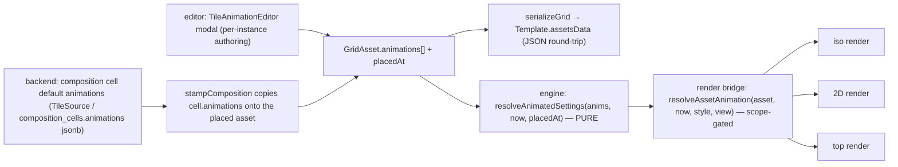

# Nebulith — Tile Animation System

> The source of truth for how a **tile animates**. Read this before touching the animation engine, the render
> bridge, the authoring modal, or a composition's default animations.
>
> Standing workflow for ALL work: **check docs → understand context → do the work.**
>
> Companion docs: `MAP-MODEL.md` (cells/blocks/tiles + the three views), `TILE-BACKEND-MIGRATION.md`
> (tiles are baked backend images resolved by label; colour filters the image), `EDITOR-INTERACTION-SPEC.md`
> §4 (assets carry a looping animation), `TRIGGERS-SPEC.md` (the event vocabulary).

---

## 1. The model in one sentence

A **tile** (a placed `GridAsset`) can carry a LIST of **animations**; each animation tweens the tile's live
render **settings** (`opacity`, screen `x`/`y`, `zoom`, `width`, `height`, `color`, …) from a `from` value to a
`to` value over one `durationMs`, with start/loop delays, looping, easing, a **trigger**, and a per-`(style,view)`
**scope**. Playback is **pure + clock-derived** — no per-frame state — so the same map animates identically on
every machine. The animation is **DATA**: authored either as a **composition/kind default** in the backend
(`TileSource`) or **per-instance** in `Template.assetsData`. The frontend only renders it.



## 2. Data shape (the `Animation` envelope)

Frontend type: `src/engine/animation/tileAnimation.ts`. Backend authoring: `Nebulith.Catalog.TileSource`
(persisted per composition cell in `composition_cells.animations`, a nullable jsonb `{:array, :map}`).

```ts
type SettingKey = 'x'|'y'|'rotate'|'zoom'|'width'|'height'|'zWidth'|'zPos'|'heightLevel'|'opacity'|'color'|'zIndex'|'display'
type Ease         = 'linear' | 'sine' | 'ease'                 // sine/ease = ease-in-out (1-cos(πt))/2
type TriggerEvent = 'load' | 'attack' | 'interact' | 'proximity' | 'night'

interface AnimationTrack { setting: SettingKey; from: number|string; to: number|string }   // many per animation
interface Animation {      // kind:'settings' fully implemented; kind:'sprite' type-only (playback stubbed)
  id: string; name?: string; kind: 'settings' | 'sprite'
  durationMs: number; startDelayMs?: number; loopDelayMs?: number; loop?: boolean; yoyo?: boolean; ease?: Ease; priority?: number
  trigger?: { on: TriggerEvent; radiusCells?: number }         // proximity → distance from the hero
  scope?:   { styles?: ('ascii'|'emoji')[]; views?: ('iso'|'2d'|'top')[] }   // absent/empty = all
  tracks:   AnimationTrack[]                                   // settings kind
  // frames: string[]                                          // sprite kind (baked frame labels)
}
```

- **`yoyo` (ping-pong loop).** Only meaningful with `loop`. A yoyo cycle runs `from`→`to` over `durationMs`
  (up leg) then AUTO-REVERSES `to`→`from` over another `durationMs` (down leg), then the `loopDelayMs` tail
  rests at `from`. So ONE animation oscillates up-and-back with **no chaining** — the fountain water grows its
  height 1→4→1 blocks from a single envelope. Default false → the plain `from`→`to`, rest-at-`to`, snap-back loop.

- **Per-instance:** `GridAsset.animations: Animation[]` + `GridAsset.placedAt` (the ms anchor). A LIST so
  animations **chain** — list order = chain order; each one's `startDelayMs` offsets it, so A→B→C sequences fall
  out of the delays. Round-trips in `assetsData` exactly like `cellAnim` (shallow-cloned on deserialize).
- **Composition default:** a `composition_cells.animations` array served verbatim by `tileset_json.ex`; the
  frontend tileset loader carries it onto `CompositionCell.animations`; `stampComposition` copies it onto the
  placed asset and sets `placedAt = 0`.
- **`placedAt = 0` is deliberate.** The render clock is `performance.now()` (ms-since-load), so `0` is the clock
  origin → a `load`-triggered loop plays immediately and every instance stays in sync. An epoch `Date.now()`
  would read as "far future" and never start.

## 3. Playback semantics (pure, defined)

`animationValue(anim, now, placedAt)` and `resolveAnimatedSettings(anims, now, placedAt)` in `tileAnimation.ts`.

- **Phase:** `elapsed = now − placedAt − startDelay`. Before the start delay → hold `from`. Non-loop past the
  duration → hold `to`. **Loop** period = `durationMs + loopDelayMs`; the duration window runs `0→1`, then the
  `loopDelay` tail **RESTS at `to`** (matches `cellAnimation`'s "hold the last frame") before snapping back to
  `from`. **Yoyo loop** period = `2·durationMs + loopDelayMs`; the up leg runs `0→1` over `durationMs`, the down
  leg auto-reverses `1→0` over the next `durationMs` (continuous at the peak), then the `loopDelay` tail
  **RESTS at `from`** (the down leg already returned there) before the next up leg.
- **Per-track value:** numeric settings (incl. `opacity`, `y`, `zIndex`) = eased numeric lerp; `color` = per-channel
  RGB lerp → `rgb(r,g,b)` (fail-safe step if unparseable); `display` = **step at the temporal midpoint** (raw ≥ 0.5
  → `to`), never eased.
- **Stacking (`resolveAnimatedSettings`):** every animation contributes its tracks' current values. On the SAME
  setting, the **higher `priority` wins; ties → later in the list**. Unwritten settings are absent (renderer keeps
  the base). Winner-takes-all per setting (see §6 for the fountain consequence). The winning value is then
  **composed onto the tile's base** at the render bridge (see §3.5) — stacking picks the value, composition
  layers it on the base slider.

### 3.5 Composition — an animation LAYERS on the base setting, it does NOT mask it

The tile's **base** render settings (the inspector sliders — `scaleY`/height, `scale`/zoom, `scaleX`/width, …)
are the value the animation builds ON TOP OF. An animated setting is a **change relative to its own `from`**,
applied to the base, so the base slider stays **live and editable while the animation plays**:

| class | settings | rendered value | example |
|-------|----------|----------------|---------|
| **ADDITIVE** | `height` (scaleY), `x`, `y`, `zPos`, `heightLevel` | `base + (value − from)` | base height **3** + a track `1→4` (delta 0→3) → **3→6** |
| **MULTIPLICATIVE** | `zoom` (scale), `width` (scaleX) | `base × (value / from)` | base zoom **2** + a track `1→3` (ratio ×1→×3) → **2→6** |
| **last-wins** | `color`, `zIndex`, `display` | the animated value (no base to compose) | — |
| **multiplier** | `opacity` | `base_alpha × value` (the caller composites it) | a 1→0 fade dims the base alpha |

Consequences: the fountain water (**base height 1** + track `1→4`) renders `1 + (v − 1)` = **1→4** — unchanged,
because its base is the additive identity. But a tile with **base height 3** and the same `1→4` grow renders
**3→6**, and dragging the base height slider to 2 shifts the whole animation to **2→5**. Zoom (a base
`scale`) still scales the column while the height animation grows it — the pre-fix bug (Image #40) was the
animation OVERWRITING `scaleY`, which masked the base slider (only zoom appeared to apply). Composition lives
in the pure engine (`composeAnimatedSetting`) and is driven by the render bridge, which reads the winning
track's `from` via `resolveAnimatedSettingsDetailed`; `MULTIPLICATIVE` guards a `from` of 0 (no ratio) by
falling back to the absolute value. Evidence: `tileAnimationCompose.realcanvas.test.ts` (real render, both styles).

## 4. Render bridge (one place, all three views)

`src/engine/render/assetAnimation.ts` — `resolveAssetAnimation(asset, nowMs, style, view, dayNight)`:
1. filters `asset.animations` to those whose `scope` matches `(style, view)` (`animationMatchesScope`) **and** whose
   day/night gate passes (`animationPlaysAtDayNight` — a `night`-trigger animation only when `dayNight === 'night'`),
2. composes the live values (`resolveAnimatedSettingsDetailed` — value + the winning track's `from`), then
   **layers each onto the tile's base** per §3.5 (`composeAnimatedSetting`),
3. returns `{ opacity, x, y, asset }` — or **`null`** (the fast path) when there are no animations, none in scope,
   or only a `sprite` animation is active. `null` keeps an un-animated tile **byte-identical** to before.

Per-frame split of concerns:
- **opacity** → a multiplier onto the tile's base alpha (canvas `globalAlpha`) — fades in every view.
- **x / y** → a screen shift in tile fractions, ADDITIVE over a base of 0 (`value − from`); **`y` positive = a RISE**
  (screen-space up → the caller subtracts it).
- **colour / zoom / width / height** → **composed onto** a shallow-cloned `asset` (`color`/`scale`/`scaleX`/`scaleY`)
  so the existing draw code reads them unchanged — colour is last-wins, zoom/width MULTIPLY the base, height ADDS
  its delta (§3.5), so the base sliders stay editable under an animation. **`height`→`scaleY` grows the block UP
  from its base** in BOTH
  iso (the extruded block gets taller) AND 2D (`draw2DLabeledCell` now sizes the cell by `scaleY`/`scaleX`/`scale`,
  bottom edge planted at the base row — the SAME collapse contract iso already honoured). So the fountain water
  column grows in place; it does not levitate.

Wired into `iso.ts` (asset branch, clock `time`), `topdown.ts` (2D, `time`), `birdseye.ts` (top, `now`) — each
using that view's existing `cellAnim` clock, so the animation shares the render's continuous RAF loop.

### Deferred settings (reported, not silently dropped)
Threaded this phase: `opacity`, `x`, `y`, `color`, `zoom`, `width`, `height`. NOT yet consumed by the render
(pre-draw or semantically ambiguous): `zPos`/`zWidth` (folded into position/extrusion before the draw),
`heightLevel` (needs a per-frame depth re-sort), `zIndex` (sort runs before the draw loop), `rotate` (pose-merge
semantics), `display` (visibility vs render-mode). `sprite` playback is stubbed. These are carried as data and
await a semantics decision before wiring.

## 5. Triggers & scope

- `load` — plays immediately (ambient loops, e.g. fountain water). **Fully wired.**
- `night` — a **CONDITION**, not a one-shot: plays ONLY while the scene is in night mode (`dayNight === 'night'`),
  and rests (neither advances nor renders) in day. **Fully wired** — the lamp bulb's glow + flicker carry it, so
  the lamp is static in day and comes alive at night (paired with the night-only ground glow POOL; see `LIGHTING.md`).
  Gated in the render bridge (`resolveAssetAnimation(asset, now, style, view, dayNight)` → `animationPlaysAtDayNight`);
  the pure interpolator ignores it, exactly like scope. Alexander: "the lamp post animation should be off on daytime
  and on on night time".
- `proximity` — plays while the hero is within `radiusCells` (reuse the iso `fadeNear` distance-to-hero math).
- `attack` / `interact` — fire on that action hitting the tile's cell (the `TRIGGERS-SPEC` event path).
- **Scope** gates playback per active `(style, view)`; an absent/empty list means "all". The pure interpolator
  ignores trigger/scope — the render bridge (`resolveAssetAnimation`) does the gating; the caller passes the
  animations that should be playing.

## 6. The fountain default (the reference case)

Authored on the `fountain` composition's interior `water_c` cells (`TileSource` `@fountain_water_grow`), served
on every fountain instance. The interior is ALL blue water (no `water_jet` drops) drawn a bit bigger (`scale`
1.15), and each water cell carries ONE looping **yoyo** `settings` animation:

| id | tracks | dur | startDelay | loopGap | yoyo | ease | priority |
|----|--------|-----|-----------|---------|------|------|----------|
| `fountain_water_grow` | **height 1→4** | 1400 | 0 | 400 | **true** | sine | 1 |

Period = `2·1400 + 400 = 3200 ms`. The water **column grows its height 1→4 blocks** over 1.4 s (up leg), then the
yoyo **auto-reverses 4→1** over the next 1.4 s (down leg), then **rests at the base (1 block)** for 0.4 s, and the
loop restarts. `height` maps to `scaleY`, which stretches the block UP from its base in every view — the water
grows **in place**: it does NOT levitate and it does NOT opacity-fade (that was the retired rise/fade look).

ONE animation writes ONE setting (`height`), so there is **no winner-takes-all conflict** — the composited value
is exactly the tween. Verified frame-by-frame (real render, both styles, iso + 2D — `fountainLoop.realcanvas.test.ts`):
the drawn column's vertical extent grows `1→~4→1` while its **base row stays fixed** (planted, not levitating),
and it is never invisible (no opacity track):

```
phase    0ms  scaleY 1.00  (base — a 1-block column, base planted)
phase  700ms  scaleY 2.50  (growing up)
phase 1400ms  scaleY 4.00  (peak — a 4-block column)        ← top of the arc
phase 2100ms  scaleY 2.50  (shrinking back)
phase 2800ms  scaleY 1.00  (back at base)                    ← end of down leg
phase 3200ms  scaleY 1.00  (rested at base, loops)
```

Older resolver note (still true): `resolveAnimatedSettings` is winner-takes-all per setting (higher `priority`,
ties → later in the list) and a looping animation rests at its `to`/`from` outside its active window. The
fountain no longer relies on that (single animation, single setting), but the rule stands for any multi-animation
tile that writes the same setting from two envelopes.

### z-index draw priority (a capability for composition optimization)

`z_index` (backend `composition_cells.z_index`, served as `zIndex`) is a CSS-style draw priority: a higher value
draws LATER (on top / in front), overriding the positional depth sort in every view (iso `isoDepthCompare`, 2D,
top). It's authored as DATA on the cell — the editor's Z-Index control or a seeded composition-cell default —
never as a render special-case.

**Right now every cell defaults to 0** (Alexander: "just leave everything on 0 by default for now, it'll work
fine; we'll only need specific z-index once we start working composition optimization"). Nothing — including the
fountain/well rim and water — carries a non-zero draw priority; the positional sort handles the current maps and
they render correctly. The capability stays wired end-to-end — the column, the depth-sort override
(`isoDepthCompare` / the 2D + top sorts), and the editor Z-Index control — so the composition-optimization pass
can reach for it later WITHOUT re-plumbing.

The intended future use is a CONTAINER occluding its CONTENTS. When one tile visually contains another (a basin
rim around water, a pot around a plant, a frame around glass), give the container a higher `z_index` than its
contents so its front edge draws in front of what it holds. For the fountain basin that would order, low→high:

```
external walls/ground  <  water  <  rim/basin
```

so the rim reads as CONTAINING the water while the water still reads in front of a wall behind it. That is a
tuning choice for the composition-optimization pass, NOT a current default — until then the fountain sits at 0
everywhere and looks right (verified real render, both styles). Also noted in `MAP-MODEL.md`.

## 7. Authoring

- **Composition default (backend):** add an `animations` array to the composition cell in
  `Nebulith.Catalog.TileSource`, migrate/seed. Served verbatim; stamped onto every placed instance.
- **Per-instance (editor):** select the tile → **✦ Animate…** → the `TileAnimationEditor` modal
  (`src/components/game/editorChrome.tsx`). Add a settings animation, check the settings to tween (each adds a
  from/to track — e.g. **height** for a grow), set timing / **loop** / **yoyo** / trigger / scope. Writes flow
  immutably through `setAssetAnimations` onto the selected tile of every selected cell (`placedAt = 0`). A live
  preview plays the composed chain (including the yoyo grow) through the real engine.

## 8. Files

- Engine (pure): `game-website/src/engine/animation/tileAnimation.ts`
- Render bridge: `game-website/src/engine/render/assetAnimation.ts` (+ iso/topdown/birdseye asset branches)
- Grid fields: `game-website/src/engine/IsometricGrid.ts` (`GridAsset.animations`, `placedAt`)
- Composition stamp: `game-website/src/game/runtime/composition.ts`; loader: `…/engine/tileset/tileset.ts`
- Authoring modal: `game-website/src/components/game/editorChrome.tsx` (`TileAnimationEditor`)
- Backend data: `nebulith/lib/nebulith/catalog/tile_source.ex` (`@fountain_water_grow`),
  `…/catalog/composition_cell.ex`, `…/controllers/tileset_json.ex`,
  migration `priv/repo/migrations/20260719120000_add_animations_to_composition_cells.exs`
- Tests: `tileAnimation.test.ts`, `assetAnimation.test.ts`, `tileAnimation.realcanvas.test.ts`,
  `tileAnimationCompose.realcanvas.test.ts` (base+animation composition, §3.5), `fountainLoop.realcanvas.test.ts`,
  `fountainAnimationDefault.test.ts`, `api.assetRoundtrip.test.ts`, `tileAnimationEditorStructure.test.tsx`

---

## Keeping this current

Update this doc whenever the envelope, the settings coverage, the render bridge, the trigger/scope rules, or the
fountain default change. Every session, every prompt: **check docs → understand → do the work.**
