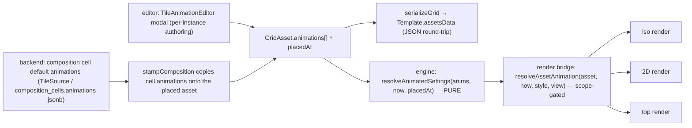

# Nebulith — Tile Animation System

> The source of truth for how a **tile animates**. Read this before touching the animation engine, the render
> bridge, the authoring modal, or a composition's default animations.
>
> Standing workflow for ALL work: **check docs → understand context → do the work.**
>
> Companion docs: `MAP-MODEL.md` (cells/blocks/tiles + the three views), `TILE-BACKEND-MIGRATION.md`
> (tiles are baked backend images resolved by label; colour filters the image), `EDITOR-INTERACTION-SPEC.md`
> §4 (assets carry a looping animation), `TRIGGERS-SPEC.md` (the event vocabulary).

---

## 1. The model in one sentence

A **tile** (a placed `GridAsset`) can carry a LIST of **animations**; each animation tweens the tile's live
render **settings** (`opacity`, screen `x`/`y`, `zoom`, `width`, `height`, `color`, …) from a `from` value to a
`to` value over one `durationMs`, with start/loop delays, looping, easing, a **trigger**, and a per-`(style,view)`
**scope**. Playback is **pure + clock-derived** — no per-frame state — so the same map animates identically on
every machine. The animation is **DATA**: authored either as a **composition/kind default** in the backend
(`TileSource`) or **per-instance** in `Template.assetsData`. The frontend only renders it.



## 2. Data shape (the `Animation` envelope)

Frontend type: `src/engine/animation/tileAnimation.ts`. Backend authoring: `Nebulith.Catalog.TileSource`
(persisted per composition cell in `composition_cells.animations`, a nullable jsonb `{:array, :map}`).

```ts
type SettingKey = 'x'|'y'|'rotate'|'zoom'|'width'|'height'|'zWidth'|'zPos'|'heightLevel'|'opacity'|'color'|'zIndex'|'display'
type Ease         = 'linear' | 'sine' | 'ease'                 // sine/ease = ease-in-out (1-cos(πt))/2
type TriggerEvent = 'load' | 'attack' | 'interact' | 'proximity'

interface AnimationTrack { setting: SettingKey; from: number|string; to: number|string }   // many per animation
interface Animation {      // kind:'settings' fully implemented; kind:'sprite' type-only (playback stubbed)
  id: string; name?: string; kind: 'settings' | 'sprite'
  durationMs: number; startDelayMs?: number; loopDelayMs?: number; loop?: boolean; ease?: Ease; priority?: number
  trigger?: { on: TriggerEvent; radiusCells?: number }         // proximity → distance from the hero
  scope?:   { styles?: ('ascii'|'emoji')[]; views?: ('iso'|'2d'|'top')[] }   // absent/empty = all
  tracks:   AnimationTrack[]                                   // settings kind
  // frames: string[]                                          // sprite kind (baked frame labels)
}
```

- **Per-instance:** `GridAsset.animations: Animation[]` + `GridAsset.placedAt` (the ms anchor). A LIST so
  animations **chain** — list order = chain order; each one's `startDelayMs` offsets it, so A→B→C sequences fall
  out of the delays. Round-trips in `assetsData` exactly like `cellAnim` (shallow-cloned on deserialize).
- **Composition default:** a `composition_cells.animations` array served verbatim by `tileset_json.ex`; the
  frontend tileset loader carries it onto `CompositionCell.animations`; `stampComposition` copies it onto the
  placed asset and sets `placedAt = 0`.
- **`placedAt = 0` is deliberate.** The render clock is `performance.now()` (ms-since-load), so `0` is the clock
  origin → a `load`-triggered loop plays immediately and every instance stays in sync. An epoch `Date.now()`
  would read as "far future" and never start.

## 3. Playback semantics (pure, defined)

`animationValue(anim, now, placedAt)` and `resolveAnimatedSettings(anims, now, placedAt)` in `tileAnimation.ts`.

- **Phase:** `elapsed = now − placedAt − startDelay`. Before the start delay → hold `from`. Non-loop past the
  duration → hold `to`. **Loop** period = `durationMs + loopDelayMs`; the duration window runs `0→1`, then the
  `loopDelay` tail **RESTS at `to`** (matches `cellAnimation`'s "hold the last frame") before snapping back to
  `from`.
- **Per-track value:** numeric settings (incl. `opacity`, `y`, `zIndex`) = eased numeric lerp; `color` = per-channel
  RGB lerp → `rgb(r,g,b)` (fail-safe step if unparseable); `display` = **step at the temporal midpoint** (raw ≥ 0.5
  → `to`), never eased.
- **Stacking (`resolveAnimatedSettings`):** every animation contributes its tracks' current values. On the SAME
  setting, the **higher `priority` wins; ties → later in the list**. Unwritten settings are absent (renderer keeps
  the base). Winner-takes-all per setting (see §6 for the fountain consequence).

## 4. Render bridge (one place, all three views)

`src/engine/render/assetAnimation.ts` — `resolveAssetAnimation(asset, nowMs, style, view)`:
1. filters `asset.animations` to those whose `scope` matches `(style, view)` (`animationMatchesScope`),
2. composes the live values (`resolveAnimatedSettings`),
3. returns `{ opacity, x, y, asset }` — or **`null`** (the fast path) when there are no animations, none in scope,
   or only a `sprite` animation is active. `null` keeps an un-animated tile **byte-identical** to before.

Per-frame split of concerns:
- **opacity** → a multiplier onto the tile's base alpha (canvas `globalAlpha`) — fades in every view.
- **x / y** → a screen shift in tile fractions; **`y` positive = a RISE** (screen-space up → the caller subtracts it).
- **colour / zoom / width / height** → overlaid onto a shallow-cloned `asset` (`color`/`scale`/`scaleX`/`scaleY`)
  so the existing draw code reads them unchanged.

Wired into `iso.ts` (asset branch, clock `time`), `topdown.ts` (2D, `time`), `birdseye.ts` (top, `now`) — each
using that view's existing `cellAnim` clock, so the animation shares the render's continuous RAF loop.

### Deferred settings (reported, not silently dropped)
Threaded this phase: `opacity`, `x`, `y`, `color`, `zoom`, `width`, `height`. NOT yet consumed by the render
(pre-draw or semantically ambiguous): `zPos`/`zWidth` (folded into position/extrusion before the draw),
`heightLevel` (needs a per-frame depth re-sort), `zIndex` (sort runs before the draw loop), `rotate` (pose-merge
semantics), `display` (visibility vs render-mode). `sprite` playback is stubbed. These are carried as data and
await a semantics decision before wiring.

## 5. Triggers & scope

- `load` — plays immediately (ambient loops, e.g. fountain water). **Fully wired.**
- `proximity` — plays while the hero is within `radiusCells` (reuse the iso `fadeNear` distance-to-hero math).
- `attack` / `interact` — fire on that action hitting the tile's cell (the `TRIGGERS-SPEC` event path).
- **Scope** gates playback per active `(style, view)`; an absent/empty list means "all". The pure interpolator
  ignores trigger/scope — the render bridge (`resolveAssetAnimation`) does the gating; the caller passes the
  animations that should be playing.

## 6. The fountain default (the reference case)

Authored on the `fountain` composition's `water_c` + `water_jet` cells (`TileSource` `@fountain_water_animations`),
served on every fountain instance. Two chained looping `settings` animations sharing ONE **1800 ms** cycle:

| id | tracks | dur | startDelay | loopGap | ease | priority |
|----|--------|-----|-----------|---------|------|----------|
| `fountain_water_rise` | opacity 0→1, **y 0→3** | 1200 | 0 | 600 | sine | **1** |
| `fountain_water_fade` | opacity 1→0 | 600 | 1200 | 1200 | sine | 0 |

Period both = `1200+600 = 600+1200 = 1800 ms`. The water tile **fades in while rising 3 blocks** over 1.2 s,
**holds at the top** for 0.6 s, then the loop restarts.

**Known semantic finding (winner-takes-all).** `resolveAnimatedSettings` is winner-takes-all and a looping
animation **rests at `to`** outside its active window. Animation **A** (priority 1) is a `load` loop, so it owns
`opacity` at all times and rests at `1` through `[1200,1800]`. Therefore **B's smooth fade-out is masked** — the
composited opacity is **fade-in (1.2 s) → hold at 1 (0.6 s) → snap to 0 at the loop boundary (a POP, not a gradual
fade)**. `y` is fully correct (only A writes it). Verified frame-by-frame (real render, both styles):

```
phase   0ms  opacity ~0.00  (invisible, at base)
phase 600ms  opacity ~0.50  (rising, half-faded-in)
phase1200ms  opacity  1.00  (full, at +3 blocks)   ← end of rise
phase1650ms  opacity  1.00  (still full — B's fade is masked)  ← hold
phase1800ms  opacity ~0.00  (snaps out, loops)     ← POP, not a smooth fade
```

To make B's smooth fade-out visible, the resolver would need opacity **compositing** (multiply/over) instead of
winner-takes-all — a Phase-1 engine-contract change, intentionally NOT made. The shipped default is
**fade-in + rise + hold + pop-loop**; confirm whether the smooth fade-out is wanted before changing the contract.

## 7. Authoring

- **Composition default (backend):** add an `animations` array to the composition cell in
  `Nebulith.Catalog.TileSource`, migrate/seed. Served verbatim; stamped onto every placed instance.
- **Per-instance (editor):** select the tile → **✦ Animate…** → the `TileAnimationEditor` modal
  (`src/components/game/editorChrome.tsx`). Add a settings animation, check the settings to tween (each adds a
  from/to track), set timing/trigger/scope. Writes flow immutably through `setAssetAnimations` onto the selected
  tile of every selected cell (`placedAt = 0`). A live preview plays the composed chain through the real engine.

## 8. Files

- Engine (pure): `game-website/src/engine/animation/tileAnimation.ts`
- Render bridge: `game-website/src/engine/render/assetAnimation.ts` (+ iso/topdown/birdseye asset branches)
- Grid fields: `game-website/src/engine/IsometricGrid.ts` (`GridAsset.animations`, `placedAt`)
- Composition stamp: `game-website/src/game/runtime/composition.ts`; loader: `…/engine/tileset/tileset.ts`
- Authoring modal: `game-website/src/components/game/editorChrome.tsx` (`TileAnimationEditor`)
- Backend data: `nebulith/lib/nebulith/catalog/tile_source.ex` (`@fountain_water_animations`),
  `…/catalog/composition_cell.ex`, `…/controllers/tileset_json.ex`,
  migration `priv/repo/migrations/20260719120000_add_animations_to_composition_cells.exs`
- Tests: `tileAnimation.test.ts`, `assetAnimation.test.ts`, `tileAnimation.realcanvas.test.ts`,
  `fountainLoop.realcanvas.test.ts`, `fountainAnimationDefault.test.ts`, `api.assetRoundtrip.test.ts`,
  `tileAnimationEditorStructure.test.tsx`

---

## Keeping this current

Update this doc whenever the envelope, the settings coverage, the render bridge, the trigger/scope rules, or the
fountain default change. Every session, every prompt: **check docs → understand → do the work.**
