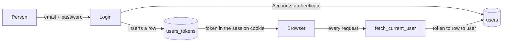

# Auth

How a person proves who they are, and what that buys them.

This follows the pattern `mix phx.gen.auth` generates, which is the Phoenix team's own answer and the
one every Phoenix codebase recognises. It is written down here rather than generated because this app
already had a `users` table, an `Accounts` context and a password hasher before the session layer
existed, and a generator run would have overwritten all three.

Source: https://hexdocs.pm/phoenix/mix_phx_gen_auth.html

---

## 1. The model

One table answers who a person is: `users`. `is_admin` is the only difference between a player and an
admin. There is no roles table, because there are two roles.

A logged-in session is a ROW, not a cookie. `users_tokens` holds a random 32-byte token per session;
the cookie carries the token and nothing else.



### Why a row and not just the user id in the cookie

A signed cookie holding `user_id` is simpler and is genuinely secure against forgery, so the reason to
reject it is not forgery. It is that the server then has no record a session exists, which costs three
concrete things:

1. **No revocation.** Changing a password cannot end the sessions opened with the old one. A stolen
   cookie stays valid until `SECRET_KEY_BASE` rotates, which invalidates everybody at once.
2. **No "sign out everywhere".** There is nothing to delete.
3. **No audit.** Nobody can answer how many sessions are open, or when one started.

A row costs one index lookup per request and answers all three.

### The token is compared as raw bytes

`users_tokens.token` is `bytea` and holds 32 bytes from `:crypto.strong_rand_bytes/1`. It is not
hashed, because unlike a password it is already high-entropy random and not reused anywhere else, and
it is not base64 in the database, because encoding is a transport concern.

---

## 2. The doors

| Area | Who gets in | How |
|---|---|---|
| `/` , `/docs` , `/health` | anyone | no gate. A reference you need a login to read is not a reference |
| `/games`, `/games/:id`, `/templates`, `/sprite-generator`, `/sprites-test` | any logged-in user | session cookie |
| `/admin` and everything under it | a logged-in user **with `is_admin`** | session cookie, or HTTP Basic |
| `/api/*` | any logged-in user, or any API token | session cookie, or `Authorization: Bearer` |
| `/health` | anyone | no gate, and it must stay that way |

`/admin` accepts two credentials on purpose. A browser session is what a person uses; HTTP Basic is what
a script uses, and the end-to-end gate is a script. Both resolve to the same row in `users`, and both
require `is_admin`.

> `is_admin` was NOT checked before this document existed. `AdminAuth` called `Accounts.authenticate/2`,
> which returns any user whose password matches, so every account reached `/admin`. The fix is
> `get_admin_user_by_email/1`, which was already written and simply was not being called.

---

## 3. The session cookie and the iframe

The engine pipeline was built with no session at all, deliberately, and the reason is written in the
router: the engine is embeddable in a cross-origin iframe, and a cross-site cookie is blocked or
partitioned by every current browser.

Requiring a login on the engine pages ends that property. An embedded engine sends no cookie, so it
sees the login page, and logging in from inside the frame does not help because that cookie is blocked
too.

This is a real trade, not an oversight:

- **Keep the login** (what is built): the engine is its own deployment at its own domain, and a visitor
  goes to it directly. The iframe embed stops working.
- **Keep the embed**: the session cookie needs `same_site: "None"` and `secure: true`, which means the
  cookie rides on cross-site requests and CSRF protection has to come from somewhere else.

Set in `config/config.exs` under the endpoint's `session_options` if the embed is ever wanted back.

---

## 4. What the engine knows about the person

The shell renders two attributes onto the mount node, the same way it renders `data-cv-url`:

- `data-user-email` so the header can show who is signed in
- `data-csrf-token` so the header's Log out button can POST

The bundle reads them at render time through a function, never at module scope. A module-level const
freezes whatever was on the page when the module first loaded.

---

## 5. The API

`/api/*` is closed. Two credentials open it, because two kinds of caller ask.

**A browser on this origin** sends the session cookie. The bundle's `fetch` defaults to
`credentials: "same-origin"`, so the engine's own calls carry it with no code at all. Nothing in the
frontend holds a credential, which is the point.

**A script** sends a token:

```
Authorization: Bearer <token>
```

Mint one for an existing account:

```bash
bin/nebulith eval 'Nebulith.Release.api_token("admin@nebulith.local")'
mix run -e 'Nebulith.Release.api_token("admin@nebulith.local")'
```

It is printed once. Only the raw bytes are stored, so a lost token is replaced, not recovered.
`Nebulith.Accounts.delete_user_api_token/1` revokes one.

An API token is context `"api"`, not `"session"`, and the two do not substitute for each other. That
separation is what lets "sign out everywhere" clear a person's browsers without killing the script that
runs their backups. It also has no expiry, deliberately: a machine credential that stops working on a
date nobody wrote down fails in the middle of the night.

### Why this pipeline has no CSRF check

The session cookie is `same_site: "Lax"`, so a cross-site `POST` does not carry it. That is what
protects the writing endpoints, and it is why adding `protect_from_forgery` here would only break the
engine's own calls without buying anything.

### What refusal looks like

`401` with `{"errors":{"detail":"Unauthorized"}}` and a `WWW-Authenticate` header. Never a redirect: a
`302` to an HTML login form is the worst possible answer to a `fetch`, because the caller gets a `200`
full of markup and parses it as data.

### The one exception

`/health` is NOT behind this, and must not be. A liveness probe that needs a credential reports the app
is down whenever the credential is wrong.

---

## 6. The checklist

Run this before calling any auth change done.

1. A logged-out request to `/games` redirects to `/login`, and does not render the shell.
2. Logging in lands on the page that was asked for, not on a fixed home page.
3. A wrong password and an unknown email give the SAME message and take roughly the same time.
4. `/admin` refuses a logged-in user who is not an admin.
5. `/admin` still accepts HTTP Basic, because the end-to-end gate uses it.
6. Logging out ends the session, and the browser back button does not restore it.
7. `/docs`, `/health` and `/` still answer with no session.
8. `/api/*` refuses a caller with no credential, and answers the same to a session and to a token.
9. `/health` still answers with no credential.
10. Both layers ran: `mix test` for the modules, and a real browser clicking the real form.
