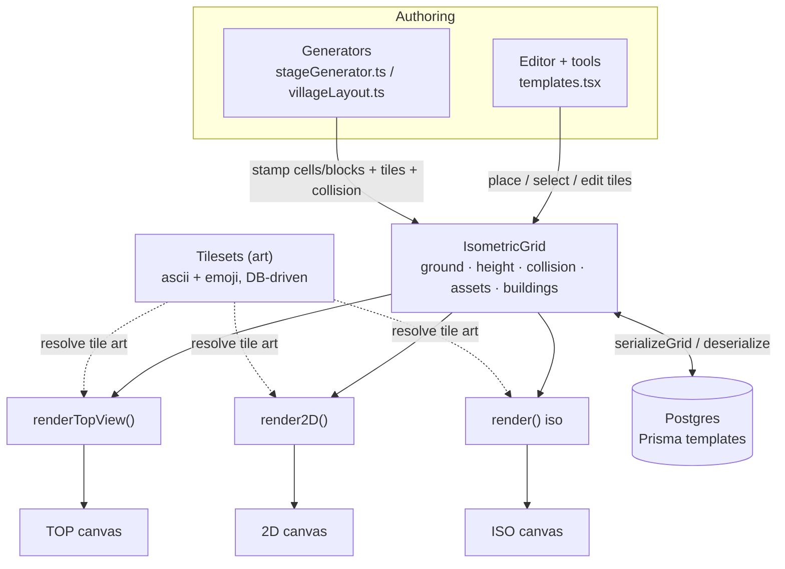
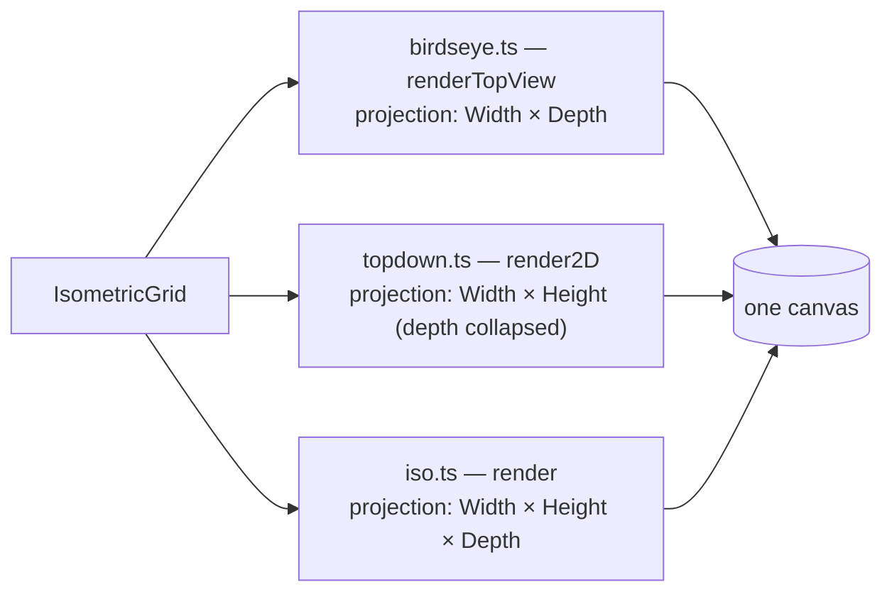
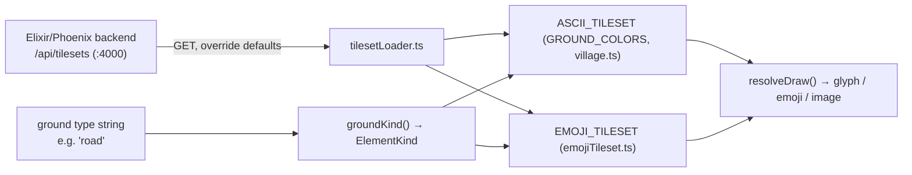

# Nebulith — Engine Architecture & Data Flow

> The **current** architecture of the Nebulith engine (the `game-website` repo: `src/engine/*` + the
> editor/runtime in `src/pages/personal-projects/game-engine/templates.tsx`), plus the Elixir tileset
> backend. Read alongside [`MAP-MODEL.md`](./MAP-MODEL.md) (the cell/block/tile model) and
> [`FEATURES.md`](./FEATURES.md) (per-feature flows). The broader 4-system audit is
> [`ARCHITECTURE.md`](./ARCHITECTURE.md). **Keep this current** — update it when the core shape changes.

---

## 1. The core: one grid → three renders

Everything hangs off **one data model** (`IsometricGrid`) that the generators/editor write and the three
view renderers read. The renderers add no state — they are pure **projections** (see MAP-MODEL).

The game loop calls **exactly one renderer per frame** based on the active view; all three draw into the
same full-window canvas.

## 2. Data model — `IsometricGrid` (`src/engine/IsometricGrid.ts`)

| Field | Shape | Meaning |
|-------|-------|---------|
| `ground[row][col]` | `string` | the floor tile type per cell (e.g. `grass`, `road`, `path_stone`) |
| `height[row][col]` | `number` | **cell elevation in blocks** (0 = ground; the renders raise cells + draw cliff faces). `setHeight`/`getHeight`. |
| `collision[row][col]` | `boolean` | blocks movement or not — independent of the tile |
| `assets[]` | `GridAsset[]` | placed tiles (trees, props, **building blocks** `type:'building'` w/ `heightLevel`, markers) |
| `buildings[]` | `GridBuilding[]` | grouped-building **metadata** for whole-building ops (move/rotate/resize/delete) — **not** a render source |

A building is **not** special: `stampBuildingCells` decomposes it into one `type:'building'` asset **per
block** (walls stacking by `heightLevel`, roof = a gable tile stack), which then render through the same
per-cell path as any tile in all three views.

## 3. Render pipeline (`src/engine/render/*`)

- **No per-view special drawer** for buildings/roofs (removed 2026-07). Each renderer iterates the grid's
  cells/blocks and draws each tile through the regular path (`drawIsoAssetAscii` / the 2D per-cell path /
  the top per-cell path), projected for that view.
- Tile art is resolved per style: `resolveDraw(kind, style)` picks the ascii glyph or the emoji/image.

## 4. Tilesets — the art, DB-driven (`src/engine/tileset/*`, `src/game/artStyle.ts`)

- **Two tilesets of the same tile**: ASCII (glyph + fg/bg colors) and EMOJI (emoji/Noto image + tint). Same
  label, different art. The front end renders; **the tile data comes from the DB** (bundled defaults are the
  seed; the backend can override the `ascii`/`emoji` blobs).
- A ground type → `groundKind()` → an `ElementKind` → the tileset entry. Adding a tile = data (color/art) +
  its label mapping — never a hardcoded render branch.

## 5. Generators (`src/engine/stageGenerator.ts`, `src/engine/villageLayout.ts`)

`generateStage({zone, variant})` dispatches to an **archetype** (town/city, forest, lake, …) that stamps the
grid: ground theming, roads, buildings, nature, features. Towns use `villageLayout` (roads skeleton →
frontages → round-robin plot distribution → oriented buildings). Output is a `Stage` (ground/collision/
props/heightData) applied to the grid. **Today `heightData` is all-zeros** — elevation is the open feature
(expand generators + tiles to place elevated PLACES; see FEATURES.md → Elevation).

## 6. Editor + runtime (`templates.tsx`)

One file holds the editor (palette, place/select/edit tiles, resize, save/load, export), the game loop
(move + collision), and view switching. Selection reads the **same** grid the render draws: an iso click
picks the front-most block (`pickIsoBlocksAll`), repeated clicks cycle behind it (`nextPickIndex`).

## 7. Persistence + backend

- **Postgres via Prisma** — a `Template` stores grid layers (ground/height/assets) + connectors as inline
  JSON. `serializeGrid`/`deserializeToGrid` in `src/lib/api.ts`.
- **Elixir/Phoenix (`nebulith/`)** — serves the tileset catalog (`/api/tilesets`, `:4000`); the front end
  loads tiles from it (`NEBULITH_API`). DB-seeded from the bundled tilesets, same shape.

## 8. Invariants (enforced by review)
- The three views are **projections that must match** (Width/Height/Depth per MAP-MODEL).
- **One tile builder**, no per-view special drawer (units/NPCs aside).
- Tiles are **DB tileset data** (ascii + emoji), labeled correctly; no hardcoded art.
- Exact terminology: **cell / block / tile**.
