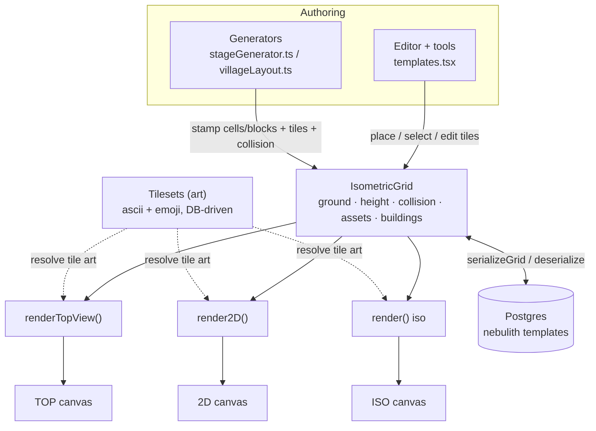
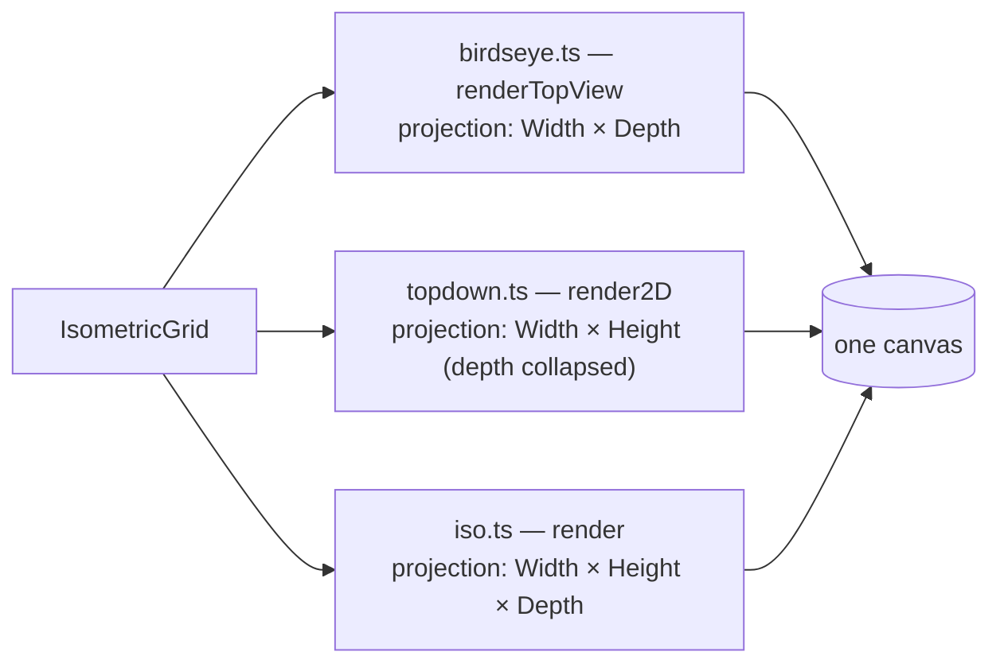
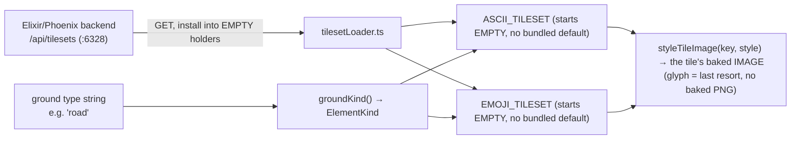

# Nebulith — Engine Architecture & Data Flow

> The **current** architecture of the Nebulith engine (the `game-website` repo: `src/engine/*` + the
> editor/runtime in `src/pages/personal-projects/game-engine/templates.tsx`), plus the Elixir tileset
> backend. Read alongside [`MAP-MODEL.md`](./MAP-MODEL.md) (the cell/block/tile model) and
> [`FEATURES.md`](./FEATURES.md) (per-feature flows). The broader 4-system audit is
> [`ARCHITECTURE.md`](./ARCHITECTURE.md). **Keep this current** — update it when the core shape changes.

---

## 1. The core: one grid → three renders

Everything hangs off **one data model** (`IsometricGrid`) that the generators/editor write and the three
view renderers read. The renderers add no state — they are pure **projections** (see MAP-MODEL).

```mermaid
flowchart TD
  subgraph author[Authoring]
    GEN["Generators<br/>stageGenerator.ts / villageLayout.ts"]
    ED["Editor + tools<br/>templates.tsx"]
  end
  GRID["IsometricGrid<br/>ground · height · collision · assets · buildings"]
  GEN -->|stamp cells/blocks + tiles + collision| GRID
  ED -->|place / select / edit tiles| GRID
  TS["Tilesets (art)<br/>ascii + emoji, DB-driven"]
  TS -. resolve tile art .-> R1 & R2 & R3
  GRID --> R1["renderTopView()"] --> TOP[TOP canvas]
  GRID --> R2["render2D()"] --> TWOD[2D canvas]
  GRID --> R3["render() iso"] --> ISO[ISO canvas]
  GRID <-->|serializeGrid / deserialize| DB[("Postgres<br/>nebulith templates")]
```

The game loop calls **exactly one renderer per frame** based on the active view; all three draw into the
same full-window canvas.

## 2. Data model — `IsometricGrid` (`src/engine/IsometricGrid.ts`)

| Field | Shape | Meaning |
|-------|-------|---------|
| `ground[row][col]` | `string` | the floor tile type per cell (e.g. `grass`, `road`, `path_stone`) |
| `height[row][col]` | `number` | **cell elevation in blocks** (0 = ground; the renders raise cells + draw cliff faces). `setHeight`/`getHeight`. |
| `collision[row][col]` | `boolean` | blocks movement or not — independent of the tile |
| `assets[]` | `GridAsset[]` | placed tiles (trees, props, **building blocks** `type:'<composition kind>'` w/ `heightLevel`, markers) |

A building is **not** special and **not** a grouped unit — there is no `buildings[]` array. A pre-built
building is a backend **composition template** stamped by `stampBuildingComposition` into one asset **per
block** (walls stacking by `heightLevel`, roof = a gable tile stack topped by the walkable `roof_top` apex),
which then render through the same per-cell path as any tile in all three views. The old facade composer,
`GridBuilding` metadata, `stampBuildingCells`, and the whole-building move/rotate/resize/delete ops are
retired — a building is just its cells.

## 3. Render pipeline (`src/engine/render/*`)

```mermaid
flowchart LR
  GRID[IsometricGrid] --> B["birdseye.ts — renderTopView<br/>projection: Width × Depth"]
  GRID --> T["topdown.ts — render2D<br/>projection: Width × Height (depth collapsed)"]
  GRID --> I["iso.ts — render<br/>projection: Width × Height × Depth"]
  B --> C[(one canvas)]
  T --> C
  I --> C
```

- **No per-view special drawer** for buildings/roofs (removed 2026-07). Each renderer iterates the grid's
  cells/blocks and draws each tile through the regular path (`drawIsoAssetAscii` / the 2D per-cell path /
  the top per-cell path), projected for that view.
- **No per-STYLE drawer either (2026-09).** Tile art is resolved by `styleTileImage(key, style)` /
  `styleTileArt(key, styleId)`: the KEY (a composition-cell label or an element kind) picks the tile, and the
  style picks **only which tileset to read it from** — a dispatch map (`TILE_ART_BY_STYLE`), never an `if`.
  Every seeded tile is image-backed in EVERY style, so ascii and emoji run the identical draw path (block →
  cube-sprite cache → `drawImage`) and differ only in the PNG. *This doc used to say "resolveDraw picks the
  ascii glyph or the emoji/image" — that sentence described, and endorsed, the divergence that made ASCII
  ~2× slower than emoji on the same map: an image-less ascii tile missed the sprite cache and fell into the
  per-face `clip + fillText` path, and a label-less prop dropped into per-type glyph drawers that called
  `ctx.measureText` every frame. Those drawers are deleted.* A **glyph is the documented LAST RESORT only**,
  for a tile with genuinely no baked image (MAP-MODEL §8 forbids that on a seeded tile) — and it is reached
  under the SAME condition in every style, so it is a no-tile path, not an ASCII path.

## 4. Tilesets — the art, DB-driven (`src/engine/tileset/*`, `src/game/artStyle.ts`)

```mermaid
flowchart LR
  DBB["Elixir/Phoenix backend<br/>/api/tilesets (:6328)"] -->|GET, install into EMPTY holders| LOADER["tilesetLoader.ts"]
  LOADER --> ASCII["ASCII_TILESET (starts EMPTY, no bundled default)"]
  LOADER --> EMOJI["EMOJI_TILESET (starts EMPTY, no bundled default)"]
  TYPE["ground type string<br/>e.g. 'road'"] --> GK["groundKind() → ElementKind"]
  GK --> ASCII
  GK --> EMOJI
  ASCII --> DRAW["styleTileImage(key, style) → the tile's baked IMAGE<br/>(glyph = last resort, no baked PNG)"]
  EMOJI --> DRAW
```

- **Two tilesets of the same tile**: ASCII and EMOJI — same label, different baked PNG. **A style is a SET OF
  BAKED IMAGES and nothing more** (Alexander: *"the only thing that changes is the tiles … we're just saying
  'use this set of images instead of this other one'"*). `glyph`/`emoji` on a tile row are BAKE INPUTS plus
  the last-resort char, not the art the renderer draws. The front end renders; **ALL the tile data comes from the DB** — `EMOJI_TILESET` /
  `ASCII_TILESET` start **EMPTY** and `tilesetLoader` installs the served rows; there is **no bundled default
  and no fallback**, and the render gate blocks until the baked images are decoded (MAP-MODEL §8).
- A ground type → `groundKind()` → an `ElementKind` → the tileset entry. **Adding a tile is a BACKEND authoring
  path** (nebulith `TileSource` → `priv/tilegen/bake.mjs` → seed → served), NOT a frontend edit — the old
  `GROUND_COLORS`/`village.ts` data is DEAD (TILE-BACKEND-MIGRATION §5). Never a hardcoded render branch.

## 5. Generators (`src/engine/stageGenerator.ts`, `src/engine/villageLayout.ts`)

`generateStage({zone, variant})` dispatches to an **archetype** (town/city, forest, lake, …) that stamps the
grid: ground theming, roads, buildings, nature, features. Towns use `villageLayout` (roads skeleton →
frontages → round-robin plot distribution → oriented buildings). Output is a `Stage` (ground/collision/
props/heightData) applied to the grid. **Today `heightData` is all-zeros** — elevation is the open feature
(expand generators + tiles to place elevated PLACES; see FEATURES.md → Elevation).

## 6. Editor + runtime (`templates.tsx`)

One file holds the editor (palette, place/select/edit tiles, resize, save/load, export), the game loop
(move + collision), and view switching. Selection reads the **same** grid the render draws: an iso click
picks the front-most block (`pickIsoBlocksAll`), repeated clicks cycle behind it (`nextPickIndex`).

## 7. Persistence + backend

- **Postgres via the Elixir backend** — a `Template` stores grid layers (ground/height/assets) +
  connectors + entities + quests as inline JSON. `serializeGrid`/`deserializeToGrid` in `src/lib/api.ts`
  talk to `/api/templates` on nebulith. **Prisma is gone** (removed wholesale in `0e3eba9`); the
  `"Template"` table it created is now owned by a nebulith migration
  (`priv/repo/migrations/20260907120000_create_template_table.exs`) — before that, no migration in either
  repo could recreate it and a fresh database came up 500ing on `relation "Template" does not exist`.
  The table keeps Prisma's quoted camelCase identifiers, because that is what existing databases hold.
- **GAMES live only in the backend** — `games` + `game_templates`, served by `/api/games`. The frontend
  once kept a second, localStorage-backed game model under `nebulith:games` with its own id scheme, so a
  user sitting inside a backend game was told they had none. That model is deleted; `lib/gamesMigration.ts`
  carries any surviving browser data across on first load and then drops the key.
- **Elixir/Phoenix (`nebulith/`)** — serves the tileset catalog (`/api/tilesets`, `:6328` by default — `PORT` env, see `nebulith/config/runtime.exs`); the front end
  loads tiles from it (`NEBULITH_API`). DB-seeded from the bundled tilesets, same shape.

## 8. Invariants (enforced by review)
- The three views are **projections that must match** (Width/Height/Depth per MAP-MODEL).
- **One tile builder**, no per-view special drawer (units/NPCs aside).
- **One tile RESOLVER**, no per-style branch beyond which tileset supplies the URL. A style may not change
  what code runs, only which PNG it draws. Locked by
  `src/__tests__/render/asciiSameEngineAsEmoji.realcanvas.test.ts`, which counts the actual canvas calls per
  style on the same assets and fails if they diverge.
- Tiles are **DB tileset data** (ascii + emoji), labeled correctly; no hardcoded art.
- Exact terminology: **cell / block / tile**.
