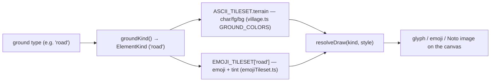
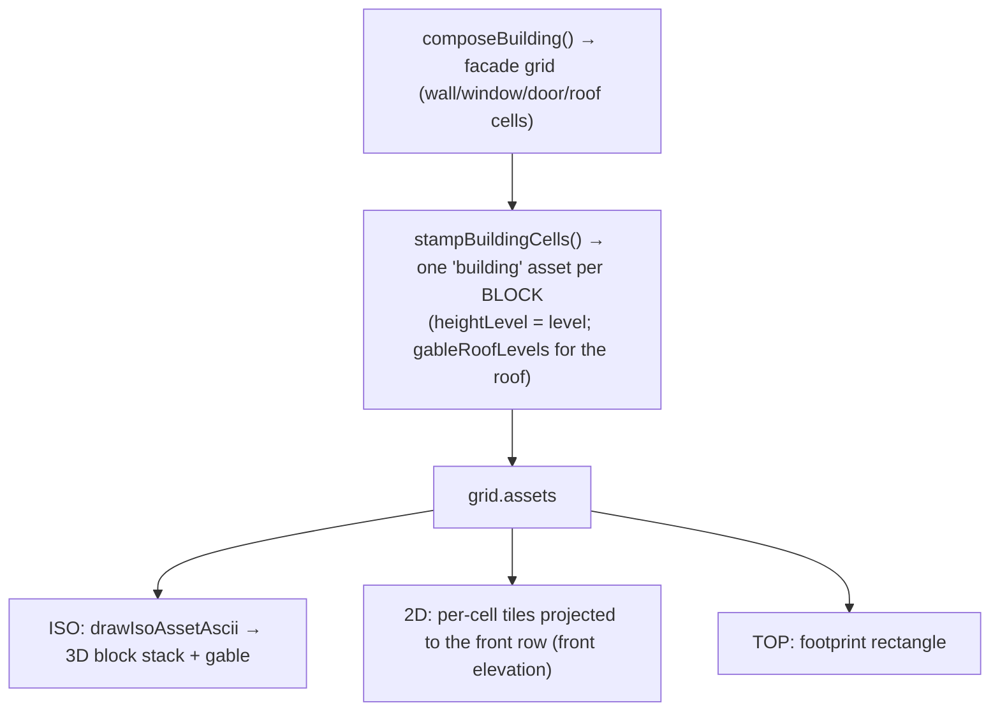
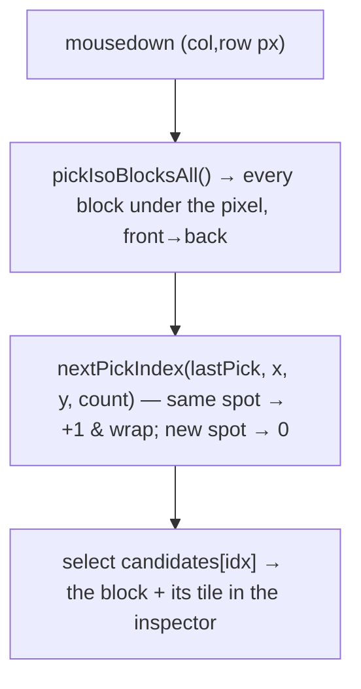
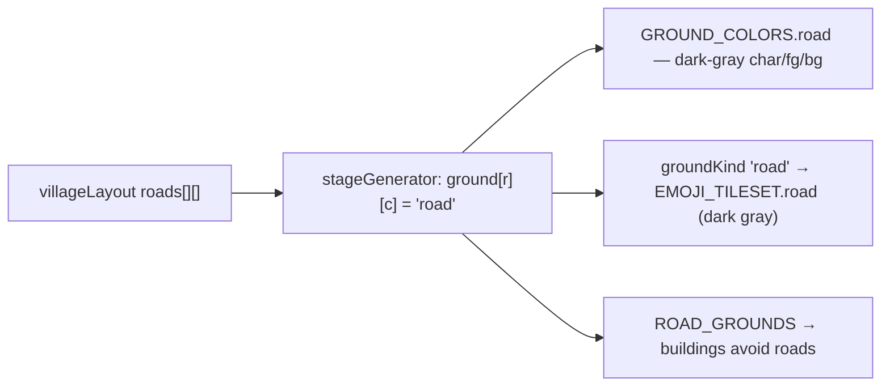
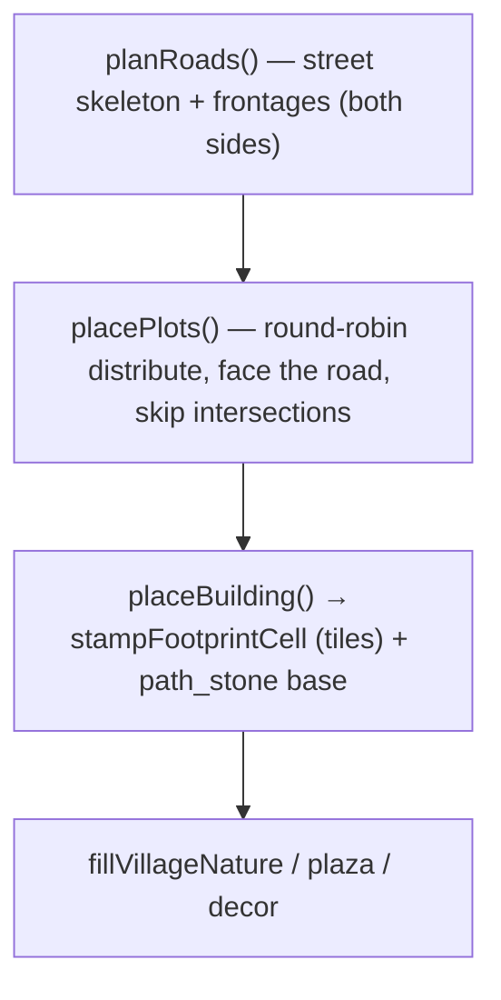
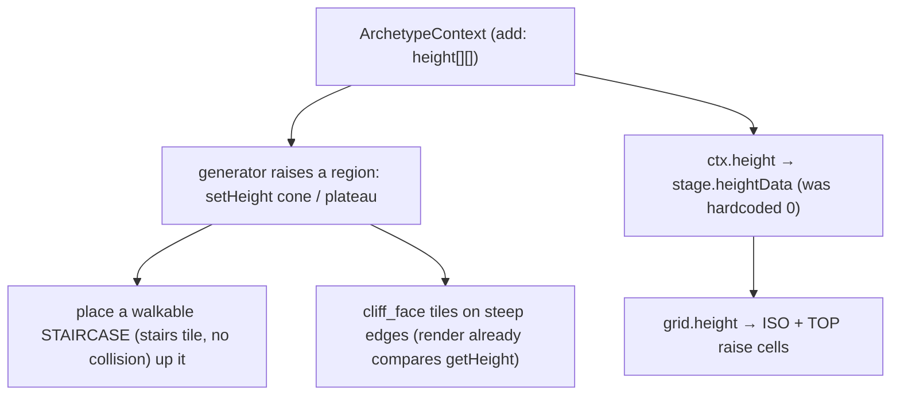

# Nebulith — Features (with flow diagrams)

> One section per feature: what it is, how it flows (mermaid), and where it lives in the code
> (`game-website` paths). Read [`MAP-MODEL.md`](./MAP-MODEL.md) + [`ENGINE-ARCHITECTURE.md`](./ENGINE-ARCHITECTURE.md) first.
> **Keep current:** touch a feature → update its section here in the same change.

Index: [Tiles & Tilesets](#1-tiles--tilesets) · [Buildings as tiles](#2-buildings-as-stacked-tiles) ·
[The three views](#3-the-three-views) · [Selection & click-to-cycle](#4-selection--click-to-cycle) ·
[Roads](#5-roads) · [Town generation](#6-town-generation) · [Elevation](#7-elevation-planned-expansion)

---

## 1. Tiles & Tilesets

Every tile has a **label** (the style-agnostic swap key) and is rendered by the active **tileset** (ascii
or emoji) — two arts of the same tile. Ground types map to a `kind`; the kind picks the art. DB-driven.

**Add a tile the right way:** add its color/art to `GROUND_COLORS` (ascii) + `EMOJI_TILESET` (emoji) as
DATA, map the type in `groundKind` — never a hardcoded render branch. Files: `src/levels/village.ts`,
`src/engine/tileset/emojiTileset.ts`, `src/game/artStyle.ts`, `src/engine/tileset/tilesetLoader.ts`.

## 2. Buildings as stacked tiles

A building is **not** a special render unit — `stampBuildingCells` decomposes it into one `type:'building'`
tile **per block** (perimeter walls rising `floors`, a gable **roof tile stack**), which render through the
regular per-cell path in all three views.

Files: `src/engine/buildingComposer.ts`, `src/game/runtime/buildings.ts` (`stampBuildingCells`),
`src/engine/gableRoof.ts` (roof stack), `src/engine/render/*`. The old per-view building drawers
(`drawIsoBuildingTiles`, `draw2DBuilding`, `drawTopBuildingRoof`, roof-cap drawers) were **removed** — one
system, no special renderer.

## 3. The three views

Projections of the one grid that must match — full detail + matching rules in
[`MAP-MODEL.md`](./MAP-MODEL.md). TOP = W×D (`birdseye.ts`), 2D = W×H front elevation (`topdown.ts`),
ISO = W×H×D (`iso.ts`).

## 4. Selection & click-to-cycle

An iso click must select the block you SEE. The pick mirrors the render's depth order and returns the
front-most block; because a front block can **occlude** the one you aimed at, repeated clicks on the same
spot **cycle** front→back through the overlapping blocks.

Files: `src/engine/render/iso.ts` (`pickIsoBlocksAll`, `pickIsoBlock`, `nextPickIndex`), editor wiring in
`templates.tsx` (mousedown only — hover keeps the front-most). Dense-town occlusion beyond cycling is
answered by camera rotation (planned).

## 5. Roads

A road is a real **`road` tile** (dark-gray) placed by the generator into road cells — DB tileset data in
**both** ascii + emoji, labeled correctly in all views. Brown `path_stone` is freed for building bases.

Files: `src/engine/stageGenerator.ts`, `src/levels/village.ts`, `src/engine/tileset/emojiTileset.ts`,
`src/game/artStyle.ts`, `src/engine/buildingEditor.ts` (`ROAD_GROUNDS`).

## 6. Town generation

`villageLayout` plans a street grid + frontages, then distributes typed plots **round-robin across all
frontages** (both sides + connectors), each building **oriented to face its road**, footprints breaking at
intersections (no corner/overlap). `stageGenerator` carves roads, stamps each building (as tiles), fills
nature.

Files: `src/engine/villageLayout.ts`, `src/engine/stageGenerator.ts`. Grid-tested
(`villageLayout*.test.ts`): distribution, road-facing, corners, no overlap.

## 7. Elevation (planned expansion)

**The system already exists** — `height[][]` (cells raised, cliff faces drawn) + collision + the elevation
tiles (`cliff`, `cliff_face`, `stairs`, `mountain`, slope). Elevation is just **stacked cells/blocks with
collision** — no new render logic. **The open work** is threading a height grid through the generators so
archetypes place PLACES with elevation (mountains + staircases, cliffs, hills), with the tiles to render
and traverse them.

Gap today: `ArchetypeContext` has no `height` grid and `stage.heightData` is all-zeros
(`stageGenerator.ts`); generated "mountains" are flat blocking tiles. Files (to expand):
`src/engine/stageGenerator.ts`, `src/engine/IsometricGrid.ts` (`setHeight`), tiles in `src/levels/village.ts`.
