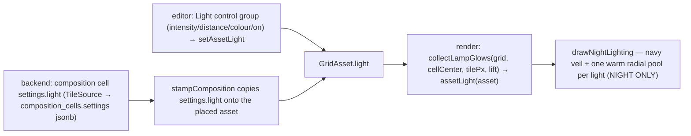

# Nebulith — Lighting (the `light` setting + the night glow pool)

> How a tile casts light at night. Read this before touching the night pass, the lamp glow, or the `light`
> setting. Companion docs: `MAP-MODEL.md` (cells/blocks/tiles), `ANIMATION-SYSTEM.md` (the `night` trigger that
> gates the lamp flicker), `TILESET-AUTHORING.md`.
>
> Standing workflow for ALL work: **check docs → understand context → do the work.**

---

## 1. The model in one sentence

A tile can carry a **`light` SETTING** — a real, controllable per-tile setting (Alexander: *"a regular setting
that allows me to control the light intensity and distance"*) — and at **night** the renderer draws a warm radial
**GROUND GLOW POOL** at that tile, sized by the light's `distance` and strengthened/tinted by its
`intensity`/`color`. Day draws no pool. The pool is **data-driven**: any asset carrying a `light` casts one; a
lamp is just the tile that ships a `light` by default.



## 2. The `light` setting shape

`AssetLight` (frontend `src/engine/tileset/tileset.ts`; carried on `GridAsset.light` and
`CompositionCellSettings.light`; backend authors it verbatim in the cell's `settings` jsonb, served camelCase):

```ts
interface AssetLight {
  intensity: number   // pool STRENGTH, 0..1 — multiplies the pool's warm alpha (1 = the old default lamp brightness)
  distance: number    // pool RADIUS in cells/blocks — the glow reaches this many cells out (default lamp = 3.2)
  color?: string      // pool COLOUR "#rrggbb"; absent → the default warm lamp glow (#ffd98a)
  on?: boolean         // false → casts NO pool (a switched-off lamp); absent/true → it lights
}
```

- **Authored** either as a **composition/cell default** in the backend (`Nebulith.Catalog.TileSource`, the lamp
  bulb's `settings.light`) or **per-instance** in the editor's **Light** control group (intensity slider,
  distance slider, colour picker, On/Off) → `setAssetLight` fans it out to every selected cell's tile. It
  round-trips in `Template.assetsData` via the shallow clone, exactly like `shape`.
- **Distance is in CELLS.** The render multiplies it by the view's per-cell pixel unit (`tilePx`) to get the
  screen radius, so the pool is the same real-world size in iso / 2D / top.

## 3. Render — `collectLampGlows` + `drawNightLighting` (`src/engine/render/shared.ts`)

- `assetLight(asset)` is the ONE resolver: an explicit `light` setting wins (unless `on === false` → no pool);
  a lamp/lantern with **no** explicit light falls back to the default warm `LAMP_GLOW`
  (`{ rgb: '255,217,138', radiusTiles: 3.2, intensity: 1 }`); anything else casts nothing.
- `collectLampGlows(grid, cellCenter, tilePx, lift, w, h, anim?)` walks `grid.assets`, resolves each via
  `assetLight`, and emits a `LampGlow { x, y, r, rgb, intensity }` per on-screen light (`r = distance × tilePx`).
  When `anim = {time, style, view}` is passed (the live views do), it MULTIPLIES each light's `intensity` by that
  asset's live animated opacity (`resolveAssetAnimation`, night-gated) — so a **failing lamp's pool follows its
  bulb flicker** (§4). A steady lamp resolves no animation → factor 1 → unchanged.
- `drawNightLighting(ctx, w, h, lamps)` lays a navy veil over the scene, then paints ONE additive (`lighter`)
  radial pool per light — the alpha stops scale by `intensity`, the hue by `rgb`.
- **Night-gated (unchanged):** each view (`iso.ts` / `topdown.ts` / `birdseye.ts`) calls this only when
  `dayNight === 'night'`. The old hardcoded per-lamp radius/colour is gone — the pool now reads each tile's
  `light`; the legacy `type === 'lamp'` bulb branches no longer fake a day/night glow (the pool is the ambience).

## 4. The bulb LIGHTS UP at night (default) + the FAILING-lamp flicker

There are **two** light-post composition variants (`TileSource.lamp_post_composition/1`), sharing one structure.
The **bulb ALWAYS changes appearance at night** (Alexander: *"the bulb should change appearance when night mode =
true, but it doesn't"*) — that is the default lamp behaviour; only the **failing** variant adds a flicker on top
(Alexander: *"the lamp should just be 'on' on night mode, the flicker animation can be applied to a few, but not
all"*):

- **`lamp_post`** (the DEFAULT — the MAJORITY of lamps) — the bulb ships a **`light`** default (`intensity 1.0`,
  `distance 3.2`, `color #ffd98a`, `on true`, reproducing the old `LAMP_GLOW`) **and ONE `night`-triggered
  `lamp_night_lit` animation** — a single **`color` track holding `#ffe9a0` (`from` == `to`, a steady value, NOT
  a tween)**. In **day** the render bridge drops the night animation → the bulb shows its plain **unlit** art; at
  **night** the colour last-wins-tints the bulb art warm (luminance-mapped) → a **lit, glowing bulb**, STEADY (no
  flicker). So the bulb itself visibly lights up, not just the ground pool.
- **`lamp_post_failing`** (a MINORITY — the frontend generator tags ~18% of lamps) — the SAME night-lit `color`
  glow, PLUS ONE **`night`-triggered** `lamp_flicker` animation: a single **`opacity` 1 → 0.12** track with
  **`ease: "flicker"`** — the frontend's irregular, STEPPED failing-bulb envelope (mostly ON with brief, erratic
  dips / full-off blinks at irregular times), NOT a smooth sine yoyo (see `ANIMATION-SYSTEM.md` → the `flicker`
  ease + the `night` trigger). `color` and `opacity` are DIFFERENT settings, so the two compose: the failing bulb
  is **lit AND flickering** — a dying street light, mostly lit but erratically cutting out.

**The pool follows the bulb.** For a failing lamp, `collectLampGlows` folds the bulb's **live animated opacity**
into that lamp's pool `intensity`, so the ground pool dims/cuts on the **exact same beat** the bulb flickers
(Alexander: *"when it fails the light area should fail at the same rhythm of the flick"*). A steady lamp's bulb
animates only `color` (not opacity) → opacity 1 → its pool stays constant.

`post` (the pole) carries neither light nor animation — only the bulb is a light source.

## 5. Verified (real running game, emoji, iso)

Headless pixel probe (`.claude-workspace`/job `lamp4`, cleared plaza + one placed `lamp_post` + one
`lamp_post_failing`, `__tileCentroid` bulb crops): toggling **⚙ Stage → Night mode** makes BOTH bulbs go from a
grey/silver DAY bulb to a **warm/golden lit bulb** (normal bulb warmth R−B **+29.6**, failing **+39** vs day).
The **normal** bulb's luminance trace over a 64-frame burst is **dead flat** (flicker COV **0.000** — steady lit),
while the **failing** bulb's trace swings erratically (149 → 79, COV **0.19** — the irregular flicker), and its
pool dims on the same beat. Earlier probes (`lamp2`): the `light` **distance** grows the pool, **intensity**
scales its strength, **`on:false`** removes it. The USER validates on `:3000`.

---

## Keeping this current

Update this doc whenever the `light` shape, the night pass, `assetLight`'s fallback, or the lamp default change.
Every session, every prompt: **check docs → understand → do the work.**
