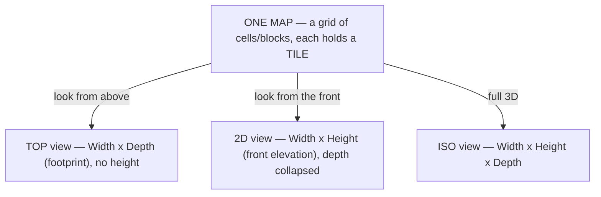
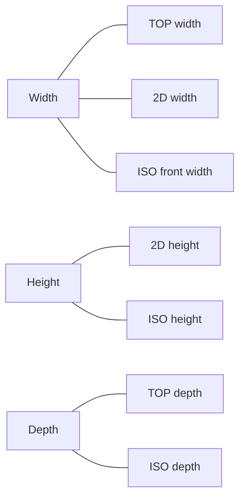
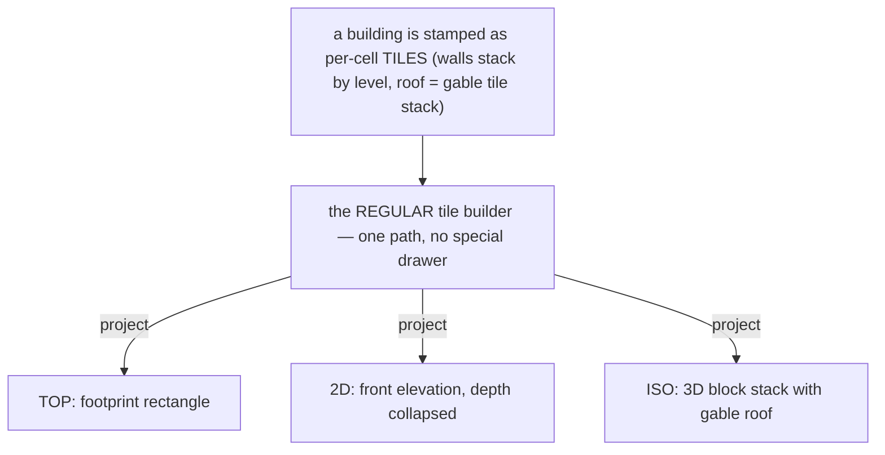
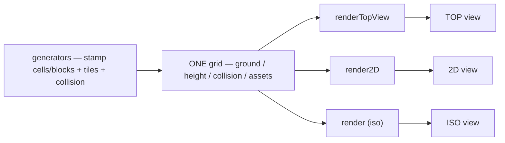

# Nebulith — Map Model, Views & the Cell/Block/Tile System

> **The source of truth for how a Nebulith map is built and viewed.**
> Read this BEFORE any work that touches maps, tiles, cells/blocks, generators, or the three views.
> New feature? Check this (+ the feature doc) and make sure the feature matches it.
> Fixing a bug? Confirm the fix matches this model.
> Touching tiles or cells/blocks? Understand this first, then update code.
>
> Standing workflow for ALL work: **check docs → understand context / high-level → do the work.**
>
> This is the canonical copy. `game-website/docs/MAP-MODEL.md` mirrors it and maps it to the code.

---

## 1. One map, three projections

There is **ONE map**: a grid of cells/blocks, each holding a **tile** (the art). Nothing is special-cased —
a house, a road, a mountain are all just **tiles in cells/blocks, stacked like legos / minecraft**. The three
views are **three projections of that one map**, rendered through the **same tile builder**. Because they are
the same map, **the views must match.**

## 2. What each view shows / hides

| View | You see | Axes | Hidden |
|------|---------|------|--------|
| **TOP** | the map from directly above | **Width × Depth** (footprint) | height / elevation |
| **2D**  | the map from the front | **Width × Height** (front elevation) | depth (collapsed) |
| **ISO** | the map in 3D | **Width × Height × Depth** | nothing |

Example — the SAME house in all three (the reference sketch):
- **TOP**: a roof **rectangle** (the footprint) + a door notch, on green ground.
- **2D**: gray wall rows + a red roof **gable / triangle** + windows + door — the front face; green ground, sky above.
- **ISO**: the full 3D house — walls + red gable roof + door/windows.

## 3. The matching rules — the views are consistent by construction

The same thing appears in all three, so its dimensions are shared:

- **Width** — 2D = TOP = ISO front width.
- **Height** — 2D = ISO. (TOP hides it.)
- **Depth** — TOP = ISO. (2D hides it.)
- **Tiles match** — roof red, walls gray, door/windows in the same places, in every view; ground green, road black, everywhere.
- Change the map (add a floor, move the door) → **all three views change consistently**, because they read the same cells/blocks/tiles.

## 4. Blocks, cells, tiles — the containers and their contents

- **ISO grid = BLOCKS** — 3D containers `(col, row, level)`. Stack as many as you want for height/depth.
- **2D grid = CELLS** — `(col, row)`; **stack cells** to simulate elevation (height). Depth is collapsed.
- **TOP grid = cells** from above — elevation is not shown.
- A **cell/block has collision or not** — it blocks movement or it doesn't. Collision is a property of the
  cell/block, **independent of the tile** it holds.
- A **TILE** is the art inside a cell/block — an ascii glyph, an emoji, or an image, coming from the **DB
  tileset**. Ascii and emoji are just **two tilesets** of the same tile (same label, different art). The
  front end renders; the tile data comes from the DB — the front end hardcodes nothing.

**Terminology — never interchange:**
- **CELL** = a 2D grid square `(col, row)`.
- **BLOCK** = a 3D unit `(col, row, level)`.
- **TILE** = the content/art placed into a cell/block.
- A **character / unit** is a depth-0 tile — the one map exception to "everything is a stacked tile."

## 5. Everything is tiles through ONE builder — no special renderer per view

A building, a tree, a mountain — all are **collections of tiles in cells/blocks**. There is **NO special
drawer** for a building, a roof, or anything (units/NPCs aside). Each view PROJECTS the same stamped tiles:
ISO stacks the blocks into a 3D shape, 2D collapses depth and stacks the cells into a front elevation, TOP
shows the footprint.

The roof is the clearest example: it is a **stack of roof tiles** (a gable). The SAME roof tiles project to a
**triangle** (2D front), a **3D gable** (ISO), and the **footprint rectangle** (TOP).

## 6. Elevation is stacked cells/blocks + collision — not special logic

A hill / mountain / cliff / staircase is just **cells/blocks stacked with collision**. The elevation system
already exists (a per-cell `height` grid; the ISO + TOP renders raise cells and draw cliff faces). The open
work is only **expanding the generators + tiles to place PLACES with elevation** (mountains, staircases,
cliffs, hills) — **not** new render logic. "Segmented code" per view is fine; the **logic is one system**.

## 7. The pipeline — generator → one grid → three renders

---

## Keeping this current

Update this doc (and its `game-website` mirror) whenever the model, the views, the tile system, or a feature
changes. Every session, every prompt: **check docs → understand → do the work.** Per-feature docs (with their
own mermaid flow) live alongside this and are written/updated as each feature is built or changed.
