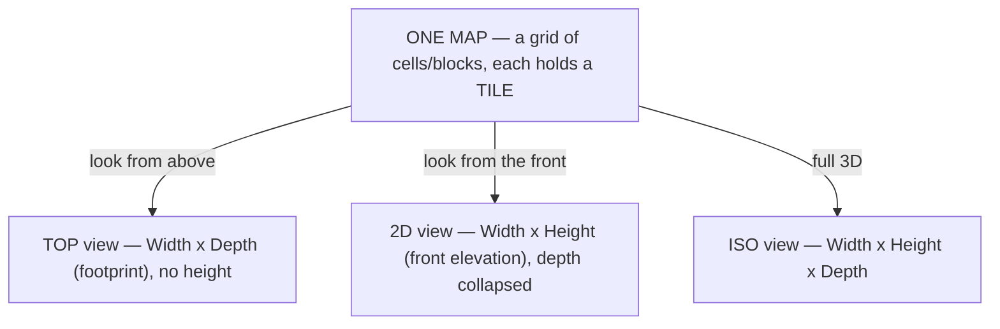
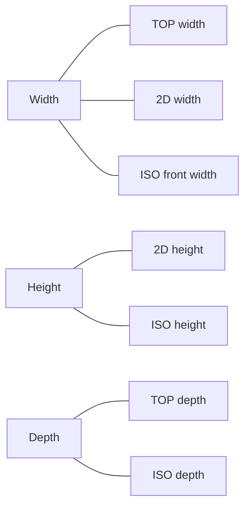
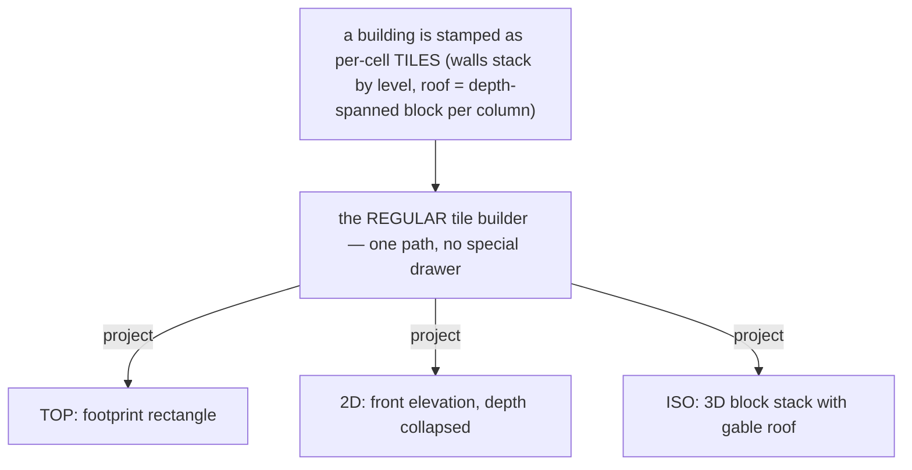
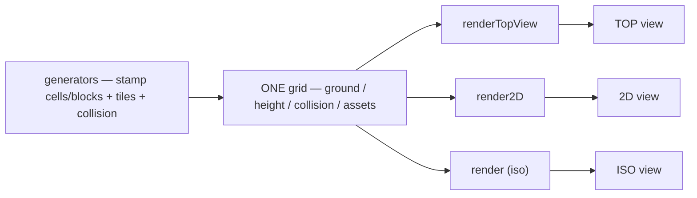
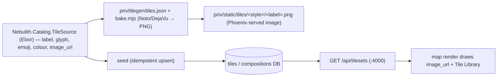

# Nebulith — Map Model, Views & the Cell/Block/Tile System

> **The source of truth for how a Nebulith map is built and viewed.**
> Read this BEFORE any work that touches maps, tiles, cells/blocks, generators, or the three views.
> New feature? Check this (+ the feature doc) and make sure the feature matches it.
> Fixing a bug? Confirm the fix matches this model.
> Touching tiles or cells/blocks? Understand this first, then update code.
>
> Standing workflow for ALL work: **check docs → understand context / high-level → do the work.**
>
> This is the canonical copy. `game-website/docs/MAP-MODEL.md` mirrors it and maps it to the code.

---

## 1. One map, three projections

There is **ONE map**: a grid of cells/blocks, each holding a **tile** (the art). Nothing is special-cased —
a house, a road, a mountain are all just **tiles in cells/blocks, stacked like legos / minecraft**. The three
views are **three projections of that one map**, rendered through the **same tile builder**. Because they are
the same map, **the views must match.**

## 2. What each view shows / hides

| View | You see | Axes | Hidden |
|------|---------|------|--------|
| **TOP** | the map from directly above | **Width × Depth** (footprint) | height / elevation |
| **2D**  | the map from the front | **Width × Height** (front elevation) | depth (collapsed) |
| **ISO** | the map in 3D | **Width × Height × Depth** | nothing |

Example — the SAME house in all three (the reference sketch):
- **TOP**: a roof **rectangle** (the footprint) + a door notch, on green ground.
- **2D**: gray wall rows + a red roof **gable / triangle** + windows + door — the front face; green ground, sky above.
- **ISO**: the full 3D house — walls + red gable roof + door/windows.

## 3. The matching rules — the views are consistent by construction

The same thing appears in all three, so its dimensions are shared:

- **Width** — 2D = TOP = ISO front width.
- **Height** — 2D = ISO. (TOP hides it.)
- **Depth** — TOP = ISO. (2D hides it.)
- **Tiles match** — roof red, walls gray, door/windows in the same places, in every view; ground green, road black, everywhere.
- Change the map (add a floor, move the door) → **all three views change consistently**, because they read the same cells/blocks/tiles.

## 4. Blocks, cells, tiles — the containers and their contents

- **ISO grid = BLOCKS** — 3D containers `(col, row, level)`. Stack as many as you want for height/depth.
- **2D grid = CELLS** — `(col, row)`; **stack cells** to simulate elevation (height). Depth is collapsed.
- **TOP grid = cells** from above — elevation is not shown.
- A **cell/block has collision or not** — it blocks movement or it doesn't. **Collision is a per-cell SETTING,
  NOT derived from anything.** It is **NOT** computed from height (or type, category, label, or art style) —
  a **4-block-tall projection can be fully walkable**, a **4-block cave entrance** walkable, a **2-block open
  door** walkable. The user drives it directly via the inspector's **Blocked/Walkable** toggle
  (`setCellCollision` → `grid.setCollision`) — that setting is the **source of truth** for a cell's collision.
  When a tile is **painted**, it lands with **ONE uniform default for every tile**: **walkable** (non-blocking).
  Same default for every tile, height, art style and category — there is **no per-type blocking list and no
  height→collision rule** anywhere in the paint/insert path. **Height and collision are fully independent:** any
  height can carry any collision. (A generated/composition cell may carry its **own** authored `walkable` DATA —
  that is per-cell DATA on the block, not a code branch, so the generator path is unaffected.)
- A cell/block CAN carry a **draw priority** (`z_index`, CSS-style) — a higher value draws LATER (on top / in
  front), overriding the positional depth sort in every view. It's DATA on the cell (the editor's Z-Index control
  or a seeded default), not a render special-case. **Currently every cell defaults to 0** and sorts positionally —
  the capability is reserved for the later composition-optimization pass (e.g. giving a container a higher
  `z_index` than its contents so its front edge occludes them). See `ANIMATION-SYSTEM.md` → "z-index draw priority
  (a capability for composition optimization)".
- A **TILE** is the art inside a cell/block — an ascii glyph, an emoji, or an image, coming from the **DB
  tileset**. Ascii and emoji are just **two tilesets** of the same tile (same label, different art). The
  front end renders; the tile data comes from the DB — the front end hardcodes nothing.
- **Height is per-tile DATA, read UNIFORMLY.** Every tile carries its **own** block height in the DB, and every
  consumer (the editor brush `stackAssetTile`, the generator, the three renderers) reads it through the **same**
  path — there is **NO branch by tile type, category, label, or art style** anywhere in the insert/height/
  collision path. The MECHANISM is identical for every tile (*"all tiles behave and are inserted the same in the
  map, regardless of type or art style"*); only the **DATA** each tile carries differs:
  - a **GROUND/FLAT** tile — terrain, a **flower**, a fallen leaf, floor decor, a facade piece — has height
    **0/min**: in iso it shows on the **floor face** of the block only (no extrusion).
  - a **STANDING** tile — a tree, a rock, a mushroom, a cactus, a crate, a lamp, a building, a prop — has height
    **≥ 1**: it extrudes into a 3D **block**.
  Height affects only the **extrusion**; it does **NOT** affect collision (see the collision setting above — a
  tall block is walkable by default just like a flat tile). This is DATA per tile, **not** a category code branch
  — a data drift on one tile can never reopen a per-type split, because there is no per-type code. A tile's
  height can be **overridden per cell/block** in the right sidebar, and collision is set independently there via
  the Blocked/Walkable toggle; nothing else — its type/category/style — changes how it inserts. (Terrain is just
  the height-0 case painted onto the **FLOOR** via `placeGroundTile` rather than stacked, so it shows on the
  floor face — the same "height 0 = floor face" rule as any other flat tile.)
- A cell/block CAN carry a **`shape`** render setting (`square` default | `circle`) — DATA on the cell
  (`composition_cells.settings.shape` or a per-instance editor setting), never a render special-case.
  **`shape: circle` takes the SAME cuboid and BENDS ITS CORNERS ROUND**, NOT a repainted sphere (Alexander:
  *"ALL I WANT WITH THE SHAPE IS TO MANIPULATE THE SIDES OF THE CUBOID … bend the corners OF THE CUBOID to form
  a circle"*): the renderer draws the block's **normal cube — the tile painted on all three shaded faces, its
  background colour fill + art + per-face shading all kept — then CLIPS it to an ELLIPSE** so the silhouette
  rounds. The clip is the block's **INSCRIBED ellipse** (`roundedBlockEllipse`): `rx = footprint half-width`,
  `ry = √((stack/2)² + stack·tileH)` centred at the cuboid's mid-height — **tangent to the four slanted faces**,
  so **EVERY corner is bent away** (the top apex, the mid-side vertices, and the bottom) and there is **no
  straight-edge/arc kink**. The earlier `ry = stack/2 + tileH` passed through the apex + bottom and cut across
  the faces, leaving those three corners angular (Alexander circled the top point, a mid-right side corner, and
  the bottom) — the inscribe fixes all three. It stays **PROPORTIONAL** — a tall block → a tall oval (an egg
  standing up), a unit cube → a rounder blob — and is **NOT a sphere**: no single flat surface, no radial
  relight, the three faces + their seams still show; only the OUTLINE rounds. `square` is the plain cube. All
  three views route their `circle`/`square` through ONE shared shape dispatch (iso `ISO_SHAPE_DRAWERS`, 2D/top
  `drawFlatTileForShape`, whose face is a rectangle so its own inscribed-ellipse clip already rounds all four
  corners) — no per-view `if (shape === 'circle')` — so a new shape adds one map entry, never a branch
  (SOLID/OCP).

**Terminology — never interchange:**
- **CELL** = a 2D grid square `(col, row)`.
- **BLOCK** = a 3D unit `(col, row, level)`.
- **TILE** = the content/art placed into a cell/block.
- A **character / unit** is a depth-0 tile — the one map exception to "everything is a stacked tile."

## 5. Everything is tiles through ONE builder — no special renderer per view

A building, a tree, a mountain — all are **collections of tiles in cells/blocks**. There is **NO special
drawer** for a building, a roof, or anything (units/NPCs aside). Each view PROJECTS the same stamped tiles:
ISO stacks the blocks into a 3D shape, 2D collapses depth and stacks the cells into a front elevation, TOP
shows the footprint.

The roof is the clearest example: it is **roof tiles** projecting to a **triangle** (2D front), a **3D gable**
(ISO), and the **footprint rectangle** (TOP). To keep the block count low, a roof is authored as ONE
**depth-spanned** block PER COLUMN (roof-z-width): each column carries smart HEIGHT (`settings.scaleY` = its
gable-step height) AND smart Z-WIDTH (`settings.depth` = the footprint depth, along `settings.depthDir`), so a
whole ridge column is a single block spanning the depth instead of one tile per `(col,row)` — a gable falls to
`w+1` blocks. The three views still read the SAME data: ISO draws the depth block as one long box, 2D collapses
the depth onto the front face (the triangle), and TOP paints the tile across every covered footprint cell.

**A composition cell resolves by its own LABEL, in every view.** A tree is two stacked cells — a `tree_trunk`
cell at level 0 and a `tree_canopy` cell above it — each carrying its OWN part label but the SAME composition
`type` ('tree'). Every renderer resolves a stacked cell (one that carries a `label` and `height ≥ 1`) by that
**label** — its own trunk/leaf/wall/roof tile — **before** the coarse whole-object KIND art is ever consulted
(`assetKind` collapses `tree_*` to the `tree` kind, whose emoji is the whole 🌲). So the trunk cell draws the
trunk tile and the canopy cell draws the leaf tile, each at its own stacked position, composing into ONE
coherent tree — identically in ISO (label cube per cell), 2D (label cell per level), and TOP (the top-of-stack
label per footprint cell). This label-first rule is what stops the 2D view from painting the whole-tree KIND
tile once per stacked cell — the "tree on tree" doubling — so **ANY** composition (tree, building, fountain,
lamp) translates consistently across the three views. It is DATA-driven (label + height), never a per-type
branch.

## 6. Elevation is stacked cells/blocks + collision — not special logic

A hill / mountain / cliff / staircase is just **cells/blocks stacked with collision**. The elevation system
already exists (a per-cell `height` grid; the ISO + TOP renders raise cells and draw cliff faces). The open
work is only **expanding the generators + tiles to place PLACES with elevation** (mountains, staircases,
cliffs, hills) — **not** new render logic. "Segmented code" per view is fine; the **logic is one system**.

## 7. The pipeline — generator → one grid → three renders

## 8. Tileset source of truth — the DB + one seed pipeline

Tiles are **DB data**, served by the nebulith backend (`:4000`, `tilesets` table, one row per style key —
`ascii`, `emoji`). Each tile entry carries its **art** (`glyph`/`char` + optional `image` + `color`) plus
optional **sidebar metadata**: `category` (terrain/buildings/units/nature) marks a tile BROWSEABLE and groups
it; `title` is its display name. Entries with no `category` (wall pieces, tree corners, entity reskin tiles)
render on the map but never surface in the sidebar.

**The app reads ONLY the DB tilesets — the front end hardcodes no tile art AND no tile data.** `tilesetLoader`
fetches the rows on load and installs them (`EMOJI_TILESET` / `ASCII_TILESET`). BOTH the **map render** and the
**Tile Library sidebar** (`tilesForStyle` / `visualForTileId`) derive from those loaded tilesets — so the
sidebar always matches the map (no parallel hardcoded catalog that can drift).

**The holders start EMPTY and a loader gates the render — there is NO fallback.** Both `EMOJI_TILESET` and
`ASCII_TILESET` are empty until `/api/tilesets` installs the DB rows; there is no bundled default tileset. The
editor shows a **LOADING TILES loader** (and the RAF loop paints only a plain background) until the tiles are
ready, and an **error/retry** state if the load fails. **"Ready" means the baked PNG IMAGES are DECODED, not
just the JSON installed** — `loadTilesetsFromBackend` preloads + decodes every installed tile image
(`preloadTileImages`, into the same cache the render reads) *before* it resolves and the gate opens. This is
what killed the last flash (Image #70): opening on the JSON alone let the first frames paint the tile's GLYPH
fallback (the wall's brick emoji tiled across the cube faces — a repeated "S" / brown-crate building, an
un-drawn hero) for the ~1s the rasters were still decoding. The glyph is now ONLY the after-load neutral render
for a genuinely image-less / unknown label — never a pre-load placeholder — and the RAF hard-gate blocks even
the saved map from painting until ready. Nothing is ever drawn from frontend tile data — so a fresh load
(including an auto-loaded saved map) goes straight from loader → the correct DB style, with no wrong-style
flash at any point.

**Entity resolution is backend data too (a unit is just a tile).** How an entity resolves to a baked tile — an
enemy's `enemyType` → slug, a person's `variant` → slug, and the baked-slug set — used to be the last frontend
data file (`game/data/entityTiles.json`). It now lives in the backend (`Nebulith.Catalog.EntitySource`) and is
served by **`GET /api/entities`**; the frontend installs it into an EMPTY holder via `entityLoader` and the
render gate waits for it **alongside** the tilesets (no fallback). The frontend now holds **no** tile OR entity
data. See TILE-BACKEND-MIGRATION §11.

**Tile pipeline (Elixir backend → baked image → DB → app).** All tile DATA lives in the nebulith backend.
The game-website FRONTEND JSON (`tileKinds.json`/`emojiCatalog.json` + `gen-tileset-seeds.mjs`) was the
ONE-TIME frontend→backend migration import and is now DEAD — do not author tiles there.

**To add or change a tile:** (1) author it in `Nebulith.Catalog.TileSource` (Elixir) with
`image_url: "/tiles/<style>/<label>.png"` — `glyph`/`emoji` are BAKE INPUTS only; (2) add a bake entry to
`priv/tilegen/tiles.json` `{label, mode, style, glyph|emoji}` and run `node priv/tilegen/bake.mjs`
(→ a baked PNG in `priv/static/tiles/`); (3) seed. NEVER `image_url: nil` + a raw glyph (renders `??` on a
machine whose font lacks the emoji), and NEVER hand-edit tile art into a component or the renderer. Seeds are
FINE (Elixir → DB); only the frontend JSON is dead.

---

## Keeping this current

Update this doc (and its `game-website` mirror) whenever the model, the views, the tile system, or a feature
changes. Every session, every prompt: **check docs → understand → do the work.** Per-feature docs (with their
own mermaid flow) live alongside this and are written/updated as each feature is built or changed.
