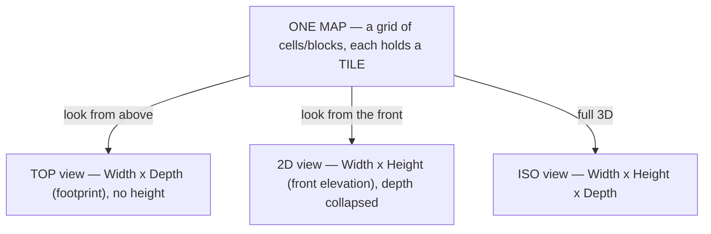
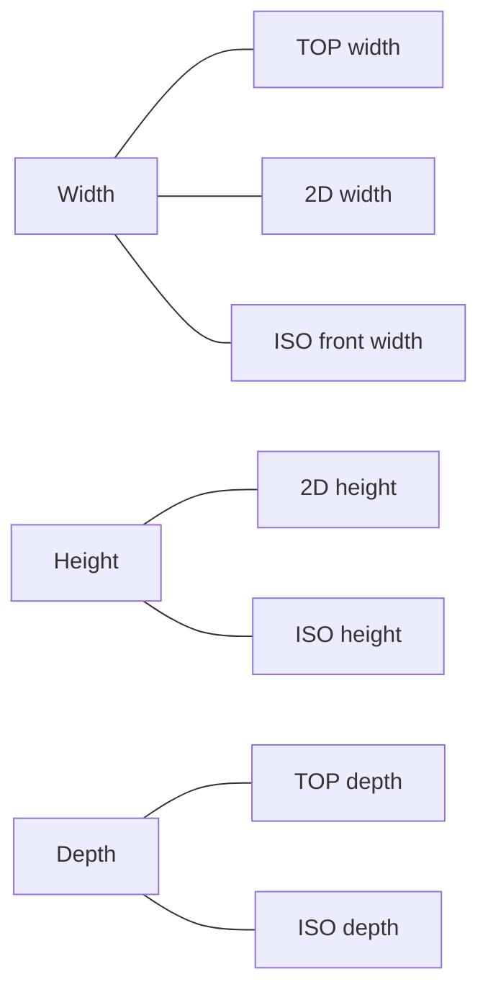
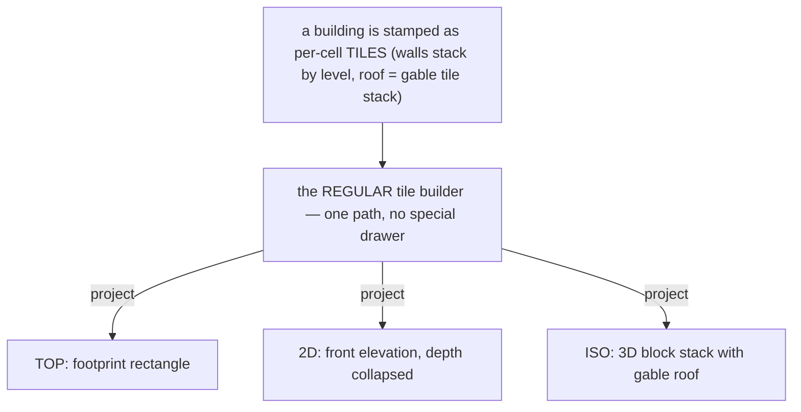
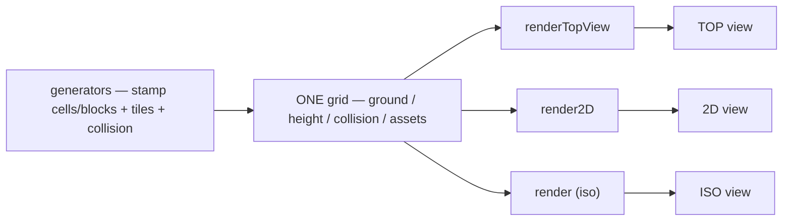
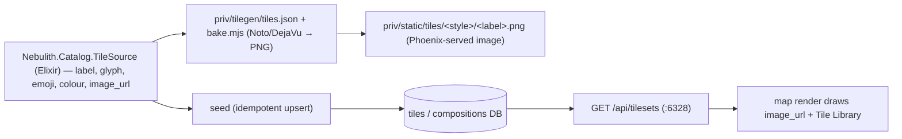

# Nebulith — Map Model, Views & the Cell/Block/Tile System

> **The source of truth for how a Nebulith map is built and viewed.**
> Read this BEFORE any work that touches maps, tiles, cells/blocks, generators, or the three views.
> New feature? Check this (+ the feature doc) and make sure the feature matches it.
> Fixing a bug? Confirm the fix matches this model.
> Touching tiles or cells/blocks? Understand this first, then update code.
>
> Standing workflow for ALL work: **check docs → understand context / high-level → do the work.**
>
> This is the canonical copy. `game-website/docs/MAP-MODEL.md` mirrors it and maps it to the code.

---

## 1. One map, three projections

There is **ONE map**: a grid of cells/blocks, each holding a **tile** (the art). Nothing is special-cased —
a house, a road, a mountain are all just **tiles in cells/blocks, stacked like legos / minecraft**. The three
views are **three projections of that one map**, rendered through the **same tile builder**. Because they are
the same map, **the views must match.**

```mermaid
flowchart TD
  MAP["ONE MAP — a grid of cells/blocks, each holds a TILE"]
  MAP -->|look from above| TOP["TOP view — Width x Depth (footprint), no height"]
  MAP -->|look from the front| TWOD["2D view — Width x Height (front elevation), depth collapsed"]
  MAP -->|full 3D| ISO["ISO view — Width x Height x Depth"]
```

## 2. What each view shows / hides

| View | You see | Axes | Hidden |
|------|---------|------|--------|
| **TOP** | the map from directly above | **Width × Depth** (footprint) | height / elevation |
| **2D**  | the map from the front | **Width × Height** (front elevation) | depth (collapsed) |
| **ISO** | the map in 3D | **Width × Height × Depth** | nothing |

Example — the SAME house in all three (the reference sketch):
- **TOP**: a roof **rectangle** (the footprint) + a door notch, on green ground.
- **2D**: gray wall rows + a red roof **gable / triangle** + windows + door — the front face; green ground, sky above.
- **ISO**: the full 3D house — walls + red gable roof + door/windows.

## 3. The matching rules — the views are consistent by construction

The same thing appears in all three, so its dimensions are shared:

- **Width** — 2D = TOP = ISO front width.
- **Height** — 2D = ISO. (TOP hides it.)
- **Depth** — TOP = ISO. (2D hides it.)
- **Tiles match** — roof red, walls gray, door/windows in the same places, in every view; ground green, road black, everywhere.
- Change the map (add a floor, move the door) → **all three views change consistently**, because they read the same cells/blocks/tiles.

```mermaid
flowchart LR
  W[Width] --- TOPw[TOP width]
  W --- TWODw[2D width]
  W --- ISOw[ISO front width]
  H[Height] --- TWODh[2D height]
  H --- ISOh[ISO height]
  D[Depth] --- TOPd[TOP depth]
  D --- ISOd[ISO depth]
```

## 4. Blocks, cells, tiles — the containers and their contents

- **ISO grid = BLOCKS** — 3D containers `(col, row, level)`. Stack as many as you want for height/depth.
- **2D grid = CELLS** — `(col, row)`; **stack cells** to simulate elevation (height). Depth is collapsed.
- **TOP grid = cells** from above — elevation is not shown.
- A **cell/block has collision or not** — it blocks movement or it doesn't. Collision is a property of the
  cell/block, **independent of the tile** it holds.
- A **TILE** is the art inside a cell/block — an ascii glyph, an emoji, or an image, coming from the **DB
  tileset**. Ascii and emoji are just **two tilesets** of the same tile (same label, different art). The
  front end renders; the tile data comes from the DB — the front end hardcodes nothing.
- **Every tile is INSERTED UNIFORMLY.** Painting or generating ANY tile places it with the SAME default: a full
  all-faces block one level tall (`height = 1`) — the SAME height the generator forces on every composition cell
  (`stampComposition`: `asset.height = 1`) and the editor brush seeds (`stackAssetTile`: `h = 1`). There is **NO
  branch by tile type, category, label, or art style** anywhere in the insertion path — a flower, a tree, a
  building, a rock, an animal-shaped decoration all land as structurally identical blocks (the user's hard rule:
  *"all tiles behave and are inserted the same in the map, regardless of type or art style"*). The **ONLY**
  source of a per-tile difference — flatten it, round it (`shape`), resize it, recolour it — is the **SETTINGS**
  on that individual cell/block, edited in the right sidebar, **never** the tile's type/category. (Terrain is
  the one exception, because it is the **FLOOR** — painted onto the ground via `placeGroundTile`, not stacked as
  a block.)

**Terminology — never interchange:**
- **CELL** = a 2D grid square `(col, row)`.
- **BLOCK** = a 3D unit `(col, row, level)`.
- **TILE** = the content/art placed into a cell/block.
- A **character / unit** is a depth-0 tile — the one map exception to "everything is a stacked tile."

## 5. Everything is tiles through ONE builder — no special renderer per view

A building, a tree, a mountain — all are **collections of tiles in cells/blocks**. There is **NO special
drawer** for a building, a roof, or anything (units/NPCs aside). Each view PROJECTS the same stamped tiles:
ISO stacks the blocks into a 3D shape, 2D collapses depth and stacks the cells into a front elevation, TOP
shows the footprint.

The roof is the clearest example: it is a **stack of roof tiles** (a gable). The SAME roof tiles project to a
**triangle** (2D front), a **3D gable** (ISO), and the **footprint rectangle** (TOP).

```mermaid
flowchart TD
  STAMP["a building is stamped as per-cell TILES (walls stack by level, roof = gable tile stack)"]
  STAMP --> REG["the REGULAR tile builder — one path, no special drawer"]
  REG -->|project| TOPp["TOP: footprint rectangle"]
  REG -->|project| TWODp["2D: front elevation, depth collapsed"]
  REG -->|project| ISOp["ISO: 3D block stack with gable roof"]
```

### Per-tile FORM modifier: `shape` — round the silhouette, keep the painting

A tile's `shape` setting (`'square'` = the default cube · `'circle'`) is a **FORM modifier, NOT a repaint** —
it changes only the tile's **silhouette**, never its painting. `circle` **bends the corners OF THE CUBOID**: it
draws the tile's **normal cube/cell** (its baked art, colour filter, per-face shading and every other setting
intact) and then **clips it to an INSCRIBED ellipse of the block's OWN projected extent** — horizontal radius =
the footprint half-width, vertical radius **tangent to the four slanted faces** (`ry² = (stack/2)² + stack·tileH`),
centred at the volume's mid-height. Inscribing pushes every one of the 6 silhouette vertices strictly OUTSIDE the
ellipse, so the clip bends them ALL away with no straight-edge/arc kink. So the outline is rounded but **PROPORTIONAL
to the block**: a tall block → a **tall OVAL** (an egg standing up), a unit cube → a rounder blob. The outer clip
only reaches the SILHOUETTE, so the ONE corner it can't bend — the top face's **interior front vertex** (where the
bright top diamond's front point meets the two front walls, Image #61) — is beveled separately by
`roundIsoTopFrontCorner`: it overpaints that sharp tip with the front-wall shades up to a rounded arc, so the bright
top recedes to a curved front instead of a downward point. Now **every** corner is bent. The three shaded faces and
the painted art all stay — it is the cuboid with its corners rounded away, **not** a repainted sphere. There is **no**
spherical relight, **no** single flat surface and **no** fixed circle (`rx==ry`) — those were rejected "ball" attempts.
All three views round the same way: ISO (`drawIsoRoundedBlock` clips `drawIsoTileBlock`, then bevels the top-front
vertex), 2D (`draw2DLabeledCell`) and TOP (footprint) draw ONE ellipse-clipped face so they have no such interior
seam. New shapes plug into a dispatch map (`ISO_SHAPE_DRAWERS`) keyed by the setting — one drawer per shape, never a new `if`.

### Per-tile SIZE modifier: `scaleZ` — THICKNESS, the 3D fill inside the cell

A tile's `scaleZ` is its **THICKNESS**: how much of its own block it fills along the **into-screen** axis.
`1` (the default) is a full cube; a **door is a thin panel in a wall** and ships at `0.3`
(`nebulith/lib/nebulith/catalog/tile_source.ex`, Alexander: *"they should be thin"*). Drawn at the default
thickness a door renders as a solid block and stops reading as a door at all.

**THE GRID'S OWN BODY is a fourth thing again, and it is not a tile's anything.** `GridConfig.slabBlocks`
is how deep the MAP stands, drawn as a skirt where the map stops (`drawGridSkirt`). A floor is a flat skin
laid on top of it, which is what lets a generator put height 0 on every floor tile and still have the map
read as ground. It is map DATA: it round-trips through the save payload and, since 2026-09-10, through the
`Template.slabBlocks` column (it was silently dropped before that, because the column did not exist). It is
edited in the editor's **Grid** rail section, never in a frontend constant — see EDITOR-INTERACTION-SPEC §17.

**THICKNESS IS NOT FOOTPRINT.** They were once conflated, and the thickness control was deleted as
"redundant" — it is not:

| | `scaleZ` — **Thickness** | `depth` / `depthDir` — **Footprint** |
|---|---|---|
| Question | how much of ONE cell does the block fill? | how many CELLS does the tile span? |
| Unit | a fraction of a block (0 < t ≤ 1 typically) | whole blocks, always ≥ 1 |
| Range | any positive number | integers ≥ 1 (a tile occupies at least its own cell) |
| Editor control | **Thickness** — four directional sliders | **Footprint** — four directional sliders |
| Backend home | `tiles.settings.scaleZ` | `composition_cells.depth` + `depth_dir` |

**Where it comes from, in precedence order** — one resolver, `tileThickness()` in
`engine/tileset/tileset.ts`, is the single reader for all of it:

1. the placed instance's own `GridAsset.thickness` reaches (the editor's Thickness sliders; saved in `Template.assetsData`),
2. an explicit per-cell `composition_cells.settings.scaleZ` for a stamped composition,
3. the TILE's authored `tiles.settings.scaleZ` — the backend default,
4. nothing → a full block, unchanged.

A tile is therefore thin **wherever it lands**: generator-stamped (`game/runtime/composition.ts`) or
hand-painted (`game/editor/tileBrush.ts`). Both call the same reader — they are only allowed to *read* it,
never to invent one, and each keeping a private copy is exactly how the paint brush silently dropped it.

#### Thickness is four REACHES — the same shape as the Footprint

Thickness alone is not enough: it needs a direction, or the shrink happens along a **screen** axis and the
same door reads thin from one side of the house and solid from the other (Alexander, Image #3: *"it's only
applied viewing to MY front, not the front of the house"*).

A cell's two ground axes are the diamond's **diagonals**, not its screen extents — the top face runs
`t → t+u → t+u+v → t+v` with `u = (+tileW, +tileH)` (+col) and `v = (−tileW, +tileH)` (+row). So thickness
is expressed on those same four iso diagonals, as **four independent reaches** (`GridAsset.thickness`).

**Thickness and Footprint ask ONE question in two units** (Alexander: *"I pefer thickness UI to work like
z-width UI"*) — *how far does this tile reach toward ⟨direction⟩?*

| | Footprint (`depth` / `depthBack` / `depthPerp` / `depthPerpBack`) | Thickness (`thickness`) |
|---|---|---|
| Unit | whole CELLS | a fraction of ONE cell |
| Range | ≥ 1 — a tile always occupies its own cell | ≤ 1 — 1 reaches that face exactly |
| Control | four arrow + slider rows | the same four arrow + slider rows |

Along each axis the block spans from `1 − reach(back)` to `reach(forward)`, so a door with reach 1 toward
its wall and 0.3 the other way is a 0.3-thick panel **flush with that wall** — it sits *in* the wall rather
than floating mid-cell. The perpendicular axis is untouched, so a thin door is still a full-width door. Two
opposing reaches that would close the block keep a visible sliver rather than vanishing mid-drag. The pure
geometry is `reachGroundQuad()` in `engine/render/isoBlock.ts`; `thinGroundQuad()` is the hug-one-face
shorthand on top of it.

**Authoring.** The backend writes either form and `tileThicknessReach()` normalises both:
`{scaleZ: 0.3, thicknessDir: "left-down"}` (the shorthand a door uses — "0.3 thick, hugging this face") or
`{thickness: {"right-up": 0.3, …}}` (explicit per-direction reaches, for anything the shorthand cannot say).

**The controls read in SCREEN space, the data stays in WORLD space.** The arrow glyphs keep their position
in the 2×2 grid — ↖ is always the up-left corner, matching where the block grows on screen — and the world
axis under each is re-derived per camera facing (`dirsForFacing`). Alexander: *"the direction should match
and be aligned with the current cammera rotation, I rotated and the direction the propreties in the UI were
showing didn't match the view."* Storing world-space is what keeps a door thin toward its own wall as you
rotate; displaying screen-space is what makes the arrow you click the axis you see. Both the Thickness and
the Footprint rows do this.

Being a WORLD axis, it is rotated twice, exactly like `depthDir`:

| Rotation | Where | Why |
|---|---|---|
| the **building**'s | `composition.ts`, at stamp time | a house turned a quarter-turn has its doors thin toward **its** front |
| the **camera**'s | `iso.ts` `orientAssetForView` | turning the camera must not re-thin the door |

Doors are authored `left-down` (+row) because a building's front face is `dy == h - 1`
(`building_compositions.ex`) — the south-facing convention every composition is authored in.

**Without a direction** `scaleZ` keeps its historical screen-axis meaning, so nothing that renders today
changes until a tile is given one.

Rendered as the block's footprint in ISO (`render/iso.ts` → `isoBlockFaces(..., quad)`) and as the vertical
axis of the TOP/overhead view (`render/assetDimensions.ts`).

#### Footprint reads in CELLS, minimum 1

The Footprint sliders once showed the **extra** cells beyond the anchor, so `0` and `1` drew the identical
block and a fractional value did nothing at all — *"I have 0, but its behaving as if value was 1 … the UI is
wrong. The min is 1 cell"*. They now count **cells, including the tile's own**, with a floor of 1. The four
stored extents are unchanged; only the unit the user reads and types changed.

### Per-tile ROLE: `unitRole` — what a `units` tile places as

A `units` tile is the one family that can become something other than a block: a **character** the player
meets, or a **combat effect** that is just decoration. Which one is the tile's own DATA —
`tiles.settings.unitRole ∈ {person, enemy, fx}` — never a frontend classification of the slug.

| Role | `placementFor` | `entityKindForUnitTile` |
|---|---|---|
| `person` | `entity` | `npc` |
| `enemy` | `entity` | `enemy` |
| `fx` | `asset` (a pinned decoration) | `null` — not a character |

The hero stays the one distinguished entity: the `player` slug is checked first and its row's role is
`person` like any other figure ("only units are special, they move").

**Status: the READER is in (`game/editor/tilePlacement.ts` — `unitRole`, `entityKindForUnitTile`,
`placementFor`), the FIELD is NOT SEEDED yet.** The live API carries `unitRole` on 0 of 79 `units` rows, so
those readers still fall through to two bridge lists (`NON_ENTITY_UNIT` 13 FX + `PERSON_SLUGS` 23 figures) —
the §3.14b Tier-1 #2 violation itself. The served role always wins, so seeding the 79 rows in
`nebulith/lib/nebulith/catalog/tile_source.ex` deletes both lists with no other change. This is also the
grouping the Characters library needs to sub-divide its 79 creatures.

## 6. Elevation is stacked cells/blocks + collision — not special logic

A hill / mountain / cliff / staircase is just **cells/blocks stacked with collision**. The elevation system
already exists (a per-cell `height` grid; the ISO + TOP renders raise cells and draw cliff faces). The open
work is only **expanding the generators + tiles to place PLACES with elevation** (mountains, staircases,
cliffs, hills) — **not** new render logic. "Segmented code" per view is fine; the **logic is one system**.

### The collision flag means the WALK SURFACE

`grid.collision` is 2D — one flag per cell — while a building is 3D. The flag therefore has exactly one
meaning: **a unit walking the ground here is stopped**. The rule, shared by every writer:

> a cell is blocked ⟺ it holds a blocking tile at or below `unitStandLevel(grid, col, row)`

`unitStandLevel` is the level a unit stands at in that cell — **not 0**. Every cell carries a floor slab at
level 0, so a building's ground course sits at level 1. Blocking a cell for a tile at ANY level made an
upper storey seal the floor beneath it (the collision map traced the storeys instead of the walls); keying
it to `heightLevel === 0` instead would block nothing at all.

Three places implement it and must not drift: the composition stamp (`game/runtime/composition.ts`), the
template load (`lib/api.ts`), and the editor's own edits (`deriveCellCollision`).

**The overlay paints on that same surface.** `renderDebugOverlays` used to tint the raw ground plane, so on
every cell the red diamond sat a block BELOW the structure it described and spilled out from under buildings
onto the grass — "collissions don't match structures" (Alexander, Image #5). Measured across a generated
town: all 181 blocked cells were tinted 26 px low, a uniform one-block offset. It now lifts by
`grid.getHeight(col,row) * heightStep + isoStackLift(tileW, unitStandLevel(...))` — the SAME lift the render
puts a unit on, so the tint and the thing it describes cannot diverge.

## 7. The pipeline — generator → one grid → three renders

```mermaid
flowchart LR
  GEN["generators — stamp cells/blocks + tiles + collision"] --> GRID["ONE grid — ground / height / collision / assets"]
  GRID --> R1[renderTopView] --> TOP[TOP view]
  GRID --> R2[render2D] --> TWOD[2D view]
  GRID --> R3["render (iso)"] --> ISO[ISO view]
```

## 8. Tileset source of truth — the DB + one seed pipeline

Tiles are **DB data**, served by the nebulith backend (`:6328` by default, `PORT`-driven; `tilesets` table, one row per style key —
`ascii`, `emoji`). Each tile entry carries its **art** (`glyph`/`char` + optional `image` + `color`) plus
optional **sidebar metadata**: `category` (terrain/buildings/units/nature) marks a tile BROWSEABLE and groups
it; `title` is its display name. Entries with no `category` (wall pieces, tree corners, entity reskin tiles)
render on the map but never surface in the sidebar.

**A STYLE IS A SET OF BAKED IMAGES AND NOTHING ELSE.** Alexander: *"all arts have the exact same behavior and
engine and the only thing that changes is the tiles, that's all that changes, the tileset art … changing from
emoji to ascii shouldn't make a difference whatsoever, because we're just saying 'use this set of images
instead of this other one'."* So EVERY tile row in EVERY style carries a baked `image_url`, and the frontend
builds its Visual through ONE helper (`artStyle.tileVisual`) fed by ONE lookup (`styleTileArt`, a dispatch map
keyed by style id). **No renderer may branch on the style for anything but which tileset to read.** A `glyph`
is the LAST RESORT for a tile with genuinely no baked image — never a per-style art path, and never a pre-load
placeholder (the loader decodes every PNG before the render gate opens).

**The app reads ONLY the DB tilesets — the front end hardcodes no tile art.** `tilesetLoader` fetches the rows
on load and installs them (`EMOJI_TILESET` / `ASCII_TILESET`). BOTH the **map render** and the **Tile Library
sidebar** (`tilesForStyle` / `visualForTileId`) derive from those loaded tilesets — so the sidebar always
matches the map (no parallel hardcoded catalog that can drift).

**Tile pipeline (Elixir backend → baked image → DB → app).** All tile DATA lives in the nebulith backend.
The game-website FRONTEND JSON (`tileKinds.json`/`emojiCatalog.json` + `gen-tileset-seeds.mjs`) was the
ONE-TIME frontend→backend migration import and is now DEAD — do not author tiles there.

```mermaid
flowchart LR
  SRC["Nebulith.Catalog.TileSource (Elixir) — label, glyph, emoji, colour, image_url"]
  SRC --> BAKE["priv/tilegen/tiles.json + bake.mjs (Noto/DejaVu → PNG)"]
  BAKE --> PNG["priv/static/tiles/&lt;style&gt;/&lt;label&gt;.png (Phoenix-served image)"]
  SRC --> SEED["seed (idempotent upsert)"] --> DB[("tiles / compositions DB")]
  DB --> API["GET /api/tilesets (:6328)"] --> APP["map render draws image_url + Tile Library"]
```

**To add or change a tile:** (1) author it in `Nebulith.Catalog.TileSource` (Elixir) with
`image_url: "/tiles/<style>/<label>.png"` — `glyph`/`emoji` are BAKE INPUTS only; (2) add a bake entry to
`priv/tilegen/tiles.json` `{label, mode, style, glyph|emoji}` and run `node priv/tilegen/bake.mjs`
(→ a baked PNG in `priv/static/tiles/`); (3) seed. **Bake incrementally** — `node priv/tilegen/bake.mjs
--only=<label>[,<label>]` restricts the run to those labels, so adding ONE tile does not re-rasterise the
other ~400 through whatever fonts happen to be installed on the baking machine. NEVER `image_url: nil` + a raw
glyph (renders `??` on a machine whose font lacks the emoji — **and it silently costs the renderer its
cube-sprite cache**, because that cache is keyed on the tile having an image; an image-less tile re-draws its
three faces live, with a `clip` each, every frame). NEVER hand-edit tile art into a component or the renderer.
Seeds are FINE (Elixir → DB); only the frontend JSON is dead.

---

## Keeping this current

Update this doc (and its `game-website` mirror) whenever the model, the views, the tile system, or a feature
changes. Every session, every prompt: **check docs → understand → do the work.** Per-feature docs (with their
own mermaid flow) live alongside this and are written/updated as each feature is built or changed.
