# The Object Construction Framework

How to build a tile composition that looks like the picture, first time, without re-deriving the engine.

## The answer, up front

An object in this engine is a **stack of cubes**. Every tile draws as a cube shell by default, so the only
things that make an object look like an object are: **which pieces you pick**, **what proportion you scale each
one to**, and **whether they touch**. The framework is five parts. A **facts sheet** that says what every setting
actually does to the picture. A **process** of nine steps with a gate at each one. Six named **patterns** you start
from instead of starting blank. A **checklist** that catches the failures we already made. And a **validation loop**
that renders the object and puts it beside the reference before anyone says it is done.

The pass mark is his: *"look exactly like I wanted, and exactly like the reference shared at their time"*.
The tree, the well, the fountain, the house and the skyscraper already meet it. They are the floor, not the ceiling.

---

# 1. Why the good objects are good, and why the bridges are not

He named them: *"the objects I mentioned in previous prompt that are good"* are buildings, skyscraper, house,
fountain, well and all tree variations. The bad one is the bridges. This section diagnoses both on the same
axes, because those axes become the checklist.

Every claim below is measured from `curl http://localhost:6328/api/tilesets` and from renders of the live app
at :3000. The shots are in `renders/`.

## 1.0 THE MEASURED ANSWER, 2026-09-14

Counted off the live `/api/tilesets`, not asserted. 53 compositions, 824 composition cells, 378 tiles.

### Why the house, the well, the fountain and the trees read

**They are built from PIECE FAMILIES and PROPORTION. Nothing else.**

| Object | How it is actually made |
|---|---|
| `lamp_post` | TWO cells. A `post` at `scale 0.3`, `scaleY 7.0`, so it draws 2.1 levels tall and 0.3 of a cell wide: a post, not a cube. Then a `lamp` bulb at `scale 0.6` with `display: single` and a `pose` of `dy -1.8` to sit it on top |
| `tree_round` | TWO cells. `trunk_mid` at `scale 0.6`, `scaleY 3.15`, so 1.89 levels tall and 0.6 wide. Then `leaf_center` at `scale 1.35` with `shape: circle`, at level 2. The crown is **2.25x the trunk's width and overhangs its own cell** |
| `house_4` | 30 cells over a 4x4 footprint. Walls are ONE block each at `scaleY 4`, not four stacked cubes. The corners and edges come from the `wall_wood` family. `window` and `door` are their own labels, which is what breaks the run. The roof is ONE cell with `depth: 4, depthDir: left-down`, spanning the whole footprint as a single block |
| `well` / `fountain` | A pure 9-slice. `fountain_tl/_t/_tr/_l/_r/_bl/_b/_br` makes the rim, `water_c` fills the middle at `scale 1.15`, slightly oversized so it meets the rim with no seam |

### The counts that settle the bridge

| Object | Pieces available to build it from |
|---|---|
| A house wall | **33**: `wall_stone` 9, `wall_plaster` 9, `wall_brick` 8, `wall_wood` 7 |
| A fountain rim | **8**, a complete 9-slice |
| A tree crown | **9** `canopy_*` pieces exist as a complete family, and ZERO compositions use them |
| **A bridge** | **3**. `bridge`, `bridge_deck`, `bridge_rail` |
| **An arch** | **0**. Searching 378 tiles for arch, span, vault, keystone, lintel or voussoir returns one hit, `spanish_tile`, which is a roof |

That is the whole diagnosis. The house has thirty-three pieces to say "corner", "edge", "middle" with. The bridge
has three, so one of them has to play three structural roles at once and the rest is faked with scale. It is not
that the bridge was built carelessly. **It was built with nothing to build from.**

### And the thing that proves it

Of 824 composition cells, **20 carry `transparent` and 22 carry `display: single`. Every single one of those is
in an entrance I built.** Apart from the lamp bulb, which is a genuine billboard, no object he approves of uses
either setting anywhere.

So the entrances were built by a method used nowhere else in the catalogue: take a WHOLE-OBJECT tile (`oak-tree`
is an entire tree baked into one tile) and flatten it into a billboard. Every good object instead takes
CONSTRUCTION pieces (`trunk_mid`, `leaf_center`, `wall_stone_tl`, `fountain_b`) and gives them proportions.

His words for it: *"the principle of objects is to use tiles as decoration, look how we build lamp post, trees
and houses"*. Measured, that principle is:

1. **Proportion does the work, not the display mode.** Drawn height in levels is `scale x scaleY`. A post is
   0.3 wide, a trunk 0.6, a crown 1.35. The cube shell is fine once the proportions are right.
2. **A piece FAMILY wherever the shape changes at a boundary.** Corner, edge, middle.
3. **One tall block, never a stack.** `scaleY: 4` for a four-level wall.
4. **`depth` to SPAN.** The house roof is one cell reaching four cells. That is already the answer to how an
   arch or a bridge deck crosses a gap, and it was never applied to either.
5. **Slight oversize to kill a seam**, the 1.15 on `water_c`.
6. **`display: single` only for a true billboard.** Never for structure.

### What this means for the next attempt

The arch, the pier, the deck and the parapet families do not exist, so there is nothing to compose. Per step 3
they get AUTHORED first, through `priv/tilegen/tiles.json` and `bake.mjs`. There is no version of this that
works by picking a different existing tile, and every attempt so far has failed trying.

## 1.1 The scoreboard

| Axis | tree | well / fountain | house / skyscraper | **bridges** |
|---|---|---|---|---|
| Distinct tile labels used | 2 | **9** (`fountain_tl/t/tr/l/r/bl/b/br` + `water_c`) | 12 to 18 | **3** (`bridge_deck`, `bridge_rail`, `post`) |
| Built from an autotile piece FAMILY | no (2 singles) | **yes, the 8-piece rim** | **yes, `wall_<mat>_<edge>` 9-piece** | **no** |
| Material variety comes from | one tile, one job | different tiles | **different tiles** (`wall_stone` vs `wall_brick` vs `wall_wood`) | **a `color` setting on the same tile** |
| Roles per tile | 1 | 1 | 1 | **`bridge_rail` plays 3** (under-bearer, near rail, far rail) |
| Size comes from | `scale` x `scaleY` proportion | piece count | piece count, `scaleY` runs | **`depth` stretching one tile over N cells** |
| Silhouette tiers (big / medium / small) | trunk / canopy / none | slab / water / rim bevels | body / roof / windows | **one flat rectangle** |
| Pieces touch | **yes**, canopy level = `round(trunk scaleY x scale)` | yes, a closed ring | yes, eave = `wall_top + 1` | **no**, both parapets are pushed AWAY from the deck |
| Colour invented in the composition | **never** | **never** | **never** | **always** (3 of 3 cells carry `color`) |

## 1.2 Why the good ones land

The five he named, rendered alone on open ground at :3000 so the silhouette is the only thing being judged.

| `tree` | `well` | `house_4` |
|---|---|---|
| 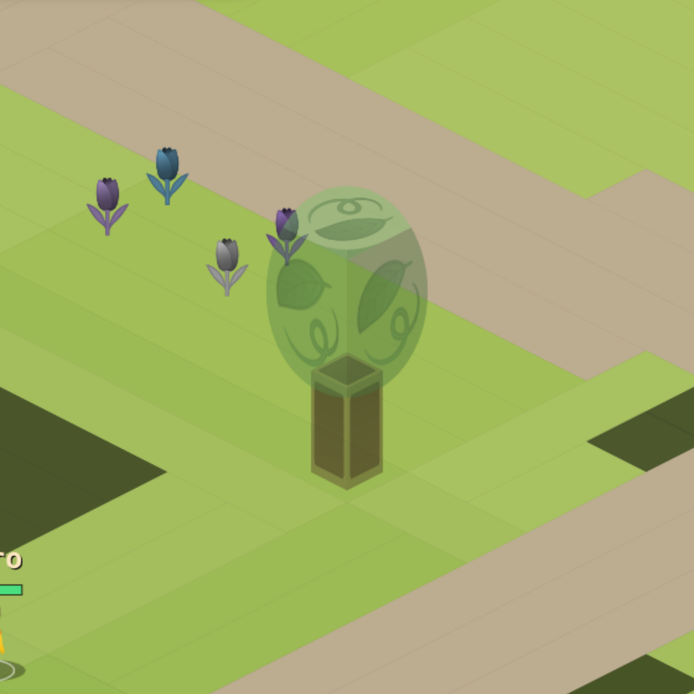 | 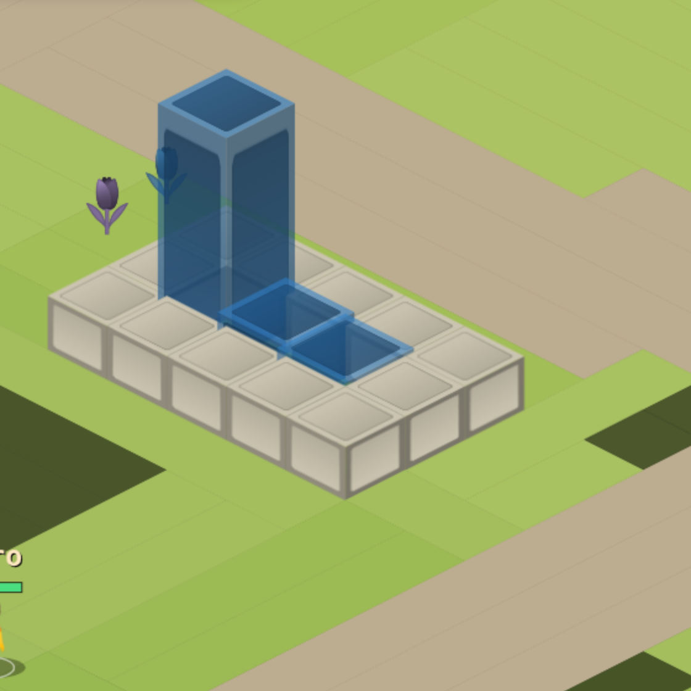 | 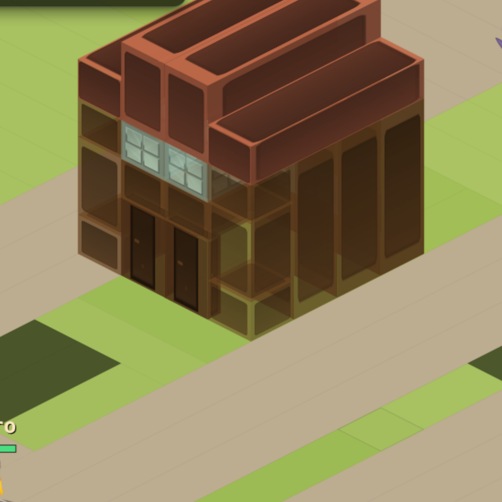 |
| 2 cells. Post plus oval. | 15 cells, 9 different pieces, a closed ring. | 30 cells. Body, roof, windows. |

| `fountain` | `office_5` (the skyscraper) | `lamp_post` |
|---|---|---|
| 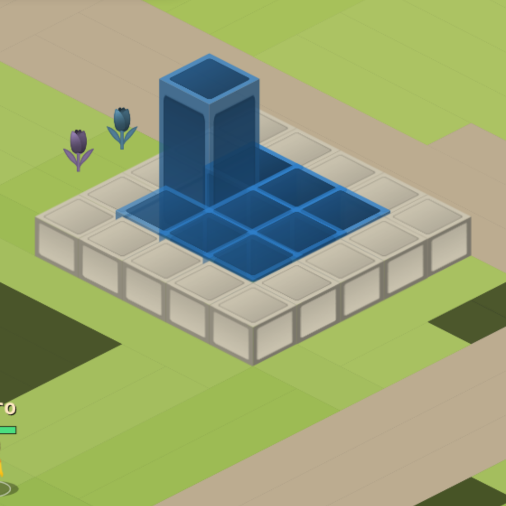 | 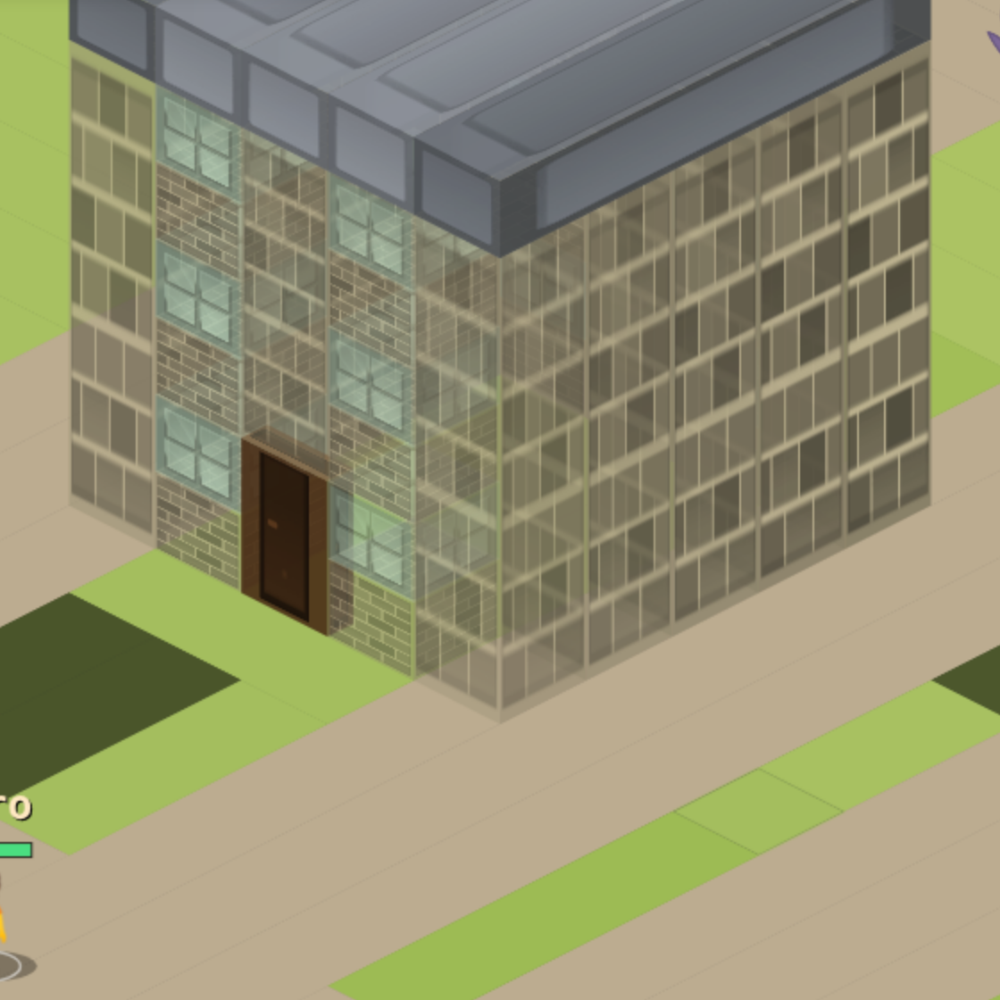 | 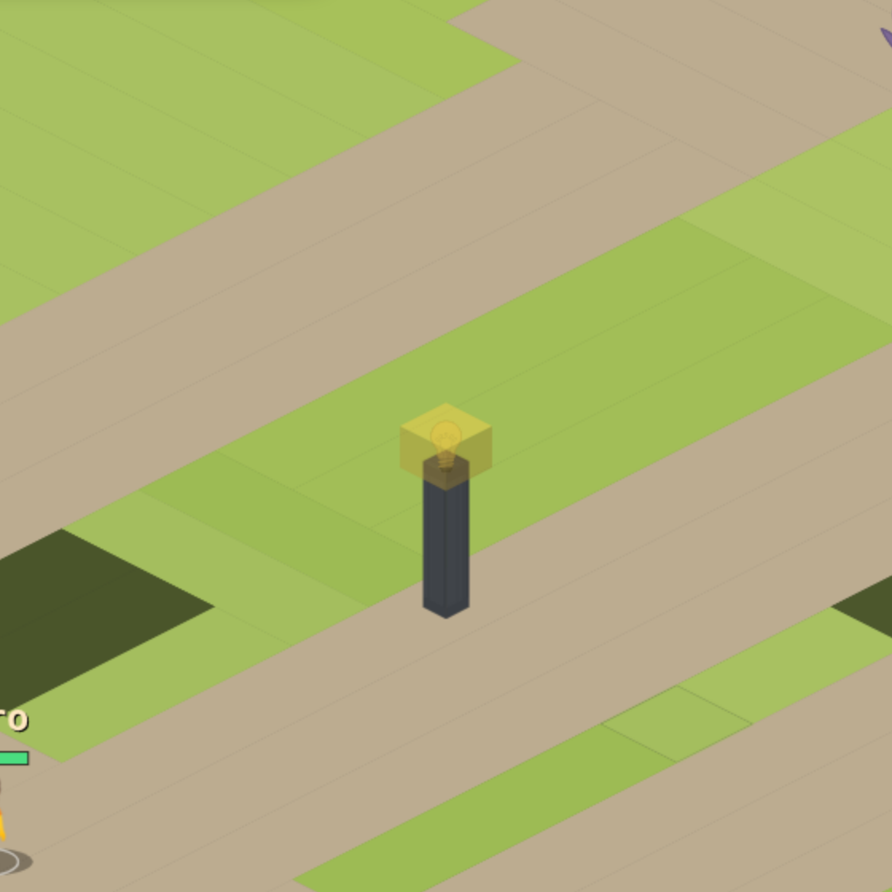 |
| The basin pattern at 5x5. | 43 cells, 7 levels, a parapet crown. | 2 cells. Shaft plus bulb. |


**The tree** (`renders/tree.png`) is the most important object in the catalogue, because it proves the
central point: **it is 100 percent cube shells and it still reads as a tree.** Two cells.

```
tree = trunk_mid  level 0  scale 0.60  scaleY 3.15               -> drawn 1.89 levels tall, 0.60 cell wide
       leaf_center level 2  scale 1.35  scaleY 2.00  shape circle -> drawn 2.70 levels tall, 1.35 cell wide
```

Three things do all the work.
1. **The trunk is not cube-shaped.** 0.60 wide by 1.89 tall is a post. A cube shell stops reading as a cube the
   moment its proportions stop being 1:1:1.
2. **The canopy is a different SHAPE.** `shape: "circle"` clips the block to an inscribed ellipse
   (`MAP-MODEL.md` §5, `iso.ts:2169`). Post plus oval is a silhouette with two tiers.
3. **They touch, by arithmetic.** `tree_comp/1` sets the canopy's level to `round(trunk_h * trunk_zoom)`
   (`tile_source.ex:2941`). Trunk top 1.89, canopy base 2.00. A 0.11 level overlap, not a guess.
   The code even refuses to build a tree that would break this: `assert_tree_dimensions!/3`
   (`tile_source.ex:2976`) raises unless `trunk_zoom < leaf_zoom` and the trunk is narrower than the crown.

The canopy is 2.25x the trunk's width and roughly the same height as the visible trunk. Big shape, medium shape.
That is the "1-2-3" rule from the research arriving independently in our own catalogue.

**The well and the fountain** (`renders/well.png`, `fountain.png`) are a **closed ring of 8 different
pieces** around a different interior material. `basin_rim/2` (`tile_source.ex:3416`) walks the perimeter and
`edge_piece/5` (`:3462`) picks `fountain_tl` / `_t` / `_tr` / `_l` / `_r` / `_bl` / `_b` / `_br` by position.
Corners appear once, edges repeat. Zero settings maps on the entire 15-cell well: everything is the `scale`
column, the `animations` column, and each tile's own colour. **The object is entirely piece selection.**

**The house and the skyscraper** (`renders/house_4.png`, `office_5.png`) add the third tier. Body in one
wall material, roof in a different material at a different value, windows and doors as small accents in a
bilaterally symmetric grid (`window?/2`, `building_compositions.ex:446`). Material variety is by TILE
(`wall_stone` vs `wall_brick` vs `wall_wood` vs `wall_plaster`), never by recolour. Roof sits at
`eave = wall_top + 1` so it lands on the wall, and the code explicitly refuses to put two cells in one block
(`:559`), with a test enforcing it (`building_compositions_test.exs:514`).

## 1.3 Why the bridges fail

His stated reason: *"you're using width and length as measures, and that shows you didn't understand what I
meant, you should build the bridge with the pieces we already have"*.

**That is correct, and it is only half the story.** Verified in the data, there are four faults, not one.

**Fault 1, length by stretching.** Every one of the 15 bridge compositions is the SAME 10 cells. A
`bridge_wood_3` and a `bridge_wood_7` differ only by `depth: 3` versus `depth: 7` on four cells. One tile is
smeared across seven cells. Nothing repeats, nothing articulates, so a long bridge is just a longer rectangle.

**Fault 2, material by recolour.** This is the bigger fault and it breaks the project's own written rule.
`TILESET-AUTHORING.md` §1: *"Variety of colour = edit the tile's settings. **Variety of material = use DIFFERENT
tiles** (e.g. `wall_brick` vs `wall_stone` vs `wall_wood`), not a recolour of one."* The bridges do exactly the
forbidden thing:

```
bridge_wood_5   rail cells carry  "color": "#8a6a45"
bridge_stone_3  rail cells carry  "color": "#b9b2a3"   <- same tile, grey paint
bridge_plank_7  rail cells carry  "color": "#8a6a45"   <- IDENTICAL to wood
```

`bridge_plank_*` is byte-identical to `bridge_wood_*`. Fifteen names, ten distinct objects. And the reason it
was built this way is written into the seed itself (`tile_source.ex:1805`): the two bridge tiles were
deliberately authored full-bleed so *"one pair of tiles serve the wooden, plank and stone crossings instead of
three pairs of pictures"*. That was an optimisation for tile count, and it cost the object its material.

**Fault 3, one tile playing three roles.** `bridge_rail` is the under-bearer at level -1 (`scaleY 0.9,
scaleZ 0.45`), the near parapet at level 0 (`scaleY 0.55, scaleZ 0.3`) and the far parapet (same, mirrored).
Three different structural members, one picture, squashed three ways.

**Fault 4, the parapets do not touch the deck, and the reason is a two-word bug.** `thicknessDir` names the face
a thinned block HUGS (`isoBlock.ts:148` `thinGroundQuad`, full toward `dir`, thin toward its opposite). The far
parapet sits at `dy 0` and the deck at `dy 1`, so it must hug +row, which is `left-down`. It is authored
`right-up`. The near parapet at `dy 3` must hug -row, which is `right-up`. It is authored `left-down`.

**Both are inverted.** Each parapet is pulled to the OUTER face of its own row, leaving a 0.6 cell gap of empty
air between it and the deck it is supposed to edge. That gap is clearly visible in
`renders/bridge_stone_3.png`: the far rail floats up and to the right, detached.

**Fault 5, incoherent material.** In that same shot the "stone" bridge has a **brown deck**. The deck cell
carries no `color` override, so it draws `bridge_deck`'s own tile colour `#a8794a`, which is wood brown. Grey
rails, brown deck, no arch, no pier, no abutment.

## 1.4 The one sentence

**The good objects are ASSEMBLED from pieces that each do one job and bring their own colour. The bridges are
one picture stretched, tinted and reused.** Everything else in this document follows from that.

---

# 2. Research findings

Deep sweep of how real games, engines and art teams do this. Each finding is followed by what it means here.

## 2.1 Isometric construction

- **2:1 diamond is the standard, and we are on it.** `arctan(1/2)` = 26.565 deg.
  [clintbellanger.net](https://clintbellanger.net/articles/isometric_intro/),
  [screamingbrainstudios.com](https://screamingbrainstudios.com/isometric-grids/),
  [pixelparmesan.com](https://pixelparmesan.com/blog/fundamentals-of-isometric-pixel-art).
  *Here:* `iso.ts:500` `tileW = cellSize * isoScale * 0.71`, `tileH = ... * 0.36`. Ratio 1.97:1. We are 2:1.
- **A true 2:1 cube has a vertical edge of 0.612 x tile width.** Measured on Kenney's shipped assets
  ([Isometric Miniature Prototype](https://kenney.nl/assets/isometric-miniature-prototype), `block_N.png`
  measured 158 px on a 256 px diamond).
  *Here:* our level rise is `tileW * ISO_BLOCK_H_FRAC` = `0.71 * 0.9` = 0.639 against a full diamond width of
  1.42, so **0.45**. **One level in this engine is 73 percent of a true cube's height.** A thing that should
  look cubic needs `scaleY` about 1.36. This is why unit-height stacks read squat.
- **"Use cuboids to create basic shapes and carve the desired shape out of it. Apply texture after the basic
  shape is solved."** Pedro Medeiros / saint11, [Isometric.gif](https://saint11.art/img/pixel-tutorials/Isometric.gif).
  His three worked examples are a stone arch, a column and a hut, which is our worked example exactly.
  *Here:* block out the mass in cells and levels first. Never start by choosing a pretty tile.
- **Top brightest, one side mid, one side darkest, from a single fixed light.**
  [Slynyrd pixelblog 54](https://www.slynyrd.com/blog/2025/1/23/pixelblog-54-isometric-pixel-art),
  [kethsong](https://kethsong.blogspot.com/2017/07/isometric-pixel-art-tutorial-ii-shading.html).
  Measured ratios: hand pixel art 1.0 / 0.67 / 0.31, soft 3D render 1.0 / 0.89 / 0.61.
  *Here:* **already done for you and you cannot fight it.** `faceLight` (`iso.ts:36`) with
  `LIGHT.dir = (-0.6,-0.8)` (`shared.ts:518`) gives **top 1.00, left 0.71, right 0.60**. Author art as a
  luminance map, never bake a light direction into a tile.
- **Foliage masses are roughly 3:2.** [Slynyrd pixelblog 54](https://www.slynyrd.com/blog/2025/1/23/pixelblog-54-isometric-pixel-art).
  *Here:* our `tree` canopy is 1.35 wide by 2.70 tall drawn, and the drawn level is 0.45 of a cell width, so
  2.70 levels = 1.22 cell widths. 1.35 : 1.22, near 1:1. Round crowns read; tall thin crowns do not.
- **"So long as the top surface is uniform the height of the tiles can vary."**
  [Slynyrd pixelblog 41](https://www.slynyrd.com/blog/2022/11/28/pixelblog-41-isometric-pixel-art).
  *Here:* this is the licence for `scaleY`. Any height is legal as long as the footprint diamond is unchanged.
- **Kenney ships openings as a 3 x 2 piece family** (`doorwayLeft` / `doorwayCenter` / `doorwayRight`, crossed
  with a `Bottom` row), and `doorway` has the **exact same bounding box as `wall`**: an arch is a wall with a
  hole carved out, not a separate object.
  *Here:* the single most useful finding for the gateway pattern. We have no such family and it is the art gap.
- **Direction grammar.** Kenney's [Isometric Roads](https://kenney.nl/assets/isometric-roads):
  `<base><connection-set>` (`roadNS`, `crossroadNEW`, `endN`) plus `Corner` for inner/outer and `Alt` for a
  silhouette variant of the same piece so repeats do not look identical.
  *Here:* our `<base>_<edge>` (`TILE-VOCABULARY-CONTRACT` §2.1) is the same idea. We have no `Alt` convention
  and repeated objects do look identical.

## 2.2 Silhouette and readability

- **Primary / secondary / tertiary, and the 70/30 split.** Neil Blevins,
  [Primary, Secondary and Tertiary Shapes](http://www.neilblevins.com/art_lessons/composition_primary_secondary_and_tertiary_shapes/composition_primary_secondary_and_tertiary_shapes.htm):
  *"If you squint at an image, the details tend to disappear and you're left with only your big shapes"*, and
  when splitting a mass prefer *"one shape that is 70% of the size, and one shape that's 30%"* over 50/50.
  Recurse at 30 percent for accents.
  *Here:* the only hard number in the whole sweep. **A composition's masses should be split 70/30, never 50/50.**
- **"Large shape, medium shape and small detail shapes. 1-2-3."**
  [World of Level Design](https://www.worldofleveldesign.com/categories/game_environments_design/silhouette-design-game-environments.php),
  and *"Do not add any details into the silhouette"* until the big form reads alone.
  *Here:* three tiers is the target. The bridge has one. The tree has two. The house has three.
- **Riot on clarity:** *"always preserve hierarchy"*, *"noise should be kept minimal"*, a champion needs
  *"a defining primary characteristic"*, and a skin *"should never remove or significantly alter"* it.
  [leagueoflegends.com/news/dev/clarity-in-league](https://www.leagueoflegends.com/en-us/news/dev/clarity-in-league/)
  *Here:* the entrance's primary characteristic is the dark opening under a span. Every entrance variant must keep it.
- **A stack of same-sized cubes is greeble.** Zach Soares,
  [Voxel Art: Reducing the Greebles](https://www.gamedeveloper.com/design/voxel-art-reducing-the-greebles):
  *"Noise will only cloud the design you intend to make. You have no direct control over the result."*
  *Here:* this is the tetris piece, named. Uniform cubes is a design-theory failure, not a taste complaint.
- **Never repeat a piece identically.** [The Level Design Book, env art](https://book.leveldesignbook.com/process/env-art):
  to build a rocky outcrop, *"duplicate, shrink, rotate, and slightly offset"*, an *"asymmetrical fractal structure"*.
  And *"repetition without variation appears cold and mechanical"*
  ([Russell Collection](https://russell-collection.com/what-is-repetition-in-art/)).
  *Here:* two identical `mushroom` cells at identical scale is exactly the forbidden thing. Vary one.
- **Tangents.** Blevins again: two things *"nearly touching"* create *"a visual mistake"* that
  *"confuse[s] the viewer as to the relative depth of the two objects"*.
  *Here:* two block stacks of equal height sharing an edge fuse into one ambiguous mass in iso. Offset one level.
- **Notan: one value must dominate, and the amounts must be unequal.**
  [virtualartacademy.com/notan](https://www.virtualartacademy.com/notan/).
  *Here:* our three face shades give a notan for free. What does not come free is unequal AREA. An object showing
  equal top, left and right face area reads busy.
- **Detail has a floor, not a scale factor.** Material Design system icons keep a **fixed 2 dp stroke regardless
  of icon size** ([m2.material.io](https://m2.material.io/design/iconography/system-icons.html)), and the live
  area is 20/24 = 83 percent of the grid, so about a 17 percent margin.
  *Here:* do not shrink the accents in lockstep with the object. A small object drops its accents entirely.

## 2.3 Modular kits, which is what a composition is

- **Footprints must be multiples of each other.** Joel Burgess and Nathan Purkeypile,
  [Skyrim's Modular Approach to Level Design](https://www.gamedeveloper.com/design/skyrim-s-modular-approach-to-level-design):
  *"a 512x512x512 room will always tile nicely with a 256x256x256 hallway, but a 384x384x384 room will eventually
  create gaps and/or overlaps"*.
  *Here:* a composition's footprint should be a multiple of the smallest thing it will ever abut. The 3-wide
  entrance matching `WOODLAND.pathWidth` of 3 is this rule, done right, by accident.
- **"Pieces always exist within the footprint."** Same source. Building to, or past, the footprint edge is a bug.
  *Here:* declare `footprint_w/h` honestly and keep every cell inside it. A `depthBack` that reaches outside the
  declared footprint is the modular-kit sin.
- **"Pick a pivot, and stick with it."** [GDC 2016 Fallout 4](https://archive.org/stream/GDC2016Burgess/GDC2016-Burgess_djvu.txt).
  *Here:* our pivot is the block, and `(col,row,level)` pins its base. The open question is sub-block tiles.
- **Priority order: utilitarian core, then variants, then hero pieces.** Same source. And a variant is a **texture
  swap, not an architecture change**: *"Material Swaps: Only changes the textures. Not an architecture change."*
  *Here:* the exact opposite of the bridges, where a material swap WAS the whole variant. A material variant is a
  different TILE; a colour variant is a settings change on one tile. Those are different things.
- **Size the family by how often it is stamped.** Skyrim's cave kit, used 200+ times, has ~50 pieces in one
  sub-kit. The Ratway kit, used twice, has 7.
  *Here:* a bridge is stamped on nearly every map. It deserves more than 3 tiles. An entrance is stamped at every
  gate. Both are core kits, not hero pieces.
- **Layered inserts beat baked combinations.** Fallout 4 broke one corner assembly from 20 objects into 123 for
  *"kit interchangeability"* and *"flexible layouts"*.
  *Here:* stack a window tile onto a wall tile, never bake a wall-with-window.
- **Grid snapping alone lets you "ship a doorway that opens to nothing"**
  ([StraySpark](https://www.strayspark.studio/blog/modular-kit-snapping-ue5-comparison-2026)). Position is not
  connection.
  *Here:* our blocks cannot drift, but nothing checks that a span actually lands on its uprights. That check is
  the process gate in step 6.

## 2.4 Autotiling and piece families

- **Edge tiles versus corner tiles, and it is decided by what the thing IS.** Guy Walker's Wang/blob reference,
  mirrored at [boristhebrave.com](http://www.boristhebrave.com/permanent/24/06/cr31/stagecast/wang/intro.html):
  matching an edge *"only affects one adjacent tile"* whereas matching a corner *"affects three adjacent tiles"*,
  so **corner sets make patches and edge sets make paths**. Both are 16 pieces. The full set is 256, the blob
  reduction is **47**.
  *Here:* roads, fences, walls, parapets, handrails are **edge** families. Terrain, floors, water, decks are
  **corner** families. Our `fountain_*` rim is an 8-piece perimeter set, which is the practical subset.
- **47 collapses to 16 if you declare allowed rotations and mirrors.**
  [Classification of Tilesets](https://www.boristhebrave.com/2021/11/14/classification-of-tilesets/): `S-V2E2-RM-Blob`
  is 16. Sub-blob is 20 quarter-pieces for the same 47 results
  ([Tileset Roundup](https://www.boristhebrave.com/2013/07/14/tileset-roundup/)).
  *Here:* we already rotate a texture for free (`turnFaceTexture`, `isoBlock.ts:230`, a basis swap, no art). We do
  not expose it as a per-tile declaration. That is the cheapest available reduction in baked PNGs.
- **9-slice and its 3D form, 27-slice.** [9-slice scaling](https://en.wikipedia.org/wiki/9-slice_scaling);
  27-slice is 8 fixed corners, 12 one-axis edges, 6 two-axis faces, 1 three-axis core
  ([Unreal writeup](https://www.artstation.com/blogs/haukethiessen/V9zn2/using-27-sliced-meshes-in-unreal)).
  *Here:* **the correct model for a bridge of any length and a building of any size.** 27 roles stamp a 2x2x2 shed
  and a 9x5x4 warehouse. Our buildings already do the 2D version of this.
- **When a family beats a stretch.** Stretch along an axis where the material is genuinely uniform and the size is
  continuous. Author a family wherever the piece must **change shape at a boundary**: corners, junctions,
  terminations, transitions.
  *Here:* the bridge DECK may legitimately be a stretch. The bridge END may not. The current bridge stretches both.
- **"Winged tiles"**, art that deliberately overlaps its neighbour, is a named published technique explicitly
  *"useful for grass spillover and isometric objects"*
  ([Beyond Basic Autotiling](https://www.boristhebrave.com/2021/09/12/beyond-basic-autotiling/)).
  *Here:* `scale > 1` on a cell is exactly this. The fountain water at 1.15 and the tree canopy at 1.35 are winged
  tiles. It is legitimate, but it must be a declared intent, not an accident.
- **Per-piece metadata every mature format carries and we do not:** a **probability/weight**, an **allowed-transform
  set**, and a **doc string on the family**. Tiled stores `wangid` as `uchar[8]` plus `probability`
  ([JSON map format](https://doc.mapeditor.org/en/stable/reference/json-map-format/)); Godot stores terrain peering
  bits, Y Sort Origin, Texture Origin and alternative tiles
  ([Using TileSets](https://docs.godotengine.org/en/stable/tutorials/2d/using_tilesets.html)); LDtk stores
  `chance`, `breakOnMatch`, `flipX/flipY`, `outOfBoundsValue`, `tilePivotX/Y`
  ([LDtk rules](https://ldtk.io/docs/general/auto-layers/auto-layer-rules/)).
  *Here:* our Postgres jsonb is a superset of all of these and carries none of the three. Worth adding.
- **The autotile identity should be a numeric field, not a substring of the label.** Every serious implementation
  keys on the bitmask. Encoding it in the name is the *"naming conventions are brittle"* failure.
  *Here:* keep `<base>_<edge>` as the HUMAN label, and if we ever autotile at runtime, put the mask in settings.

## 2.5 Pipelines and review gates

- **Blockout first, and the reason is testability.** [The Level Design Book, blockout](https://book.leveldesignbook.com/process/blockout):
  *"You can't playtest a design document or a layout sketch, but you can playtest a blockout."* Metrics given:
  walls **150 to 200 percent of the scale figure**, entryways **at least twice as wide as the figure**.
- **Named passes:** blockout, silhouette, value, detail.
  [The Level Design Book, env art](https://book.leveldesignbook.com/process/env-art) and
  [Poly Haven](https://blog.polyhaven.com/simple-prop-workflow/): *"Pay close attention to the silhouette,
  proportions and shapes that define the prop"*. And *"START BIG, and save smaller details for later art passes"*.
- **Work every piece to 50 percent, iteratively, not one piece to 100 percent.** Same source, and Christian
  Cunningham on 80.lv: *"I bring each model to about 30% completion and bring up my entire level slowly so no part
  gets overlooked."*
  *Here:* build all cells of a composition rough, then tune them together. A perfect trunk next to a missing
  canopy cannot be judged at all.
- **Three kit stress tests: loopback, stack, gap.**
  [Modular kit design](https://book.leveldesignbook.com/process/blockout/metrics/modular).
  *Here:* runnable headlessly against real pixels. Rotate a composition four times and assert it closes; stamp it
  at levels 0, 1, 2 and assert the seams mate; render the family adjacency and assert no transparent seam.
- **Vector-to-PNG baking is a published, recommended pipeline for exactly our kind of art:** bold, geometric,
  stylised, multi-size ([Sunstrike Studios](https://sunstrikestudios.com/en/blog/vector_vs_raster_in_game_art/)).
  *Here:* `priv/tilegen/tiles.json` + `bake.mjs` is a correct pipeline and should not be replaced. One operational
  note: our bake already supports `--only=label1,label2` to avoid rewriting 452 PNGs, use it.

## 2.6 Gateway proportion, the numbers for the worked example

- **Roman triumphal arches.** Arch of Titus: opening **8.3 m high x 5.36 m wide** = **1.55:1**. Arch of
  Constantine central bay: **11.5 x 6.5** = **1.77:1**, lateral bays **2.18:1**.
- **Stonehenge.** Outer sarsen circle: uprights 4.11 m, gaps about 1 m, so **gap : post height = 1 : 4.1**, which
  reads open and airy. Trilithon horseshoe: uprights 6.7 to 7.6 m, gap 0.76 to 1.07 m, so **1 : 7 to 1 : 10**,
  which reads as a weighty threshold.
- **Torii gates.** [suikoushya.com](https://suikoushya.com/ja/2020/04/13/toriiproject3/):
  *"The distance between the pillars and the distance from the ground to Nuki should be the same, making the
  entrance to the torii square."* [thecarpentryway](https://thecarpentryway.blog/2013/03/japanese-gate-typology-31/):
  post spacing to cap length is **3:5**, so the cap oversails, and the horizontal members get **thinner as they
  go up**.
- **saint11's pixel arch**, measured from the tutorial frames: the lintel band is **28 percent** of the total
  elevation and is **proud of the piers**.

> **The convergence:** Roman entablature, torii kasagi and saint11's pixel lintel all independently land on
> "the cap is a quarter to a third of the elevation and it overhangs the uprights". That overhang is what
> separates an arch from a hole in a wall. **Our first entrance had no overhang and no height. That is why it
> did not read.**

**Translated to this engine.** One cell spans `tileW` horizontally per step and one level rises `0.9 * tileW`.
So for a footprint `W` cells wide, an opening at the Roman 1.55:1 needs about **`1.55 * W / 0.9` = `1.7 * W`
levels**. A 3-cell gate wants **uprights near 4.3 levels and a crown near 5**. The first attempt used level 1.
That is the whole of it.

---

# 3. THE ENGINE FACTS SHEET

The part nobody wrote down. Every setting that changes how a composition cell draws.

## 3.0 The two facts that explain the tetris piece

> ### **EVERY TILE DRAWS AS A CUBE SHELL BY DEFAULT.**
> The baked picture is painted onto the block's top face and its two camera-visible side faces, sheared to the
> iso angle, over a solid fill of the tile's colour shaded per face. `TileDisplay` defaults to `'all-faces'`
> (`tileset.ts:26-34`), drawn by `drawIsoTileBlockLive` (`iso.ts:1868`) through `fillIsoFaceWithTile`.
> **There is no billboard path for a placed tile. A tile is a solid, always.** If you place a mushroom tile with
> no settings you get a red cube with a mushroom printed on three of its faces.

> ### **A COMPOSITION CELL IS ALWAYS HEIGHT 1. ITS DRAWN SIZE IS ENTIRELY `scale` AND `scaleY`.**
> `compositionCellRender` hardcodes `height: 1` (`composition.ts:137`), on purpose: a tile is pure art and carries
> no height. So `blockLayers(1)` is 1 and `layerBlockScale(1)` is 1, and the geometry collapses to:
> ```
> drawn half-width  = tileW * (scaleX ?? 1) * (scale ?? 1)              iso.ts:2386
> drawn half-depth  = tileH * (scaleZ  ?? 1) * (scale ?? 1)             iso.ts:2390  (1 when a thickness map is present)
> drawn height (px) = tileW * 0.9 * (scaleY ?? 1) * (scale ?? 1)        iso.ts:2394, ISO_BLOCK_H_FRAC = 0.9 at iso.ts:1615
> one level (px)    = tileW * 0.9                                       isoStackLift, iso.ts:1621
> ```
> **Therefore: a cell's drawn height in LEVELS is exactly `scale x scaleY`.** That one product is how you make a
> post, a slab, a beam or a tower. Learn it and most of the rest follows.

## 3.1 The settings table

| Setting | Where | What it does to the picture | Real example that works | The trap |
|---|---|---|---|---|
| **`scale`** | cell COLUMN, not settings | Uniform zoom on all three axes. `<1` shrinks the piece inside its cell, `>1` spills it over the neighbours (a "winged tile"). | `tree` trunk 0.60, canopy 1.35. Fountain water 1.15. Entrance feet 0.7. | It multiplies `scaleY` too, so halving `scale` halves the height. Compensate.
| **`scaleX`** | settings | Width only. Narrows the diamond across. | `tree_palm` trunk `scaleX 0.7` on top of `scale 0.4`, a very thin palm. | Screen axis, not world axis. It shears when the camera turns. Use `thickness` for anything that must stay thin from every facing.
| **`scaleY`** | settings | **Height. The single load-bearing setting.** Across all 14 building types it appears 246 times; `depth`/`depthDir` 89 each; nothing else at all. | `post` 7.0 (lamp), wall runs 2 to 4, bridge deck 0.09, entrance mouth 0.06. | Absent means 1 level, and 1 level is only 73 percent of a cube. Anything that should look cubic needs about 1.36.
| **`scaleZ`** | settings | Thickness into the screen, the historical screen-axis squash. | `door` tile, authored 0.3 so a door is a panel in the wall wherever it lands. | **Silently ignored when a `thickness` reach map is present** (`iso.ts:2390`). Pairing it with `thicknessDir` converts it to a reach map, which is what you want.
| **`thicknessDir`** | settings | With `scaleZ`, says which face the thinned block HUGS. Full reach toward `dir`, thin toward its opposite (`tileThicknessReach`, `tileset.ts:323`). World axis, so it survives camera rotation and building rotation. | A door thin toward its own wall. | **Get the direction backwards and the piece is pushed to the far side of its cell, leaving a visible gap.** This is live in both bridge parapets today. `left-down` = +row, `right-up` = -row, `right-down` = +col, `left-up` = -col (`DEPTH_CELL_STEP`, `isoBlock.ts:258`).
| **`thickness`** | settings | The explicit four-reach map, `{"left-down": 0.4, ...}`. Anything the shorthand cannot say. | Bridge `post`, all four reaches 0.64, a square-section pile that stays square at every camera facing. | A map of all 1s means nothing is thinned, and the renderer knows (`thicknessThins`, `isoBlock.ts:89`).
| **`depth` + `depthDir`** | settings | Extrudes this ONE cell into ONE long iso box spanning `depth` cells along a diagonal, anchored at its base cell. One draw, no column seams. | Roof bars: `depth: 4, depthDir: "left-down"` spans a house's whole depth as one block. | **This is the stretch.** Correct for a genuinely uniform run (a deck, a roof plane). Wrong for anything that must articulate along its length. It is how the bridges got long without getting built.
| **`depthBack`** | settings | Extra cells the same block spans BACKWARD from the anchor. | (none seeded) | Reaches outside the declared footprint if you are not careful, which breaks the modular-kit footprint rule.
| **`depthPerp` / `depthPerpBack`** | settings | The perpendicular extents, making the cell a RECTANGLE (a 2x2 deck as one tile). | **Zero occurrences in the backend.** Frontend-only capability today. | Untested from the data side. Treat as unproven.
| **`shape`** | settings | `'square'` (default cube) or `'circle'`, which clips the block to an ellipse INSCRIBED in its own projected hexagon, plus a bevel on the top-front vertex. Proportional: a tall block gives a tall oval. Keeps the art, the colour, the per-face shading. | **Every tree canopy.** `bush_round`. | It rounds the SILHOUETTE, it does not repaint. A wide flat block becomes a disc, which is how the entrance mushrooms came out as counters.
| **`level`** | cell COLUMN | Which block up the cell sits in. One level = `tileW * 0.9` px. | Tree canopy at `round(trunk scaleY x scale)`. Bridge bearers at **-1**, under the deck. | Two cells in the same `(dx,dy,level)` is a bug. The buildings have a test for it (`building_compositions_test.exs:514`); the trees do not, which is how `tree_sapling` ended up with its canopy inside its trunk.
| **`pose`** | settings | Per-cell nudge: `dx`, `dy`, `rotate`, `flip`, `scale`, applied as a canvas transform (`pose.ts:52`). `dy` is in `tileH` units. | Lamp bulb `{"dy": -1.8}`, lifting it onto the post top. | A pose moves the PICTURE, not the block. Collision, depth sort and the pick still use the unposed cell. Use it for millimetres, not for structure.
| **`zIndex`** | cell COLUMN | Draw priority. Higher draws later, overriding the positional depth sort in every view. | Authored 0 everywhere today. | Reach for it only when the positional sort is genuinely wrong. Usually the real fix is a level or a footprint.
| **`light`** | settings | The cell casts a radial ground glow pool at night. `{intensity, distance, color, on}`. `distance` is in cells. | Lamp bulb `{1.0, 3.2, "#ffc24d"}`. Entrance mouth uses it with a near-black colour for the opposite effect. | Night only (`drawNightLighting`). It does nothing to the day render, so it cannot be your only darkness.
| **`color`** | settings | Tints the baked tile by luminance (`tintedImage`). | Bridge cells, because `post` is shared with the lamp and is charcoal. Entrance mouth, where the darkness IS the feature. | **The most abused setting.** `MAP-MODEL` §8 and his own words: *"colors should be settings in the object, things we can modify, remember objects are just tile compositions at the end of the day."* A piece already owns its colour. `tile_source.ex:3546` says it best: *"A boulder is already the colour a boulder is... Recolouring them from this function would be inventing a palette in code."* Set it only when one tile is deliberately reused across variants that must differ, or when the colour is the feature.
| **`display: "single"`** | settings | Drops the tile off the faces and draws **ONE centred billboard inside the block, at `SINGLE_TILE_FRAC` = 0.6 of the block width** (`shared.ts:411`), **over a plain shaded shell** (`drawIsoSingleTileBlock`, `iso.ts:2064`). | The lamp BULB, and only that, among the good objects. | **On its own it does NOT remove the cube.** It replaces "picture on three faces" with "small picture floating inside a coloured cube". Alone it makes things worse, not better. **No tree, no wall, no roof, no deck, no fountain piece uses it.**
| **`transparent: true`** | settings | Drops the coloured shell. With `display: single` you get the billboard alone. **Without `display: single` the tile draws NOTHING at all** (`iso.ts:2222`, a bare `return`). | Eight flower tiles and `thicket`, at TILE level (`tile_source.ex:75-82`). | **BROKEN ON THE COMPOSITION PATH. See 3.2.** And on its own it is an invisibility switch.
| **`actAsTile`** | tile settings | The cell behaves as if a tile is already in it, so the next tile stacks ON TOP (`cellStack.ts:247`). Opt-in, default false. | **No tile in the live DB sets it.** | Not a composition-cell setting. It is read from the TILE by slug, and a composition cell cannot author it.
| **`stackAt`** | tile settings | Where in the cell the next thing stands: 1 is this tile's top face, 0 its bottom (`cellStack.ts:222`). | `mushroom`, `red-mushroom`, `thicket`, `shrub`, `bush`, `water`. | Same: a TILE setting, not a cell setting. How tall a thing DRAWS and whether you can stand on it are two different questions.
| **`height`** | tile COLUMN | The tile's own default block height. | `snag` 0.0, `trunk_mid` 1.0, `water` 0.35. | **A composition cell ignores it entirely.** `compositionCellRender` forces `height: 1`. The tile's height matters for the paint brush and for stacking, never for a stamped composition cell.
| **`walkable`** | cell COLUMN | Ground-course collision only. A level-0 cell writes the 2D collision map; higher levels never do (`composition.ts:297`). | Entrance mouth `true`, uprights `false`. | Setting `walkable: false` on a level-3 span does nothing. Collision is 2D and only the ground course speaks.

## 3.2 The bug you must know about before you author anything

**`transparent` never reaches a stamped composition cell. It is silently dropped.**

The stamp builds a cell's render settings in `cellSettings` (`composition.ts:185`), which merges exactly three
things: `tileRenderBehavior(tile.settings)`, the cell's `display`, and the apex badge.
`tileRenderBehavior` (`tileset.ts:252`) whitelists `minAlpha`, `fadeNear`, `cutawayRoof`, `display` and
`collision`. **Neither function reads `transparent`, from the cell or from the tile.**

Proven live, not inferred. Stamping the seeded `forest_entrance` and reading the placed assets back off the grid:

```
API serves       dx0 dy0: {"display": "single", "transparent": true}
asset on grid    label "oak-tree"     settings {"fadeNear": true, "display": "single", "collision": [...]}
asset on grid    label "red-mushroom" settings {"display": "single", "collision": []}
```

`transparent` is gone in both. So every entrance piece draws **shell plus billboard**, which is a coloured cube
with a small picture floating in the middle of it. That is `renders/forest_entrance.png`, and it is the
tetris piece, still live today.

The only place `transparent` reaches the renderer at all is `GENERATED_PROP_RENDER`
(`stageGenerator.ts:414`), a **hardcoded frontend list** of two entries (`flower`, `ground_decor`), which is
itself a violation of "the backend owns all data".

**The fix is two lines and it plumbs data that already exists.** Add `transparent` to the whitelist in
`tileRenderBehavior` and read `cell.settings?.transparent` in `cellSettings`. `AssetSettings.transparent`
already exists (`IsometricGrid.ts:31`) and the renderer already honours it. **I have not made this change.**
It is a prerequisite for the entrance work, and it should be its own small ticket with its own test.

**Until it lands, the way to escape the cube is proportion and `shape`, not `transparent`.** Which is what the
tree has always done.

## 3.3 Six more facts with teeth

1. **A composition key starting with `tree` changes render behaviour.** `stampComposition` collapses vertical
   runs of the same label into one taller block, `canCollapse = !kind.startsWith('tree')` (`composition.ts:216`).
   Name a non-tree composition `tree_arch` and you silently lose run collapsing.
2. **The art's alpha margin decides whether a cube reads as a solid.** `post.png` and `sq_brown.png` are rounded
   squares with a **31 percent transparent margin**, so a block extruded from them shows its own dark interior
   through the gap: the "open crate". `bridge_deck` and `bridge_rail` were authored **full bleed, 0 percent
   transparent**, so a block made of them is a solid body (`tile_source.ex:1798-1807`). Check a tile's alpha
   before you extrude it.
3. **Ascii bakes WHITE on transparent; emoji bakes in colour.** An ascii PNG is a tintable luminance MASK
   recoloured per zone at render; an emoji PNG already carries its colour (`priv/tilegen/atlas.html`, and
   `tile_source.ex:620`). So a colour setting moves the HUE and the ART owns the TONE. Art drawn at three
   different luminances will never read as one material.
4. **Rotation is entirely frontend.** The backend stores one facing, south. `depthDir` and `thicknessDir` are
   named as WORLD axes precisely so `rotateDepthDir` / `rotateThicknessReach` can turn them with the footprint
   (`composition.ts:156-165`). `scaleX` and `scaleZ` are SCREEN axes and do not rotate, which is why a post that
   uses a four-reach `thickness` map keeps its section at every facing and one that uses `scaleX` does not.
5. **A composition stacks onto whatever is already in its anchor cell.** `baseLevel = cellStackTop(...)`
   (`composition.ts:199`), added to every cell's authored level. You author from 0 and the stamp lifts the whole
   object onto the floor. Do not pre-add a lift.
6. **`category` is what makes an object appear in the editor palette.** `Composition.category`
   (`tileset.ts:171`), served from `compositions.category`. **Absent means not browseable.** `lamp_post_failing`
   has a deliberately nil category. Anything new and placeable needs one.

## 3.4 What the catalogue actually holds

378 tiles per style, 53 compositions, both tilesets identical in structure.

**Autotile families that exist:** `wall_stone`, `wall_brick`, `wall_wood`, `wall_plaster` (full 9), `canopy`
(full 9, **placed by nothing**), `fountain` (8, no `_c`), `shore` (8), `water` (`_c` only).

**Families that do NOT exist and would have to be authored:** anything for a bridge, anything for an arch,
any deck or plank family, any parapet or handrail family, any pier or abutment.

---

# 4. THE PROCESS

Nine steps. Each has a gate. You do not pass the gate by intending to fix it later.

### Step 1. FIND the reference. Do not accept a description of one.

**Search for real isometric art of the thing you are about to build.** By name, plus "isometric". Save the
images into `docs/references/` and add a row to `docs/references/SOURCES.md` with the URL and the licence.

Rules that exist because each one was broken:
- **A written description is NOT a reference.** An entrance was built from a paragraph describing a picture and
  came out as two posts with grey balls on them. If the picture is not on disk, you have no reference.
- **Same projection or it is worthless.** This engine draws a 2:1 diamond. Reference art in a different
  projection teaches the wrong proportions, and wrong proportions are the whole failure mode.
- **It is your job to find it.** Asking for the reference instead of searching for it is not a blocker, it is
  the step. His words: *"You were supposed to search that, in fact, it was supposed to bbe part of the framework
  search, getting the references for the requested objects, and asking for approval to build"*.
- **Our own approved objects are also references**, and they set the floor: the house, the well, the fountain
  and the trees. His standard is that a new object lands near them, not far behind. If your result is visibly
  worse than the well, it fails, whatever the cell table says.

Then read the reference as STRUCTURE, not as art: name the masses, count them, say which is biggest and which
one the eye goes to first.

**Gate:** the image files exist in `docs/references/`, and a written list of 3 to 5 named parts. If you cannot
name the parts you cannot build them.

### Step 1b. APPROVAL, and this one is a full stop.

Put the references in front of him and **ask whether to build against them**. Nothing below this line starts
until he says yes.

This gate exists because four objects were designed, rendered and written up against references that were
either paraphrased or absent, and every one of them was rejected on sight. The cost of asking is one message.
The cost of skipping is the whole object, twice.

**Gate:** his approval, in words. Not inferred from silence, and not from an earlier approval of something else.

### Step 2. Silhouette blockout
Decide the **footprint in cells** and the **height in levels**, and nothing else. Draw the masses as an ascii
elevation. Apply the proportion rules:
- **Three tiers**: a big shape, a medium shape, a small accent. Two tiers is a minimum, one tier is the tetris piece.
- **Split 70/30, never 50/50.**
- **Gateway openings**: height in levels about `1.7 x width in cells` (section 2.6). A 3-cell gate needs 4 to 5 levels.
- **Footprint** should be a multiple of what it abuts. A path-width-3 gate is 3 wide.
- Everything else, remember one level is only 0.45 of a cell width, so heights need bigger numbers than instinct says.
**Gate:** the ascii elevation reads as the object with no labels on it. Show it to someone.

### Step 3. Piece selection
For every mass, pick a **real catalogue tile**. Rules:
- **Prefer a piece FAMILY** where the shape changes at a boundary (corners, ends, junctions). `curl` the API and
  look for `<base>_tl/_t/_tr/_l/_c/_r/_bl/_b/_br`.
- **One tile, one role.** If you catch yourself using the same label for two different structural members, stop.
  That is the bridge's mistake.
- **Material variety is a different TILE. Colour variety is a setting.** Never fake stone by tinting wood.
- If nothing in the catalogue fits, **STOP AND AUTHOR THE ART**. Do not bend a tile with scale and hope, and do
  not substitute the nearest round thing. That is the bridge's mistake and it is also this document's: the first
  forest entrance used `boulder`, a SPHERE, as the springer of an arch, and rendered as grey balls on posts. The
  standing rule is that a missing tile gets authored through `priv/tilegen/tiles.json` + `bake.mjs`, never left
  as a gap and never faked.
**Gate, and it is a HARD STOP:** a table of mass to label, every label verified present in `/api/tilesets`, and
**zero** masses served by a substitute. A mass with no real piece means the art gets authored first. Writing
"art that would fix it" at the bottom of the page and shipping the substitute anyway is how this failed.

### Step 4. Proportion pass
Give each cell its `scale` and `scaleY`. Remember **drawn height in levels = `scale x scaleY`**.
- A **post** is roughly 0.3 to 0.6 wide and 2 to 5 tall.
- A **slab or deck** is 1.0 wide and 0.1 to 0.2 tall.
- A **beam or lintel** is 0.9 to 1.0 wide, 0.2 to 0.35 tall, with `depth` across the span.
- A **mass or crown** is 1.2 to 1.9 wide, similar tall, usually `shape: circle`.
- Horizontal members get **thinner as they go up** (the torii rule).
**Gate:** compute the drawn height of every cell and write it in the table. The number that matters is whether
the thing above starts at or below the thing below ends.

### Step 5. Contact pass
For every stacked piece, **derive its level from the drawn height beneath it**, the way the tree does:
`level = round(lower scale x lower scaleY)`. Aim for a small OVERLAP, 0.1 to 0.2 levels, never a gap.
Check `thicknessDir` on anything thinned: it must hug the face nearest the thing it attaches to.
**Gate:** no two cells share a `(dx, dy, level)`. Every raised cell has something under it. No piece is pushed
away from its neighbour by a thickness.

### Step 6. Settings pass
Add the rest, in this order of preference:
`shape` -> `depth`/`depthDir` -> `thickness` -> `light` -> `pose` -> `color` (last resort) ->
`display: single` + `transparent` (only for a small accent that must read as a picture, and only once the fix in
3.2 has landed).
**Gate:** every `color` you wrote has a one-line justification. If it does not, delete it and let the tile's own
colour stand.

### Step 7. Stamp and rotate
Author south-facing only. Confirm every `depthDir` and `thicknessDir` is a WORLD axis so the frontend can rotate
it. Give the composition a `category` so it becomes a placeable object.
**Gate:** render at all four camera facings. A piece that is correct at facing 0 and wrong at facing 2 is using a
screen axis where it needs a world axis.

### Step 8. Render and compare
Render the object on **open ground, alone**, and crop it. Put the crop **beside the reference, same document,
same size**.
```
export PATH=/home/visiond/.nvm/versions/node/v24.15.0/bin:$PATH
cd /home/visiond/projects/game-engine/game-website
NAME=my_object SPEC=/tmp/specs/my_object.json ZOOM=7 SIZE=560 node .probe/objshot.mjs   # a proposal, nothing seeded
NAME=well COMP=well FP=5x3 ZOOM=7 SIZE=560 node .probe/objshot.mjs                      # what the DB serves today
```
`.probe/objshot.mjs` builds the cell list live on the running grid with the same field mapping the stamp uses,
so you can see a design before you seed it.
**Gate:** the two pictures are in the document, side by side. Not a description of the picture. The picture.

### Step 9. Report, part by part
Walk the part list from step 1 and say, for each, whether it matches. His rule:
*"we should have a design, then model over said design, then compare the end result visually with the original
design, and report when it has been validated they're the same or close."*
**"Close enough" means: every named part is present, in the right relationship, at the right relative size, and
the thing your eye goes to first in the reference is the thing your eye goes to first in the render.**
Colour exactness, texture detail and art quality are NOT part of close enough. Silhouette, proportion, contact
and hierarchy are.
**Gate:** his eyes. Nothing is done until he says the render matches. A defect you can see is a defect you report,
not a defect you explain.

---

# 5. PATTERNS

Six shapes. Start from one, do not start blank. `dx` runs +col, `dy` runs +row, `lvl` is the stack level.

## 5.1 The GATEWAY (an arch, a portal, an exit marker)

```
     [cap]                  crown, 1 level proud of the springers
  [s]═══════[s]             springers, landing on both uprights
   │  DARK   │              the mouth: the darkest thing in the frame
   │  MOUTH  │              opening height in levels ~ 1.7 x width in cells
  ─┴──▓▓▓────┴─             cover at the feet, asymmetric
```

| dx | dy | lvl | role | typical settings |
|---|---|---|---|---|
| 0 | 0 | 0 | left upright | `scale 0.5`, `scaleY` so `scale x scaleY` is 4 to 5 |
| W-1 | 0 | 0 | right upright | same, **deliberately different tile if the place is grown, matched if it is built** |
| mid | 0 | 0 | mouth | floor tile, `scaleY 0.05`, dark `color`, `light` with the same dark colour |
| 0 | 0 | top | left springer | `shape circle` for rock, or a `depth W` beam for a built lintel |
| mid | 0 | top+1 | keystone / cap | 1 level proud, the torii and Roman rule |
| W-1 | 0 | top | right springer | |
| 0, W-1 | 1 | 0 | feet | `scale 0.4 to 0.7`, vary the two |

Rules: middle cell stays **walkable**, the uprights **block**. The cap must **oversail**. Openings shorter than
1.5 : 1 read squat.

## 5.2 The TOWER (a post, a pillar, a trunk, a lamp, a chimney)

```
  ( o )   cap or crown, wider than the shaft, shape circle if organic
   │ │    shaft: scale 0.3 to 0.6, scaleY 3 to 8
   │ │    drawn height = scale x scaleY
  ─┴─┴─   base course, optional, one level, slightly wider
```
Two cells is usually enough. The cap's `level` = `round(shaft scale x scaleY)`. The cap must be **wider** than the
shaft, which is the one invariant the tree code actually enforces. `lamp_post` and every tree are this pattern.

## 5.3 The SPAN (a bridge, a walkway, a viaduct)

```
  P═══════════════P      parapet or handrail, both sides, hugging the deck
  ┌───────────────┐      deck: ONE stretched run is legitimate, it is uniform
  │  ║     ║     ║│      piers at intervals: this is what says "it spans a gap"
  A               A      abutments where it meets the bank
```
| Course | lvl | What |
|---|---|---|
| piers / piles | -1 | at **intervals along the length**, not only at the ends. **This is the whole pattern.** |
| deck | 0 | `depth = span`, `scaleY 0.12 to 0.18`. The one place a stretch is right. |
| parapet / rail | 0 or 1 | `depth = span`, thinned, `thicknessDir` hugging the DECK side |
| end posts | 0 | taller than the parapet, terminating it |
| abutments | -1 | at both ends |

The rhythm of the piers is what reads as length. A smooth 7-cell bar reads as a plank.

## 5.4 The BASIN (a well, a fountain, a pond, a planter, a courtyard)

```
  tl  t  t  t  tr      a CLOSED RING of 8 different pieces
  l   ▒  ▒  ▒  r       a different material inside
  bl  b  b  b  br      corners appear once, edges repeat
```
Straight from `basin_rim/2`. Interior tile is a **different material**, usually at `scale 1.15` so it wings over
the rim seam. Minimum footprint 3x3. This is the pattern to reach for whenever an object has an inside and an
outside.

## 5.5 The CANOPY (a crown, a dome, a roof mass, a bush)

One cell, `shape: circle`, `scale` 1.2 to 1.9, `scaleY` giving a drawn height near the width, sitting at
`round(support scale x scaleY)`. Must be **wider than what holds it up**. It is the medium shape in the 1-2-3.

## 5.6 The GROUND SCATTER (cover at the feet, litter, moss, rubble)

Small cells at `scale 0.4 to 0.7`, `scaleY 0.5 to 0.9`, `walkable: true`, at level 0 around the base of the main
mass. **Vary them**: different tiles, or the same tile at different scale. Two identical cells is the
"repetition without variation" failure. Their job is to break the hard line where the object meets the ground,
which is the grounding the research says a floating object lacks.

---

# 6. THE CHECKLIST

Short enough to actually run. Every item is a failure we have already shipped.

**Silhouette**
- [ ] Does it have **three size tiers** (big, medium, small)? Two is the floor. One is a tetris piece.
- [ ] Squint at the render. Is the primary mass still identifiable?
- [ ] Are the masses split **70/30**, not 50/50?
- [ ] Is anything a **1:1:1 cube**? A cube shell only reads as an object when it is not cube-shaped.

**Pieces**
- [ ] Is every label a **real tile** in `/api/tilesets`?
- [ ] Does any tile play **more than one role**? (the `bridge_rail` failure)
- [ ] Where the shape changes at a boundary, did you use a **piece family** or stretch one tile?
- [ ] Is material variety by **different tile**, or faked with `color`? (the `bridge_stone` failure)

**Colour**
- [ ] Every `color` on a cell: can you justify it in one line? If not, **delete it** and let the tile's colour stand.
- [ ] Are the pieces' own colours **coherent** as one object? (a grey bridge with a brown deck is not)

**Contact**
- [ ] Does every raised cell have something **underneath** it? (the floating span failure)
- [ ] Compute `scale x scaleY` for each support and check the thing above starts **at or just below** its top.
- [ ] Any `thicknessDir`: does it hug the face **toward** its neighbour? (the detached parapet failure, live today)
- [ ] Do any two cells share the same `(dx, dy, level)`? (the `tree_sapling` failure)

**Engine**
- [ ] Any cell using `transparent`? **It is dropped on the composition path today** (3.2). Do not rely on it.
- [ ] Any cell using `display: single` alone? That is shell **plus** billboard, usually worse than plain.
- [ ] Does the composition have a **`category`**? Without one it never appears in the objects palette.
- [ ] Does the key start with `tree`? That disables run collapsing.
- [ ] Are `depthDir` and `thicknessDir` authored **south-facing** so rotation works?

**Parity and proof**
- [ ] Does it render in **both ascii and emoji**? Same labels, so it should, but look.
- [ ] Does it hold up at **all four camera facings**?
- [ ] Is there a **render beside the reference** in the document?
- [ ] Have you walked the part list from step 1 and reported each one?

---

# 7. FOUR WORKED EXAMPLES

His acceptance test: *"the best test for the framework build be to build the entrance look of a forest and a
town as example, as well as two bridges, stone and wood, once they're approved, our framework will be ready for
deeper test."*

**Nothing below is seeded.** These are proposals, rendered live through `.probe/objshot.mjs` so the picture is
real, and each one ends in the exact cell list to seed once he approves.

## STATUS: ALL FOUR WERE REJECTED. 2026-09-14.

His verdict on what is below, verbatim:

> *"you didn't put the side buy side comparison between the model your were using as reference and the resulting
> object"*
>
> *"I'm sure you didn't visually checked and compared anything because all new objects look like shit, none of
> they are close to the quality of houses, well, fountain, nor trees. The difference being the named ones
> actually look like what their name describes, while what you looks nothing alike. Before doing any design, you
> must pick references in the same context (isometric art). Given the result and your failure, I'm sure the
> framework sucks, otherwise your result would've bee closer to the objects mentioned and not far behind."*

He is right, and the cause is visible in this document rather than in the renders:

1. **There was never a side-by-side against the reference.** The tables below compared the OLD broken object
   against the NEW one. Both are ours. The thing being modelled against never appeared in the comparison, so
   nothing was ever actually checked against it.
2. **There was no reference image at all.** This section used to open by admitting the entrance reference lived
   only in a transcript and that *"The bridges have no reference picture at all, which is itself a gap worth
   naming"*, and then built all four anyway. Naming a gap is not closing it.
3. **The pieces were substituted, against this document's own step 3.** The forest entrance used `boulder`, a
   SPHERE, as an arch springer. It rendered as grey balls on brown posts. Step 3 already forbade exactly that
   and had no hard stop, so the rule did not bite.

Step 1 and step 1b of the process exist because of this, and the references now live in
[`references/`](references/) with their sources and licences.

## The references

**The first set I gathered was rejected on sight**: *"none of the references are good, I'll share ones witht he
same name"*. His set replaced it. They are licensed stock, so the files live in
`.claude-workspace/game-website/references/` and only their sources are recorded, in
[`references/SOURCES.md`](references/SOURCES.md).

What each one settles:

- **Bridges** come from one sheet holding eleven of them, split into `references/split/bridge-01..11`: stone
  arch viaduct, brick trestle on cylindrical piers, gatehouse bridge with crenellated towers, suspension,
  steel truss viaduct, steel arch, WOOD arched footbridge, red stone humped bridge, rope-and-plank footbridge,
  modern highway on piers with lamp posts, stone bridge with turreted towers. Every type he listed, in one
  place, in the right projection.
- **The cave entrance** is a DARK MOUTH cut into a rock MASS, with greenery over the top and boulders at its
  feet. Never a dark patch painted on the floor, which is what ours does.
- **The woodland** reference is the one that reframes the whole job: the way out is not one big arch object. It
  is the PATH, the dark canopy closing in either side, and the scatter between them. It also carries two small
  plank bridges, ruined columns, benches, logs and blooms, which is the whole vocabulary of a forest map.
- **His construction principle, stated plainly**: *"for towns you can use lamp post and similar things like we
  do on meadow, in general the principle of objects is to use tiles as decoration, look how we build lamp post,
  trees and houses"*. The good objects are tiles used as decoration. That is the method, and it is why the
  arch-from-spheres attempt below reads as nothing at all.
- **Still to gather**, his list: entrances to Pokemon towns and cities, Zelda, Death's Door, Ori, Hollow Knight.

Everything below this line is the REJECTED first attempt, kept so the next one can see what failed and why.
Nothing in it is seeded.

---

## 7.1 FOREST ENTRANCE

### Step 1, reference in

The reference, read as structure rather than as art:
1. Two uprights flanking an opening, **different from each other**, one bare and gnarled, one full-crowned
2. A span over the top, a mossy rock arch, leaning left to right
3. A **dark mouth** under the span, the darkest value in the picture, and where your eye goes
4. Ground cover crowding the feet, moss, small stones, one mushroom
5. The opening sits **below the arch's highest point**, so the arch reads as a way IN rather than a wall

| Seeded today (the tetris piece) | Our version | REJECTED: neither column is the reference |
|---|---|---|
| 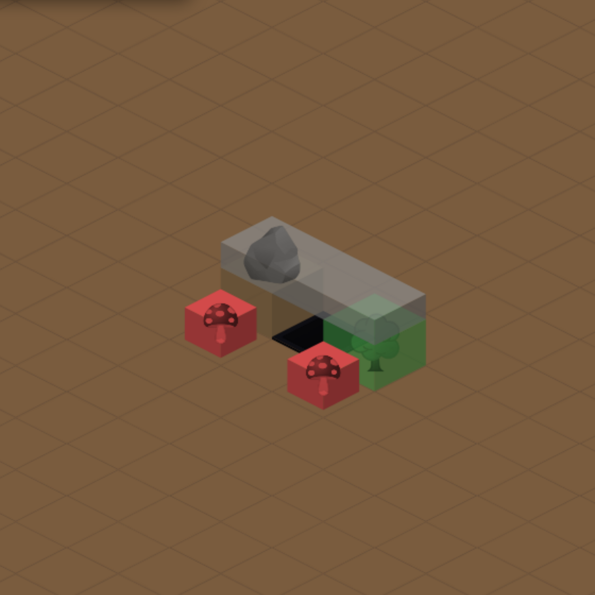 | 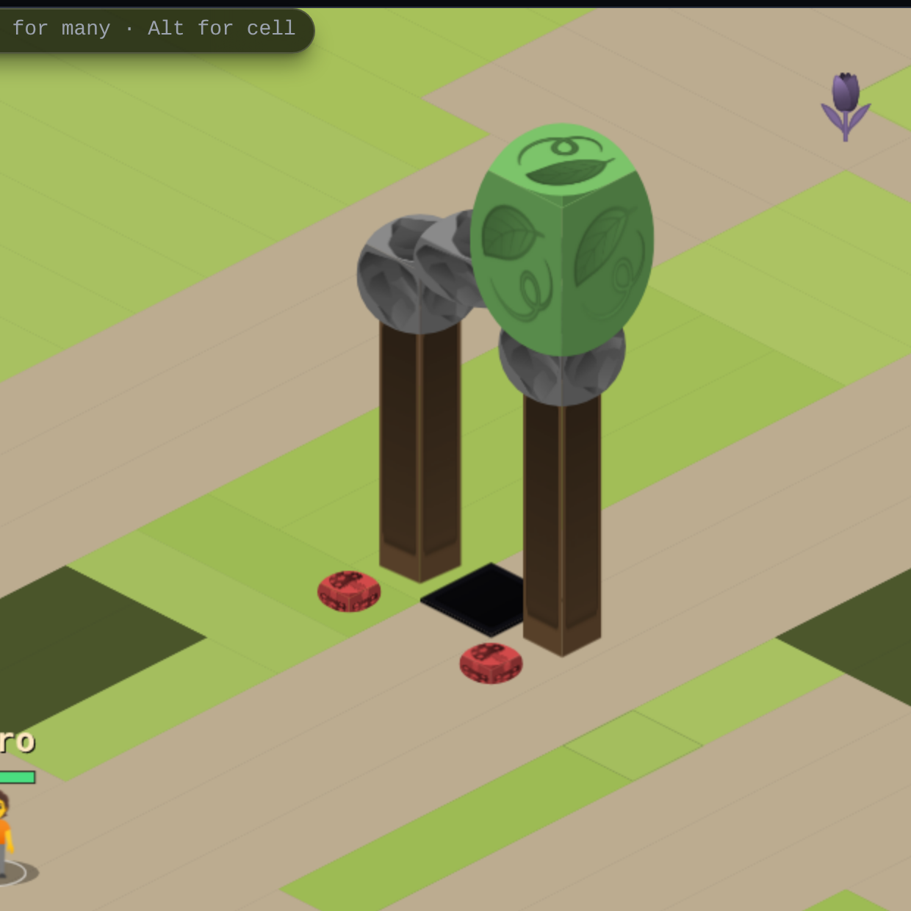 |
| Six cells. Every piece a coloured cube with a small picture floating in it, because `transparent` is dropped (3.2). The span is a grey wall hanging at level 1 touching nothing. The mushrooms are red boxes. | Nine cells. Uprights at 4.3 levels for a 3-cell opening (the Arch of Titus ratio), a rock mass landing on both of them, a crown above the arch, the dark mouth on the ground, cover at the feet. |

### Step 2, silhouette blockout
```
            (crown)          leaf mass, level 5
    [rock]--[key]--[rock]    springers level 4, keystone level 5
      ║              ║
      ║              ║       uprights, 4.3 levels tall (1.7 x 3 cells wide)
      ║   ▓▓▓▓▓▓    ║       the mouth
   o                    o    cover at the feet
```
Footprint 3 x 2, which is `WOODLAND.pathWidth`. Three tiers: uprights plus arch (big), crown (medium),
mushrooms (small). Opening 3 cells wide by 4.3 levels, which is 1.55 : 1 after the 0.45 level-to-cell
conversion, the Arch of Titus number.

### Step 3, piece selection
`trunk_mid` (both uprights), `rock` (springers), `boulder` (keystone), `leaf_center` (crown), `path_dirt` (mouth),
`mushroom` and `red-mushroom` (feet). **All real catalogue tiles. No colour invented: every piece brings its own**
(`trunk_mid` #7a5a3a, `rock` and `boulder` #8a8a8a, `leaf_center` #7cc46a, mushrooms #d24a4a). The only `color`
is on the mouth, where the darkness is the feature.

### Steps 4 to 8, the cell list

| dx | dy | lvl | label | walk | scale | settings | drawn |
|---|---|---|---|---|---|---|---|
| 0 | 0 | 0 | `trunk_mid` | false | 0.50 | `scaleX 1.15, scaleY 8.6` | 4.30 tall, 0.58 wide (gnarled, thicker) |
| 2 | 0 | 0 | `trunk_mid` | false | 0.55 | `scaleY 7.8` | 4.29 tall, 0.55 wide |
| 1 | 0 | 0 | `path_dirt` | **true** | 1.0 | `scaleY 0.05, color "#0d0d12", light {0.85, 2.2, "#0d0d12", on}` | a stain |
| 0 | 0 | 4 | `rock` | true | 0.90 | `scaleY 1.25, shape circle` | springer, base 4.0 |
| 1 | 0 | 5 | `boulder` | true | 1.10 | `scaleY 0.70, shape circle` | keystone, 1 level proud |
| 2 | 0 | 4 | `rock` | true | 0.90 | `scaleY 1.25, shape circle` | springer |
| 2 | 0 | 5 | `leaf_center` | true | 1.30 | `scaleY 1.90, shape circle` | crown, above the arch |
| 0 | 1 | 0 | `mushroom` | true | 0.45 | `scaleY 0.70, shape circle` | |
| 2 | 1 | 0 | `red-mushroom` | true | 0.45 | `scaleY 0.70, shape circle` | |

Contact check: uprights draw 4.30 and 4.29, springers sit at level 4. A 0.30 overlap. The keystone at 5 overlaps
the springers, which draw to 4 + 1.125 = 5.125.

### Step 9, the honest report
- **Part 1, two different uprights: MATCHES.** Slim, tall, one thicker than the other.
- **Part 2, a span over the top: PARTIAL.** The three rocks bridge the gap and land on both uprights, but they
  merge into one lump rather than reading as a curved arch, and the keystone is hidden behind the crown.
  **Cause: the catalogue has no arch voussoir family.** A rock is a rock-shaped picture, not an arch segment.
- **Part 3, the dark mouth: MATCHES in placement, PARTIAL in kind.** It reads as a shadow on the ground, which
  is honest, but the reference's darkness is a RECESS you look into. We have no dark-recess piece and
  `light` only fires at night.
- **Part 4, cover at the feet: PARTIAL.** Present, but `shape: circle` on a wide flat cell turns a mushroom into
  a red counter. They should be billboards, which needs the 3.2 fix.
- **Part 5, opening below the crown: MATCHES.**
- **NOT close enough yet. Two of five parts are limited by missing art, one by the `transparent` bug.**

### What art would fix it
In `priv/tilegen/tiles.json`, then `node bake.mjs --only=...`, then a seed:
- `arch_stone_l`, `arch_stone_c`, `arch_stone_r` (a 3-piece voussoir family, the Kenney `doorwayLeft/Center/Right`
  shape, authored full bleed so the block is solid)
- `portal_dark` (a full-bleed dark gradient tile so a mouth can be a recess in daylight, not a painted floor)

---

## 7.2 TOWN ENTRANCE

### Step 1, reference in
No picture. The design note specifies: **pillars both sides, dressed stone, clearly BUILT rather than grown; a
span; a stone mouth; lamps at the feet that also light the way at night.** The type reference is a torii gate.

| What it should be | Our version | What is seeded today |
|---|---|---|
| Two matched built uprights, a **two-bar** lintel, a dark mouth, lamps at the feet | 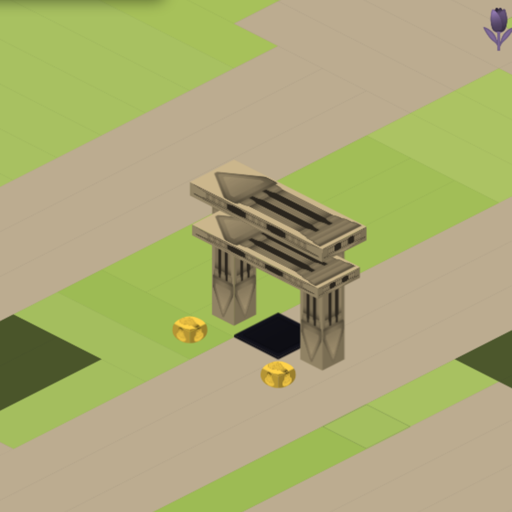 | 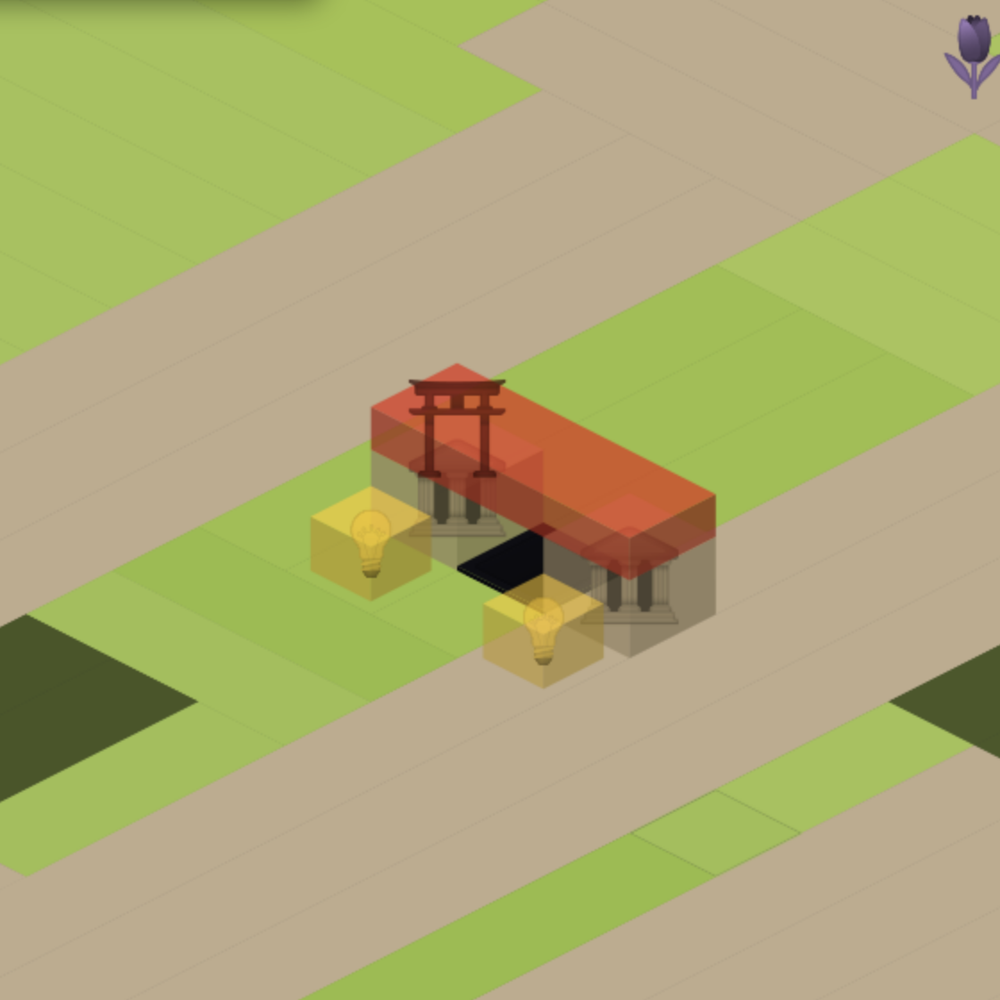 |

### Step 2, silhouette blockout, and why two bars
```
  ══════════════   kasagi, the top lintel, level 3, thinner
  ──────────────   nuki, the tie beam, level 2, thinner still going up
   ║          ║
   ║   ▓▓▓▓   ║    pillar spacing = ground-to-nuki height (the torii square rule)
  (o)        (o)   lamps
```
Torii rules from 2.6: **pillar spacing equals the ground-to-crossbeam height**, so a 3-cell gate wants the nuki
at about 3 levels. Horizontal members get **thinner as they go up**. Two bars is what makes it instantly read as
a gate rather than a doorway.

The seeded version uses the whole `torii-gate` TILE as a single piece. That is the "single whole-object emoji"
mistake `TILESET-AUTHORING.md` §4 forbids. Building the gate from `pillar` bars is more correct, and it means
one tile serves posts and beams because they are genuinely the same material.

### The cell list

| dx | dy | lvl | label | walk | scale | settings | drawn |
|---|---|---|---|---|---|---|---|
| 0 | 0 | 0 | `pillar` | false | 0.50 | `scaleY 6.0` | 3.00 tall, 0.50 wide |
| 2 | 0 | 0 | `pillar` | false | 0.50 | `scaleY 6.0` | 3.00 tall |
| 1 | 0 | 0 | `path_stone` | **true** | 1.0 | `scaleY 0.05, color "#12121a", light {0.85, 2.2, "#12121a", on}` | stain |
| 0 | 0 | 2 | `pillar` | true | 0.95 | `scaleY 0.28, depth 3, depthDir "right-down"` | nuki, 0.27 thick |
| 0 | 0 | 3 | `pillar` | true | 1.00 | `scaleY 0.34, depth 3, depthDir "right-down"` | kasagi, 0.34 thick, lands on the posts |
| 0 | 1 | 0 | `lamp` | true | 0.40 | `scaleY 0.90, shape circle, light {0.9, 2.8, "#ffc24d", on}` | |
| 2 | 1 | 0 | `lamp` | true | 0.40 | `scaleY 0.90, shape circle, light {0.9, 2.8, "#ffc24d", on}` | |

Contact: posts draw 3.00, the kasagi's base is level 3. Flush. The nuki at level 2 passes through the posts,
which is what a real nuki does.

### Step 9, the honest report
- **Reads unmistakably as a gateway.** Two posts, two lintels, a dark threshold, two lamps. This is the strongest
  of the four and it is built from **one tile at four different proportions** plus two accents.
- **Defect 1:** the `pillar` art is a fluted column, and stretched sideways as a beam it shows vertical flutes
  running the wrong way. **Cause: no horizontal beam tile.** Cosmetic, but visible.
- **Defect 2:** the kasagi does not oversail the posts, because a `depth 3` span anchored at `dx 0` is flush with
  the 3-cell footprint. The torii 3:5 rule wants it proud. Fixing it means either a 5-wide footprint or a
  `depthBack`, and `depthBack` reaches outside the declared footprint, which breaks the modular-kit rule.
  **This one needs his call** (see section 9).
- **Defect 3:** the two lamps are identical. The research says vary one.
- **Close enough on silhouette and hierarchy. Not yet on the beam art.**

### Art that would fix it
`beam_stone` (a horizontal member with its grain running along the span), and optionally `pillar_cap`.

---

## 7.3 STONE BRIDGE

### Step 1, reference in
No picture. **A stone bridge is not a wooden bridge painted grey.** It is a different structure: piers or an
arch carrying the load, solid spandrel walls, a solid parapet, abutments into the bank. That structural
difference is the whole point.

| Today (`bridge_stone_3`) | Our version (`bridge_stone_5`) |
|---|---|
| 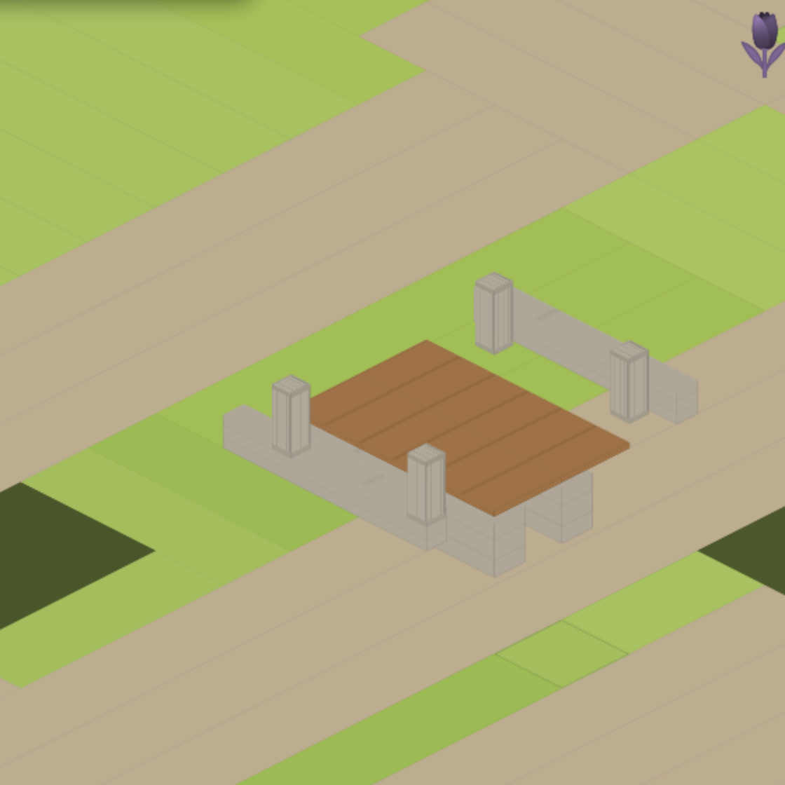 | 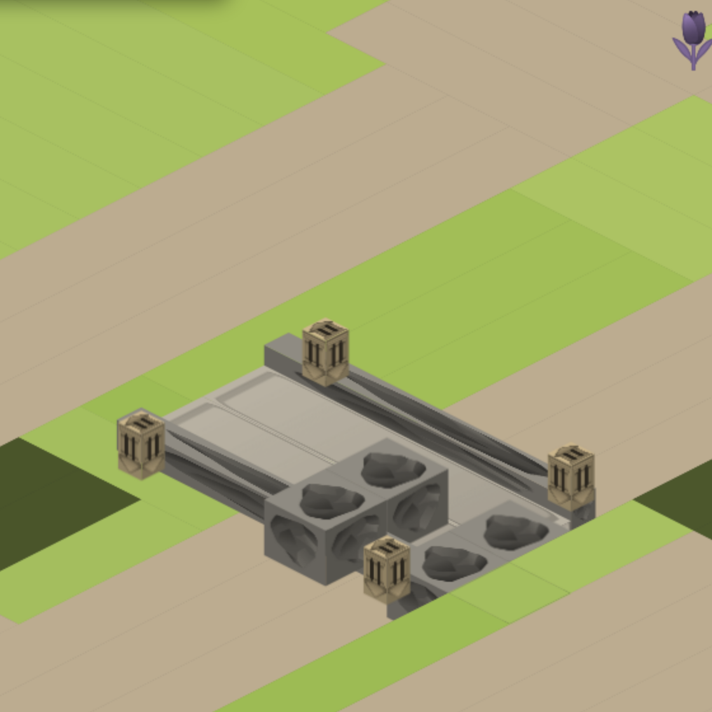 |
| 3 labels, brown deck, detached parapets, nothing under it | 3 labels each doing ONE job, piers below, parapets hugging the deck, stone throughout |

### Step 2, silhouette blockout
```
   P═══════════════P        parapet both sides, hugging the deck
   ┌───────────────┐        stone deck
   ║      ║      ║          piers at dx 0, 2, 4: two openings under it
```
Three tiers: the deck plus parapet mass (big), the piers (medium), the end posts (small). The piers are the
change: **the rhythm underneath is what says "this spans something".**

### Step 3, piece selection
`wall_stone_c` (piers and parapets), `cobblestone` (deck), `pillar` (end posts). **Three tiles, three jobs, and
not one `color` anywhere.** `wall_stone_c` #8f8b82, `cobblestone` #b9b2a3, `pillar` #cbb68c: three stone tones
that already agree.

### The cell list (span 5; `depth` and pier positions scale with the span)

| dx | dy | lvl | label | walk | scale | settings |
|---|---|---|---|---|---|---|
| 0, 2, 4 | 1 | **-1** | `wall_stone_c` | false | 1.0 | `scaleY 1.0` |
| 0, 2, 4 | 2 | **-1** | `wall_stone_c` | false | 1.0 | `scaleY 1.0` |
| 0 | 1 | 0 | `cobblestone` | **true** | 1.0 | `scaleY 0.18, depth 5, depthDir "right-down"` |
| 0 | 2 | 0 | `cobblestone` | **true** | 1.0 | `scaleY 0.18, depth 5, depthDir "right-down"` |
| 0 | 0 | 0 | `wall_stone_c` | false | 1.0 | `scaleY 0.55, scaleZ 0.4, thicknessDir "left-down", depth 5, depthDir "right-down"` |
| 0 | 3 | 0 | `wall_stone_c` | false | 1.0 | `scaleY 0.55, scaleZ 0.4, thicknessDir "right-up", depth 5, depthDir "right-down"` |
| 0, 4 | 0 | 0 | `pillar` | false | 0.38 | `scaleY 2.2` |
| 0, 4 | 3 | 0 | `pillar` | false | 0.38 | `scaleY 2.2` |

**14 cells versus the current 10, and note the `thicknessDir` values: `left-down` on the `dy 0` parapet and
`right-up` on the `dy 3` parapet. Those are the opposite of what is seeded, and that inversion is the visible gap
in the current render.**

### Step 9, the honest report
- **The piers land.** There are openings under the bridge, which the current one has nothing of.
- **The parapets touch the deck.** The gap is gone.
- **It is stone throughout**, with no invented colour.
- **Defect 1:** the deck reads pale and slightly flat against the parapets. `cobblestone` is a road tile and its
  art is low-contrast at this size.
- **Defect 2:** no arch. A real stone bridge has a segmental arch ring between the piers, and that is what would
  make it unmistakable. **The catalogue has no voussoir family** (the same gap as the forest entrance).
- **Defect 3:** the parapets are plain runs with no end pieces. A `wall_stone_*` family EXISTS, so the ends could
  use `_l` and `_r`, but a `depth`-spanned run is ONE cell and cannot vary along its length. To use the family
  you have to give up the span and author one cell per length, which costs cells and gains articulation.
  **This is a genuine trade and it needs his call** (section 9).
- **Better than today on every axis. Not yet a stone bridge you would recognise from a reference photo.**

### Art that would fix it
`arch_stone_l/_c/_r` (shared with the gateway, so it pays for itself), `bridge_abutment`, and a
`parapet_stone_l/_c/_r` family.

---

## 7.4 WOOD BRIDGE

### Step 1, reference in
No picture. **A wooden bridge is a trestle**: piles driven into the bed, a plank deck, post-and-rail parapets.
The rhythm of the piles and posts is the object.

| Today (`bridge_wood_5`) | Our version |
|---|---|
| 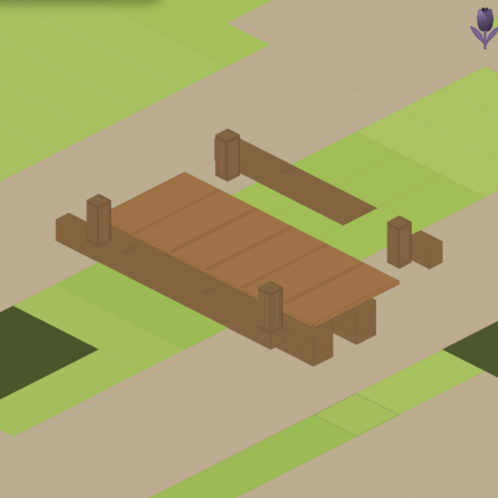 | 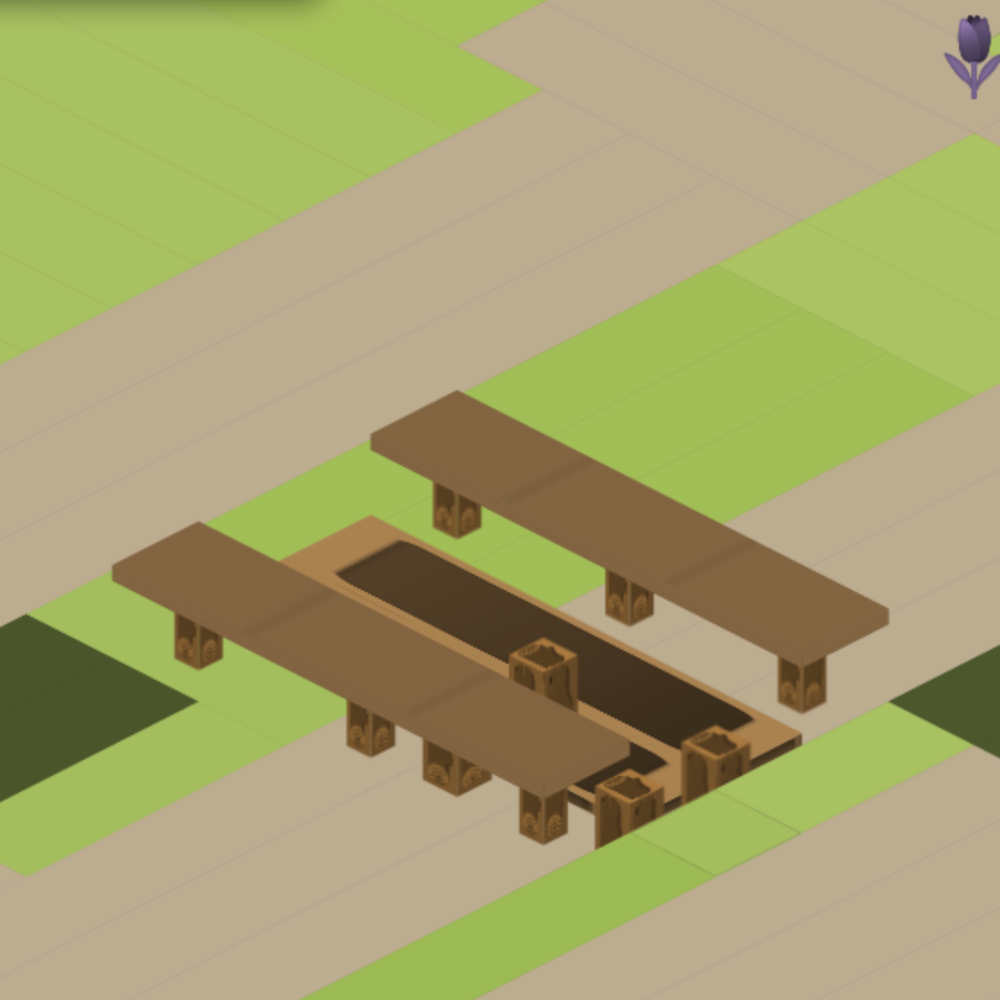 |
| Same 3 labels as the stone one, tinted brown | Timber posts, a plank deck, handrails at hand height |

### Step 2, silhouette blockout
```
   ═══════════════      handrail at level 1, not a kerb at level 0
   │   │   │   │        rail posts at dx 0, 2, 4, both sides
   ┌───────────────┐    plank deck
   ║   ║   ║            piles below
```

### Step 3, piece selection
`wood-log` (piles and rail posts, both genuinely round timber verticals), `wooden_planks` (deck),
`bridge_rail` (handrail, a horizontal member, and it is authored full bleed). **Three tiles, three jobs.**
`wood-log` #a9793f, `wooden_planks` #aa8250, `bridge_rail` #8a6a45: three timber tones that already agree.
**No `color` anywhere**, which is the headline difference from the seeded version.

### The cell list (span 5)

| dx | dy | lvl | label | walk | scale | settings | drawn |
|---|---|---|---|---|---|---|---|
| 0, 2, 4 | 1 | **-1** | `wood-log` | false | 0.40 | `scaleY 2.6` | pile, 1.04 tall |
| 0, 2, 4 | 2 | **-1** | `wood-log` | false | 0.40 | `scaleY 2.6` | pile |
| 0 | 1 | 0 | `wooden_planks` | **true** | 1.0 | `scaleY 0.16, depth 5, depthDir "right-down"` | deck |
| 0 | 2 | 0 | `wooden_planks` | **true** | 1.0 | `scaleY 0.16, depth 5, depthDir "right-down"` | deck |
| 0, 2, 4 | 0 | 0 | `wood-log` | false | 0.28 | `scaleY 4.2` | rail post, 1.18 tall |
| 0, 2, 4 | 3 | 0 | `wood-log` | false | 0.28 | `scaleY 4.2` | rail post |
| 0 | 0 | **1** | `bridge_rail` | false | 1.0 | `scaleY 0.20, depth 5, depthDir "right-down"` | handrail, base 1.0 |
| 0 | 3 | **1** | `bridge_rail` | false | 1.0 | `scaleY 0.20, depth 5, depthDir "right-down"` | handrail |

16 cells. Contact: posts draw 1.18, handrails sit at level 1.00. A 0.18 overlap, so the rail lands ON the posts.

### Step 9, the honest report
- **It reads as a timber structure.** The post rhythm is there, the handrails are at hand height instead of being
  kerbs, and nothing is tinted to fake a material.
- **It is visibly a DIFFERENT OBJECT from the stone bridge**, which is the thing the current pair fails at
  completely.
- **Defect 1:** the handrails read slightly detached at the far side, because a `depth`-spanned rail is one long
  box and the posts are separate small boxes, so there is no joint art where they meet.
- **Defect 2:** the deck's side faces draw dark at `scaleY 0.16` (the face shading applies to a very thin block),
  so the deck reads as a recessed trough rather than a raised walkway.
- **Defect 3:** `wood-log` is doing two jobs, pile and rail post. Better than three, still not one.
- **Defect 4:** no cross-bracing, which is what makes a trestle read as a trestle.
- **Better than today on every axis. Still short of a reference photo.**

### Art that would fix it
`bridge_pile` (a round driven pile), `bridge_rail_post` (a squared post with a rail notch), `bridge_brace`
(a diagonal), and a `bridge_plank_t/_c/_b` deck family so the outer planks differ from the inner ones.

---

## 7.5 The honest total

| | Silhouette | Pieces | Colour | Contact | Overall |
|---|---|---|---|---|---|
| forest entrance | pass | pass | pass | pass | **limited by missing arch art + the `transparent` bug** |
| town entrance | **pass** | pass | pass | pass | **closest to done. Beam art and the oversail are the gaps.** |
| stone bridge | pass | pass | pass | pass | **structurally right, needs an arch family to be recognisable** |
| wood bridge | pass | pass | pass | pass | **structurally right, needs pile/post/brace art** |

**All four are better than what is seeded, on every axis, using only catalogue tiles and no invented colour.**
**None of the four is finished, and the reason is the same in all four: the catalogue has no piece family for
the thing being built.** That is the framework working as intended: it took the guesswork out and left one
clearly named problem.

---

# 8. What the framework does NOT cover

- **Art authoring itself.** It tells you when you need a new piece and what it must be. It does not tell you how
  to draw the SVG. That is `priv/tilegen/tiles.json` plus `bake.mjs`, and it is a separate skill.
- **Animation.** The fountain's water loop and the lamp's night flicker are a different system
  (`ANIMATION-SYSTEM.md`). A composition can ship animations on a cell; choosing them is not covered here.
- **Generation and placement.** Where an object goes on a map, how many, in what biome. That is the generator.
- **Collision beyond the ground course.** The collision map is 2D. Hitboxes and per-level collision are the
  separate hitbox spec.
- **The 2D and top-down views.** Everything here is reasoned from the iso render. The other two views project the
  same stamped tiles (`MAP-MODEL` §5), so a correct composition should be correct there, but this document does
  not check it and you should look.
- **Units and characters.** A unit is a depth-0 tile and the one map exception to "everything is a stacked tile".
- **Performance.** Cell count matters at scale and this document optimises for readability, not draw count.
- **Runtime autotiling.** We select pieces by hand at author time. Nothing here computes a neighbour bitmask.

---

# 9. Questions that need his decision

1. **The `transparent` fix.** It is two lines and it makes the already-seeded entrances behave as authored
   (section 3.2). Should that land as its own ticket before the entrance work, or as part of it?

2. **Span versus family, and it is a real trade.** A `depth`-spanned run is ONE cell and cannot vary along its
   length, so it cannot use `_l` / `_c` / `_r` end pieces. Using the family means one cell per length, so a
   7-span bridge parapet goes from 1 cell to 7. **Articulation or cell count. Which do you want for the
   bridges?** My recommendation is the family for parapets and end pieces, the span for decks.

3. **The torii oversail.** A cap that overhangs its posts needs the composition to reach outside its declared
   3-cell footprint (via `depthBack`), or the footprint grows to 5 with two empty columns. Both are slightly
   wrong. Which is less wrong?

4. **Art budget.** The four examples name 12 new tiles. Shared across them the real list is about 9:
   `arch_stone_l/_c/_r`, `portal_dark`, `beam_stone`, `bridge_pile`, `bridge_rail_post`, `bridge_brace`,
   `bridge_plank_t/_c/_b`. Every one is a small greyscale SVG in `tiles.json`. **Do you want those authored
   before we seed anything, or do you want the catalogue-only versions above seeded first so you can place them
   and judge?**

5. **Reference pictures for the bridges.** There is no reference image for either bridge, and the framework's
   pass mark is "matches the reference". Can you drop one in for each?

6. **A `probability` / `Alt` convention.** Every mature tileset format carries a per-piece weight and a
   silhouette variant so repeats do not look identical. We have neither. Worth adding?

---

# Appendix: the probe

`game-website/.probe/objshot.mjs` renders one object alone on open ground and crops it.

```bash
export PATH=/home/visiond/.nvm/versions/node/v24.15.0/bin:$PATH
cd /home/visiond/projects/game-engine/game-website

# a SEEDED composition, as the DB serves it today
NAME=well COMP=well FP=5x3 ZOOM=7 SIZE=560 node .probe/objshot.mjs

# a PROPOSAL from a cell list, nothing seeded
NAME=my_object SPEC=/tmp/specs/my_object.json ZOOM=7 SIZE=620 node .probe/objshot.mjs
```

The spec is the composition's own shape plus a resolved `tileColor` per cell (the probe places assets directly
and does not run `resolveTile`, so the colour has to be handed in; that is the ONE thing it does not do for you).
The four proposal specs are in `renders/*.json`. Output goes to `/tmp/objshots/`.

Env: `PRESET` (default Meadow), `VIEW` (iso/2d/top), `ZOOM`, `SIZE`, `PAD`, `FP` (footprint for COMP mode),
`OUT`.

---

*Beam*

---

# 8. THE ART TO AUTHOR, awaiting approval

Step 3's hard stop landed: the pieces do not exist, so nothing can be composed until they do. This is the
proposal, and it stops here per step 1b. Nothing is authored, baked or seeded.

**Where they go.** `priv/tilegen/tiles.json` takes one entry per label per style: `{label, mode, style}` plus a
`glyph` for ascii, an `emoji` for emoji, or an inline 128x128 `svg` that `bake.mjs` renders to a PNG. Then a
migration seeds the tile row. That is the whole pipeline and `bridge_deck` already uses the `svg` form.

**Why these and not others.** The family structure is not invented here: every object he approves of is built
from one (`wall_stone` 9 pieces, `fountain` 8, `wall_wood` 7), and the shapes come from the references he gave.
The bridge kit shows the exact set a deck needs: a flat run, a ramp, a run on piers, a run with posts.

## 8.1 ARCH, for the gateway and entrance spans

From `gateway-arch` and `gatehouse-town`: an arch is not a lintel balanced on two posts. It is a MASS with a
curve cut through it, and a cap that oversails.

| Label | What it is | Composes as |
|---|---|---|
| `arch_pier` | The vertical mass either side of the opening | One block, `scaleY` to height. The `wall_*` trick |
| `arch_spring_l` / `arch_spring_r` | Where the curve leaves the pier, handed | One cell each, at the top of its pier |
| `arch_key` | The crown of the curve | One cell between the springers |
| `arch_cap` | The entablature that oversails both piers | ONE cell with `depth`, the way `roof` spans `house_4` |

## 8.2 DECK, for every bridge

| Label | What it is | Composes as |
|---|---|---|
| `deck_c` | The walking run | ONE cell with `depth` across the water, as the roof does |
| `deck_l` / `deck_r` | The ends, where the deck meets the bank | One cell each, which is what stops the deck floating |
| `deck_ramp` | The sloped approach up from the bank | One cell, handed by rotation |

## 8.3 PIER, for what holds a deck up

| Label | What it is |
|---|---|
| `pier_stone` | A masonry pier, `scaleY` to reach the bed |
| `pier_timber` | A driven timber pile, thinner, for the wood bridge |

## 8.4 PARAPET and RAIL, for the sides

| Label | What it is |
|---|---|
| `parapet_c` / `parapet_l` / `parapet_r` | Stone, a low solid wall along the deck |
| `rail_post` / `rail_span` | Timber, a post and the rail between, for the wood bridge |

## 8.5 What this gives each of the four objects

- **Forest entrance**: `arch_pier` x2 with a rock material, `arch_spring_l/r`, `arch_key`, the dark mouth INSIDE
  the mass rather than painted on the floor, and existing nature tiles crowding the feet.
- **Town entrance**: the same arch family in dressed stone, plus `lamp_post` either side, which is his own
  instruction: *"for towns you can use lamp post and similar things like we do on meadow"*.
- **Stone bridge**: `deck_c` spanning by `depth`, `deck_l`/`deck_r` at the banks, `pier_stone` beneath,
  `parapet_*` down both sides.
- **Wood bridge**: the same deck family with a timber material, `pier_timber`, `rail_post` and `rail_span`.

**14 pieces.** For comparison, a house wall has 33 and a fountain rim has 8. Three is what a bridge has today.

## 8.6 Still open before any of this starts

- **His approval**, per step 1b.
- **References for the game entrances he named**: Pokemon towns and cities, Zelda, Death's Door, Ori, Hollow
  Knight. Not gathered: this session's web search budget is spent, so they need either a raised budget or links.
- **The nine `canopy_*` pieces** are a complete family that zero compositions use. Either wire them or drop
  them; leaving authored art unreferenced is what makes the catalogue look emptier than it is.

---

# 9. HOW THE APPROVED ENTRANCES WERE ACTUALLY OBTAINED

Three objects passed: `temple_entrance`, `cave_entrance_cube`, `cave_entrance_rounded`. This is the record of
what produced them, so the next object starts here instead of rediscovering it. *"once these improvement are
implemented, then we can update the framework specifying how these results were obtained and replicate that
with other objects"* (2026-09-14).

**No new art was authored.** Every one is built from tiles that were already in the catalogue. The whole
difference between the rejected version and the approved ones is HOW the blocks are shaped and placed.

## 9.1 The five facts that did it

1. **`scale * scaleY` is the drawn height in levels.** This governs every stack: the next piece sits at that
   level, not at the one you meant. The first attempt put piers at `0.85 * 4.0 = 3.4` and a cap at `level: 4`,
   and the cap floated. Compute the top, do not guess it.
2. **`depth` SPANS.** `house_4`'s roof is one cell reaching four, and it had been doing that all along while
   arches and bridge decks were faked with scale. The temple's lintel and the cave's overhang are that trick.
   Point it along the other axis (`right-up`) and it spans the diagonal instead of the row.
3. **`shape: circle` makes a MASS.** The tree canopy was its only user. Rock lumps as circles MERGE into one
   organic outcrop; as cubes they read as stacked boxes. It is one setting, and it is the entire difference
   between `cave_entrance_cube` and `cave_entrance_rounded`, which is why they share one builder.
4. **A FAÇADE LIES ON AN ANTI-DIAGONAL, NEVER ON A ROW.** Screen depth is `col + row`. Cells in the same ROW
   sit at different depths, so a row-shaped face is drawn over by its own near end: the cave's mouth sat at
   depth 3 while the mound's near corner sat at depth 6, and the mound was drawn in front of its own opening.
   The cells at a constant `col + row` are the ones that read as one flat face toward the camera. Put the
   opening in the middle of that diagonal, the mass BEHIND it (smaller sum), and nothing but low scatter in
   front (larger sum).
5. **`fadeNear` is a tile setting and it will ghost a whole structure.** `wall_stone_c`, `rock` and `boulder`
   all carry it, so anything built from them goes semi-transparent when the hero is close. A solid rock mound
   looked like soap bubbles until the hero was moved away. Check it before blaming the geometry.

## 9.2 The shape rule that separates the two kinds

A **temple** is post, lintel, post: two piers with a beam ACROSS them. A **cave** is a hole cut INTO a mass,
with no beam at all. Removing the lintel did most of the work of turning one into the other, and no amount of
retexturing would have.

And the proportion: the rejected version was tall and narrow (3 wide, 4 levels) where the reference mound is
wide and low (5 wide, about 2 levels). The SQUINT TEST names this in one look. Threshold the render to pure
black and white and compare the silhouette: the rejected one reads as a solid upright rectangle, which is a
building. Do this before tuning anything else, because no detail rescues a wrong silhouette.

## 9.3 The loop that made iterating cheap

`.claude-workspace/game-website/iterations/upsert-one-composition.exs` takes a JSON cell list and surgically
upserts ONE composition; `.probe/objshot.mjs` then renders that real seeded object through the real path with
its real colours. Edit JSON, upsert, render, compare: about ninety seconds a pass. Four passes took the cave
from a temple to something approved. Building through the probe's SPEC mode instead is faster still but LIES
about colour, because it has no tileset to resolve a label against.

## 9.4 Naming

*"always name in relation to the object itself"*. `forest_entrance` named a PLACE, which says nothing about
what the thing looks like, and it is how a cave mouth ended up as the forest's entrance. `temple_entrance`,
`cave_entrance_cube` and `cave_entrance_rounded` each say what they are.

Still to build, and it is the same point: **a forest entrance depends on the forest.** *"is not the same
entering ajungle than entering a meadow or a woodland or a swamp, each one must have their own tree guided
entry"*. Four objects, each guided by its own trees, none of them named `forest_entrance`.

---

# 10. THE RECIPE: turning a reference into an object, consistently

*"I just want to make sure we always have a step by step guide on how to make an object out of a reference
consistently"* (2026-09-14). This is that guide. It is the process of section 4 reduced to what you actually
DO, with the measurement that tells you when to stop.

Everything here was used to build `temple_entrance`, `cave_entrance_cube` and `cave_entrance_rounded`.

## The loop

```
  reference  ->  measure it  ->  block it out  ->  render  ->  measure ours  ->  read the deltas  ->  adjust
                                                      ^                                                |
                                                      +------------------------------------------------+
```

### 1. Get the reference, and CROP IT TO THE OBJECT

One object, nothing else. The reference of a cave that still has half a forest in it measures the forest: the
first run said `fill 0.57` for a whole woodland scene, which described nothing. Crop, then check the crop by
eye before using it.

```
convert reference-sheet.jpg -crop 250x150+35+65 +repage reference-object.png
```

A sheet holding many objects splits into one file each (see `references/SOURCES.md`).

### 2. MEASURE the reference. Write the four numbers down.

```
python3 .probe/silhouette.py reference-object.png reference-object.png
```

| number | what it means | what it catches |
|---|---|---|
| **aspect** | width over height of the silhouette | tall and narrow when the thing is wide and low. The single most common error |
| **fill** | ink over bounding box | a SOLID block. Near 1.0 is architecture. The rejected temple measured **0.98**, which is the number saying "building" |
| **centroid** | where the mass sits vertically, 0 is top heavy, 1 is grounded | a shape that floats instead of sitting |
| **jag** | how uneven the skyline is | a dead flat roofline is built, a broken one is natural |

### 3. BLOCK OUT to those numbers, not to instinct

Pick the footprint and the heights so the aspect lands near the reference's. Remember `scale * scaleY` is the
drawn height in LEVELS, and that one level is only 0.45 of a cell width, so heights need bigger numbers than
they look like they need. Read section 9.1 before placing anything.

Decide the SHAPE FAMILY from the reference: a beam across two supports is architecture, a hole cut into a mass
is natural. They are different objects and no retexturing converts one into the other.

### 4. RENDER the real thing

```
# seed it, then shoot it: this goes through the real path with the real colours
SPEC=cells.json mix run --no-start -e 'Application.ensure_all_started(:nebulith); Code.eval_file("upsert-one-composition.exs")'
OUT=/tmp/shots NAME=thing COMP=thing FP=5x5 HEROAWAY=14 node .probe/objshot.mjs
```

`HEROAWAY` matters: `fadeNear` ghosts a whole structure when the hero stands next to it (9.1, fact 5).

### 5. CROP OURS the same way, and MEASURE

The same rule as step 1: the render sits on grass, so crop to the object or the grass gets measured as part of
it. An uncropped frame measures `aspect 1.03` for everything, which is the frame, not the object.

```
convert shot.png -crop 900x680+310+230 +repage ours.png
python3 .probe/silhouette.py reference-object.png ours.png
```

### 6. READ THE DELTAS. Each one has one fix.

| delta | means | do this |
|---|---|---|
| `aspect` too low | too narrow | widen the footprint, or lower the heights |
| `fill` too high | too solid, reads as built | break the silhouette: vary heights, open gaps, vary scale per cell |
| `fill` too low | too sparse, reads as scattered junk | merge masses, overlap them, `shape: circle` at scale > 1 |
| `centroid` too low | top heavy | move weight down, widen the base |
| `jag` too low | flat skyline, reads as architecture | vary the top of each cell |
| `jag` too high | noisy skyline | fewer, larger masses |

### 7. STOP when the deltas are small AND his eyes agree

Close enough is silhouette, proportion, contact and hierarchy. Colour exactness and texture detail are not part
of it. **The numbers never close the gate: they tell you where to look and when to stop guessing.** Only his
verdict at :3000 closes it.

## 10.1 Three more facts, learned placing the forest entrances

These cost a render each and none of them is guessable from the code.

**`light` IS NIGHT ONLY.** `drawNightLighting` is the only thing that draws it, so a `light` setting shows
NOTHING in daylight. To make a deep forest read as dark *while the sun is up*, the darkness has to be the
object's own COLOUR: a jungle's crowns are near black green, a meadow's are pale. Colour is a per-cell setting,
so it belongs to the object and it reads at every hour. A true cast shadow is the lighting LAYER, still ahead
of us, and a tint is not pretending to be one.

**NEVER LAY A FLOOR OVER A PATH THAT EXISTS.** A run of thin floor slabs shows mostly its own dark SIDES, so a
paved strip comes out as a pit. An object standing on a pathway the generator already paved should carry no
floor at all and let the map's own surface run through. This caught me twice in one object: once as the path,
once as the cells I added to carry a light.

**THE MOUTH IS THE FRONT EDGE, THE ONE THAT MEETS THE BORDER.** Authored south-facing that is the LARGEST
`dy`, not `dy 0`. Anchoring on `dy 0` puts the object's back on the border and grows it outward, so a 5-deep
entrance at a south gate on a 40-row map got rows 39 to 43 and four fifths of it fell off the world. A 2-deep
object loses one row and nobody notices, which is how it survived.

**And a warning that is not about art at all:** the test fixtures are captured payloads and they DRIFT. A
composition renamed in the backend still had the old name in `generators.json` and no entry at all in
`tilesets.json`, so `compositionFootprint` returned null, the centring silently did nothing, and the tests
stayed green while the real map was wrong. Top a fixture up field by field against live before trusting a test
about placement.

## Worked numbers, the three approved objects

Against the cave mound reference, both cropped to the object:

| | aspect | fill | centroid | jag |
|---|---|---|---|---|
| **reference** | **1.67** | **0.59** | **0.49** | **0.054** |
| `cave_entrance_rounded` | 1.32 | 0.81 | 0.52 | 0.169 |
| `cave_entrance_cube` | 1.32 | 0.82 | 0.53 | 0.166 |
| `temple_entrance` | 0.62 | 0.70 | 0.54 | 0.173 |

What the rows say, and it matches what he said by eye:

- The caves are **still too narrow (1.32 against 1.67) and too solid (0.81 against 0.59)**. Those are the two
  named next moves for them, and neither needs an opinion to find.
- Their `centroid` matches the reference almost exactly. The mass sits right.
- Their `jag` is HIGHER than the reference, not lower: the trees poking out of the mound make a more broken
  skyline than the real thing.
- `temple_entrance` measures `aspect 0.62` against a cave, which means nothing. **A temple needs a temple
  reference.** Measuring against the wrong reference produces a confident wrong answer, which is worse than no
  measurement.

## What this does NOT do

It measures ONE silhouette from ONE camera angle. It says nothing about colour, material, readability at small
size, or whether the object is the right object. It is a tool for closing the gap to a reference you have
already agreed is the right reference.

