# Nebulith: the engine spec

The base for everything from here. What each system is, what the database holds, how the systems talk to
each other, how it is tested and how it is documented.

**This document is the target, not the present.**

---

## 0. How to read this

| Section | What it answers |
|---|---|
| 1. The laws | the rules every decision below obeys |
| 2. Architecture | what runs where, and what crosses the boundary |
| 3. The schema | every table, grouped, with its relationships drawn |
| 4. The systems | what each system owns, its flow, its rules, its tests |
| 5. The flows | what happens when you generate, load, save, place, fight, publish |
| 6. Testing | what gets tested at which layer, and what a gate looks like |
| 7. Documentation | what gets written, where it lives, and what keeps it true |
| 8. The plan | fifteen phases in the order of the schema you wrote, each with its tables, its rewiring and its gate |
| 9. The setting ledger | all 184 authorable properties and where each one lands |

### Where everything in here came from

Nine passes over the code, every file accounted for by name. Nothing below is inferred from a filename.

| Document | What it is | Feeds |
|---|---|---|
| `SCHEMA-DECISIONS.md` | D1 to D18, his words, dated, append-only | every table in section 3 |
| `SETTINGS.md` | the 184 authorable properties, five physical homes, the alias table | 3.2 and section 9 |
| `VOCABULARY.md` | the settled terms, and the ones that collide | section 1, and every name used here |
| `SYSTEMS.md` | the systems audit of what exists today | section 4 |
| `VERIFIED.md` | which of my own claims survived verification: 8 of 24 | every claim below |
| `TICKETS-EXTRACT.md` | 70 tickets read in full, the product frame, 33 absent systems | 2.2, 3.6, 3.7, section 4 |
| `BASELINE-MEASURED.md` | 19 jsonb columns and every key, the dead data, the vocabularies | 3.2, section 6 |
| `PHYSICS-RESEARCH.md` | how real engines model formulas, with sources | 3.4 |
| `CENSUS-BACKEND.md` | 200 `.ex` modules | 2.1, 3.1, 3.3 |
| `CENSUS-MIGRATIONS.md` | 133 migrations | section 8, and the migration hazards in 6.2 |
| `CENSUS-EDITOR.md` | 64 components, routes and lib files | 3.2, 3.7 |
| `CENSUS-GAME-LOGIC.md` | 55 game-logic modules | 3.5, 3.6 |
| `CENSUS-ENGINE.md` | 64 renderer and engine modules | 3.2, 3.4, section 6 |

Decisions are recorded in `SCHEMA-DECISIONS.md` as **D1 to D18** and are cited inline.

### What this is for

Recovered from the ticket corpus, and it reorders the priorities below:

> *"we'll build a demo game and the idea is to sell the 'build a game prototype in X minutes'... we're not
> looking to compete with game engines, we're looking to provide a platform and a community where people can
> play with their ideas openly and get funding to actually build it with a real game engine... we're just
> allowing people to execute their ideas without having the barrier of programing knowledge to test the
> waters."*

**So users, visibility and sharing are the product, not infrastructure.** That is why section 3.7 exists and
why `users`, `games.visibility` and the author-versus-player split are in the first schema pass rather than
bolted on later.

---

## 1. The laws

Every one of these is his, from the code or from the thread that produced this spec.

1. **A second vocabulary whose whole job is to be translated back is not a concept.** The test for every
   table in section 3.
2. **One fact, one owner.**
3. **A tile is an image.** Not a glyph, not an emoji, not a char.
4. **A tileset is a set of PNGs.** All rules are global; the only difference between art styles is which
   pictures they provide.
5. **The catalog is thin, the placement is fat.** A default is a schema default; context is written by the
   generator onto the placement.
6. **A setting is stated, never implied by its own absence.**
7. **The backend decides values, the frontend renders them.** A hardcoded fallback for served data is a
   defect, not a safety net.
8. **Everything typed.** `jsonb` only where the payload is heterogeneous AND never queried.
9. **Accept a reset.** No back-compat, no dual-read, no save migration.
10. **A hand-written field list is a leak waiting to happen.** Anything that copies a record field by field
    must be generated from the schema, never typed out.
11. **A list a person could extend without new code is data. A list the engine switches on is code, and is
    served** (D17). Never a second copy either way.
12. **The frontend sets no limits.** No minimum, no maximum, no step invented in React (D18).

### Where laws 10, 11 and 12 came from, measured

Not principles. Three defects, each found by name in the census.

**Law 10.** `placeAsset` copies a `GridAsset` with a hand-written whitelist and silently drops **21 of its
41 columns**. The sibling function `stagePaint` carries a comment admitting the same shape: *"EVERY FIELD,
BY HAND, WHICH IS THE TRAP."* Copy-paste in the editor drops seven more (`thickness`, `depthBack`,
`depthPerp`, `depthPerpBack`, `flow`, `sideColor`, `placedAt`). Every one of those is the same bug written
three times.

**Law 11.** The engine understands `ease: "flicker"` and `trigger.on: "night"`. Both are seeded. Neither
appears in its picker, because the picker keeps its own copy of the list. A value the engine supports is
unreachable from the editor, and nothing anywhere says so.

**Law 12.** `editorInspector.tsx` fences Width at 5, Footprint at 9 cells, Thickness at 1, Draw order at
100 and Glow distance at 12. All five numbers are invented in React and identical for all 366 tiles.

> *"none of the sliders should be limited... the react side just reacts the values of the backend and allow
> us to change them in the state, as simple as that."*

### The two failure modes this rebuild exists to end

Both measured, both in `VERIFIED.md`:

- **One fact with two owners**, where the second quietly wins. A seeder writing a whole column over ten
  migrations' work, ten times.
- **A knob with two ends and nothing between.** A value served by the backend, parsed by the frontend, and
  read by nothing. `GeneratorDef.position` is parsed and never read, so the backend's ordering is not
  honoured. `useGenerationLayers` discards both of its return values. `HUD_ACTIONS` has zero consumers.

---

## 2. Architecture

### 2.1 What runs where

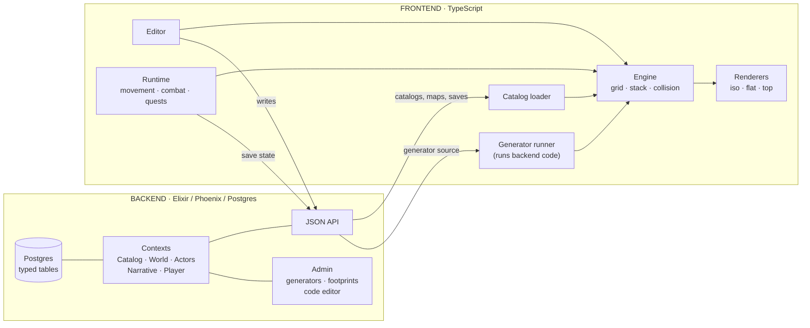

**The boundary rule:** everything that is a VALUE crosses from the backend. The frontend owns algorithms,
rendering and input, and nothing else. A number, a colour, a name, a threshold or a list belongs to the
database.

**The one thing that now crosses in the other direction from usual:** generator SOURCE CODE (D15). It is
authored in the admin, stored in the backend, and executed in the frontend against a capability-limited
grid API.

### 2.2 The system map

Eight groups, 51 subsystems. A dashed box does not exist today: it was named by a ticket and measured
absent, not assumed absent.

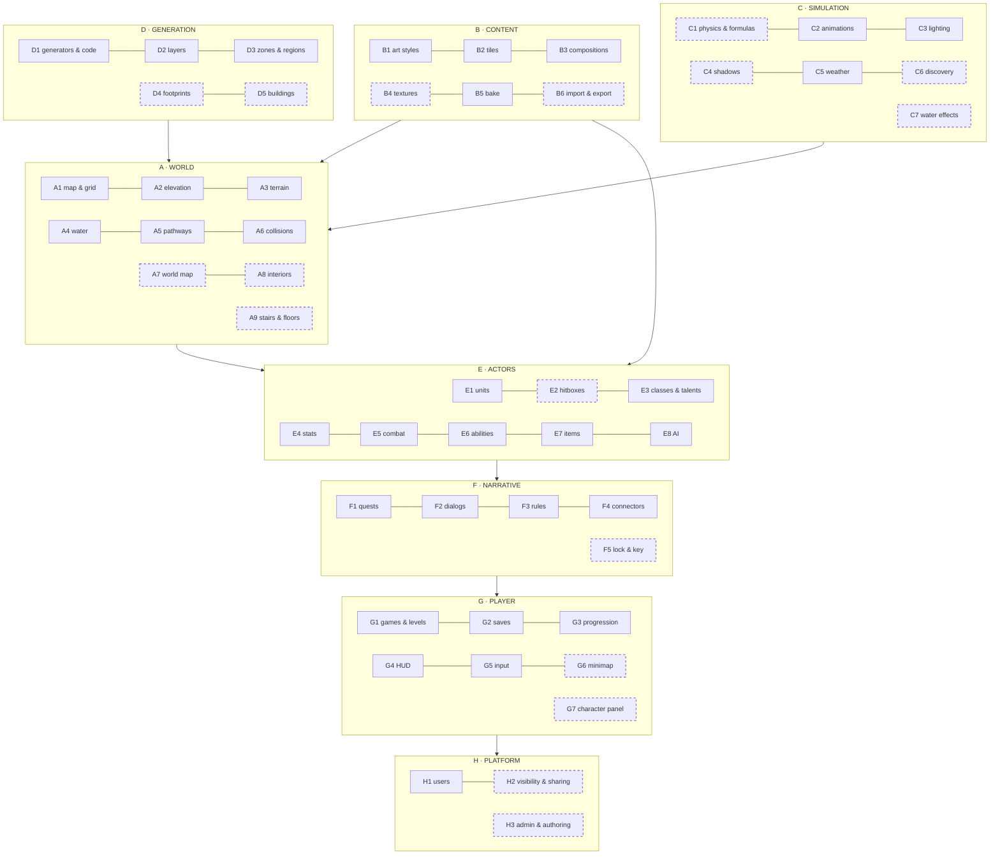

**How to read the arrows:** content and generation produce the world; simulation animates it; actors live in
it; narrative drives actors; the player owns everything above; the platform owns the player. A system may
only depend downward. **A cycle in this graph is a design error.**

**Why so many gaps.** 33 systems were named by tickets and do not exist. That is not a backlog, it is the
reason a schema designed only around what runs today would be wrong before it shipped. Three examples of
what the gaps cost right now:

| Gap | What it costs today |
|---|---|
| **B4 textures** | *"Texture is not a concept at all"*. "Add texture to things" has no home in the data model, so it cannot be asked for |
| **A9 interiors** | a building's inside is not a place, so there is nothing to walk into |
| **G6 minimap** | *"There is no minimap in the game engine"*, on either surface, and it is what the world map needs to be readable |

### 2.3 The request lifecycle

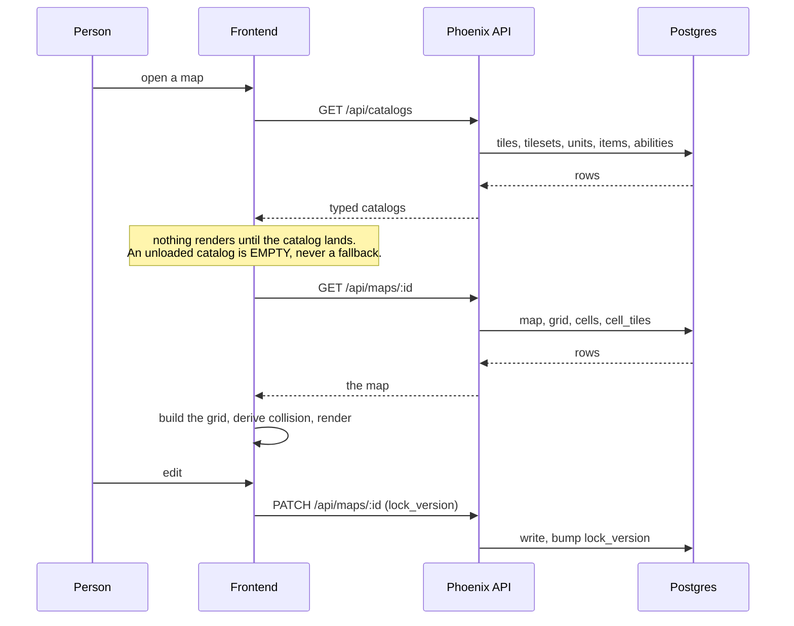

**The two gates in that diagram:**
- **Nothing renders before the catalog lands.** This is law 7 made operational.
- **`lock_version` on write.** Today two editors silently overwrite each other.

---

## 3. The schema

Seven groups. Each one is drawn on its own below; this first diagram is the join between them.

### 3.0 The whole thing, at a glance

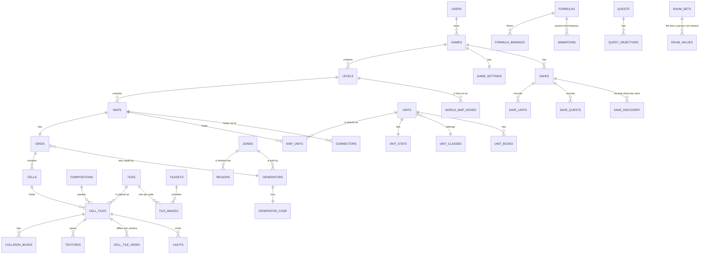

**Seven groups, and what decides which group a table is in:**

| Group | The question it answers | Written by |
|---|---|---|
| 3.1 Content | what CAN be placed | an author, or an import |
| 3.2 World | what IS placed, and how it looks there | the generator, then the editor |
| 3.3 Generation | what BUILDS a world | an admin, in the admin |
| 3.4 Simulation | what MOVES, LIGHTS or SHAPES it | an author |
| 3.5 Actors | who is IN it | an author |
| 3.6 Narrative | what HAPPENS in it | an author |
| 3.7 Player and platform | who OWNS and PLAYS it | a player, at runtime |

**The one line that decides everything in 3.2:** an author writes the definition, a player writes the save.
Today progress rides the map, so every player of a map shares one set of quest states. That is the single
largest structural defect in the current schema and 3.7 exists to end it.

### 3.1 Content

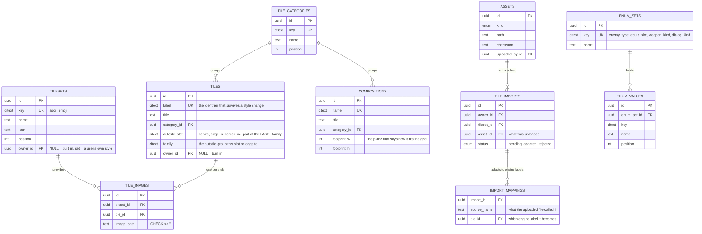

**The rule this shape enforces (D3, D7):** a LABEL owns every fact; a TILESET owns only the picture. A new
art style is one `tilesets` row plus N `tile_images` rows, and no fact is copied. The drift measured today
becomes unrepresentable.

**Parity is a query, not a test:** any tile with fewer image rows than there are tilesets.

**`autotile_slot` and `family` live on the tile, not on a placement.** Whether a picture is the centre of a
run or its north edge is a fact about the picture, so it belongs with the label. Today this is
`settings.position`, stored on 96 tiles with **no control that can write it** and **five different
spellings across the code**, and `tilesetLoader.ts:121` invents `position ?? 'single'` when it is missing.
One column with a real name ends all of that.

**A building has no "interior" field, because a building's inside is the building.** Ticket 54 is *"entering
a door, opacity, walking out the back, interior space"*: you walk in, the near walls drop their opacity so
you can see, and you walk out the back. That is `cutaway_near` and `transparent` on cells that already
exist, not a second kind of place.

A door may OPTIONALLY carry a trigger whose action is goto, if a particular building should lead somewhere
else. That is the existing rules system, with no new table. Ticket 55 is what comes after: *"stairs in
multi-floor buildings, then interior generators and dungeon connections"*.

**Import is two tables because adaptation is the hard half.** An uploaded tileset is useless until its
pictures are mapped onto engine labels, and that mapping is what the generator needs. `tile_imports` is the
upload, `import_mappings` is the translation, and only when every label a generator asks for has a mapping
is the import usable.

**`enum_sets` is only half the lists (D17).** A list a person can extend without new code lives here:
enemy types, equip slots, weapon kinds, dialog kinds, attack presets, HUD anchors. A list the engine must
switch on stays in Elixir and is SERVED from there: eases, trigger events, directions, views. The test is
not "is this list fixed", it is **"does adding an entry require code"**.

### 3.2 World

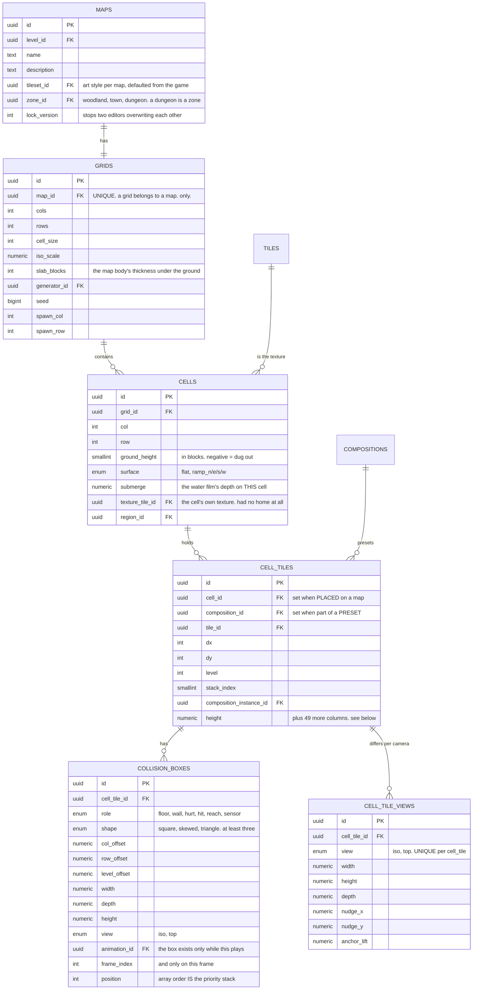

**`cell_tiles` is the one table that carries the setting vocabulary (D7, D14).** There is no
`tile_settings` table and no `composition_cells` table: a composition's tiles ARE cell_tiles, hung off the
composition with an offset from its anchor.

> *"A composition is just a preset of tiles positioned in the grid to create a complex asset... a
> composition DOESN'T HAVE ANY GRID; we'll I guess it does have a footprint, but that's different from the
> grid, a footprint is a plane that tells us how a given design would fit into the grid."*

---

#### The measurement that decides where a default lives

This is the single most load-bearing number in the redesign. Measured on the live catalog:

| Setting | Tiles that state it | Engine sites that invent it when absent |
|---|---|---|
| `display` | **26 of 636** | |
| `transparent` | **26** | |
| `actAsTile` | **4** | |
| `shape` | **0** | |
| | | **116 `?? <literal>` reads** |

So 610 of 636 tiles say nothing about how they draw, and 116 places in the renderer each make that decision
independently. His conclusion, quoted into the migration that found it:

> *"the default shouldn't happen at the engine level, it should happen at the setting level."*

**That is why every setting below is a COLUMN WITH A DEFAULT and not a jsonb key.** A column is always
present, so "unstated" stops existing as a state, and the 116 fallbacks have nothing left to do. This is
law 6 made structural rather than remembered.

---

#### Where the 184 authorable properties land

`SETTINGS.md` enumerates 184 properties from all six sources: the inspector panels, the unit panels, the
animation editor, the in-memory `GridAsset` model, the stored jsonb keys and the `Entity` model. **Only 44
of them are cell_tile settings.** The rest belong to other systems and have been sitting in the wrong place.

| Source group | Count | Lands in |
|---|---|---|
| Size & position | 32 | **24 → `cell_tiles`**, 3 → `cell_tile_views`, 1 → `tile_images`, 1 → `grids.slab_blocks`, 2 deleted |
| Appearance | 32 | **17 → `cell_tiles`** (+2 new = 19 columns), 4 → `lights`, 4 → the animation tables, 1 → `tiles.autotile_slot`, 1 → `tile_images`, 4 deleted, 1 not stored |
| Behaviour | 26 | **1 → `cell_tiles`** (`act_as_tile`), 5 → `collision_boxes`, 3 → `units`, 6 → `unit_stats`, 7 → `abilities`, 4 deleted |
| Character | 43 | 0 → `cell_tiles`. All of it to the actors group (3.5) |
| Animation | 30 | 0 → `cell_tiles`. All of it to the simulation group (3.4) |
| Rules | 10 | 0 → `cell_tiles`. All of it to the narrative group (3.6) |
| Identity | 13 | 5 → `tiles`, 2 → `compositions`, 2 → `cell_tiles`, 1 → `building_templates`, 3 deleted |

**The full property-by-property ledger is section 9.** It names all 184 and where each one goes, so nothing
can be quietly dropped the way 21 of `GridAsset`'s 41 fields are dropped today.

**Why the Character group leaves `cell_tiles`.** 43 properties (name, stats, dialog, loadout, inventory,
movement, attack pattern) describe a UNIT, and a unit is not a tile placement. They belong to the units
system and the combat system, which own stats together with items.

**Per-placement variation is the design, not a defect.** A unit dropped on a map carries its own numbers
on purpose: it might be a higher level, a different variant, tuned for that fight. The backend seeds the
unit options, the editor offers them, and the author changes whatever they want on the one they placed.

So the split is:

| Table | Holds |
|---|---|
| `units` | the seeded option: what this kind of unit IS, and what it starts with |
| `unit_stats` | its starting numbers |
| `map_units` | the one that was placed: where it stands, and everything the author changed on it |

**And a game-wide unit list, which does not exist today.** Every unit in a game, listed, editable in bulk
or one at a time, through the SAME settings panel you get when you select a unit on a map. One panel, two
ways in. That is why the panel's fields must be columns rather than a blob: a bulk edit is an UPDATE over
a set of rows, and you cannot write that against jsonb you never validated.

---

#### The 53 columns of `cell_tiles`

**Identity and placement (9).** `cell_id` and `composition_id` are nullable with a
`CHECK (num_nonnulls(cell_id, composition_id) = 1)`, which is the whole of D14 expressed as one constraint.

| Column | Type | Default | Note |
|---|---|---|---|
| `id` | uuid | | |
| `cell_id` | uuid FK | | set when PLACED on a map |
| `composition_id` | uuid FK | | set when part of a PRESET |
| `tile_id` | uuid FK | | the label it draws as |
| `dx` `dy` `level` | int | 0 | offset from the composition's anchor. 0 for a map placement |
| `stack_index` | smallint | 0 | which tile in this cell's stack. NOT `height_level` |
| `composition_instance_id` | uuid FK | | which stamped instance this came from, so the whole object selects as one thing |

**Size (3). There is no Zoom column (D20).**

| Column | Type | Default | Unit |
|---|---|---|---|
| `width` | numeric | 1.0 | how wide it draws |
| `height` | numeric | 1.0 | how tall it draws, in **BLOCKS**. the one height (D6) |
| `depth` | numeric | 1.0 | how deep it draws, into the screen |

**Why Zoom goes.** Zoom is not a separate idea, it is the three axes set to the same number. The draw
resolves as:

```
width  = base x Width  x Zoom
height = base x Height x Zoom
```

So Zoom multiplies the axes rather than replacing them, which makes it a second way to reach one outcome.
Width 2 with Zoom 2 draws at 4, and nothing in the panel says so. One fact, one owner: the axes are the
primitive, because they can express a uniform size and Zoom cannot express a non-uniform one.

**The worse divergence it was hiding.** The Depth control does two unrelated jobs depending on which camera
you are looking through:

| View | What Depth does today |
|---|---|
| top | stretches the sprite vertically. A SIZE |
| iso | thins the block inside its cell, unless Thickness is set, in which case it is ignored. A THICKNESS |

That is one control answering two different questions, and which question depends on the camera. Here,
**Depth is a size in every view** and **Thickness is the only thing that thins a block**, which is what the
four reaches already exist to say.

**Thickness (5).** How much of its own cell it fills, per iso direction. **Thickness is not width**: pulling
a face in leaves the block its own size and makes it thin, which is what a trunk is.

`thickness_lu` · `thickness_ru` · `thickness_ld` · `thickness_rd` (numeric, default 1.0) · `thickness_axis`
(enum).

**Span (5).** How many WHOLE cells it covers, per iso direction.

`span_forward` · `span_back` · `span_perp` · `span_perp_back` (int, default 1) · `span_axis` (enum).

> **Why "span" and not "depth".** Two different controls both end up called depth: one is a fraction of ONE
> cell, the other is a count of WHOLE cells. The type definition flags the clash in its own comment.
> Renaming one of them is the fix, and `span` cannot be mistaken for a size.

**Pose (6).** `nudge_x` · `nudge_y` (numeric, 0) · `rotation` (numeric, 0, **degrees**) · `mirror` (bool) ·
`art_scale` (numeric, 1.0) · `muzzle` (numeric, weapons only, where the shot comes out).

> `rotation` is stored in DEGREES. Today the control shows degrees and the column stores radians, so every
> read and every write converts, and a value copied between two places that disagree is silently 57x wrong.

**Order and slide (4).** `slide_amount` (numeric, 0) · `slide_direction` (enum) · `draw_order` (int, 0) ·
`stack_level` (smallint, 0).

> The control is "Toward and away", so that is what the column is called. Its current name is kept only so
> that name survives a round-trip, which is exactly law 1.

**Stacking (2).** `stack_at` (smallint, **default 1**) · `act_as_tile` (bool, false).

> **`stack_at` default is 1, and there is no ambiguity about it.** *"Stack default is 1, a generator can set
> that setting to other value based of context, so for grass and water we set it at 0, because it makes
> sense in their context."* `act_as_tile` means the cell behaves as if a tile is already in it, so the next
> one stacks on top: a road, a deck.

**Appearance (19).**

| Column | Type | Default | Note |
|---|---|---|---|
| `display` | enum | `all_faces` | `single` draws ONE face, a picture standing in the cell |
| `transparent` | bool | false | the ground shows through that face |
| `shape` | enum | `square` | `square`, `circle`, **`cone`** |
| `color` | text | | the HUE moves, the TONE does not |
| `color_role` | enum | | which part of the palette it takes |
| `opacity` | numeric | 1.0 | |
| `brightness` | numeric | 1.0 | written today, read by nothing. wired up here |
| `bg_color` | text | | |
| `side_color` | text | | **written from the material**, not derived by darkening the surface |
| `leaf_color` | text | | beside roof and wall on the colour chain |
| `fade_near` | bool | false | |
| `cutaway_near` | bool | false | a roof opens when the hero is under it |
| `min_alpha` | numeric | | how far a fade may go |
| `sign_text` | text | | |
| `sign_color` | text | | |
| `foliage` | bool | false | |
| `water_heading` | enum | | `n` `e` `s` `w`, NULL = still. four frame sets, one per heading |
| `surface` | enum | `plain` | `plain`, `tiled`, `ornament`. a building wall's finish |
| `pinned` | bool | false | |

**`shape` gains `cone`** because *"a conifer and a cypress are NOT round, they are cones"*, and today
`TileShape` offers square or circle, so every conifer in the catalog is lying about its silhouette.

---

#### Settings are named by their CONTROL, not by their wire spelling

**The panel is the vocabulary.** Every setting in this document is named for the control a person actually
uses, in the modal it lives in: Character, Size and position, Appearance, Behaviour, Animation, Rules.

A setting travels on the wire under some spelling or other. A spelling is not a setting. When these become
columns the control's name IS the column's name, and there is no translation table in either direction.

The one place a rename does real work is the pair that means two different things:

| Control | What it measures |
|---|---|
| **Depth** | how far the tile reaches into the screen, as a share of ITS OWN cell |
| **Footprint** | how many WHOLE cells it covers |

Both are called `depth` somewhere today, and the type definition flags the clash in its own comment.
The columns are `depth` and `span_*`, which cannot be mistaken for each other.

**No walkable, no blocking, no blocked, no blocks_movement, no is_solid.** A cell is blocked where a box
says so. This is a standing instruction that has been ignored before:

> *"it's the same fucking issue with 'blocking and walkable' properties from the pass, I requested to remove
> and use collissions and you silently keep unsing them until it became a huge problem."*

#### Collision boxes carry a ROLE, and may belong to one animation frame

**At least three shapes, and the triangle is the point:** *"hitboxes need to have at least 3 shapes, square,
skewed/triangle... basically we need to implement elevation and the triangly allow us to smoothly handle the
effects of things like stairs, mountains, it allow us to accurately depict them"*. The triangle IS the ramp.

Six roles, because one box answers many different questions and a geometry-only box cannot tell them apart:

| Role | Answers |
|---|---|
| `floor` | can I stand on this |
| `wall` | can I walk through this |
| `hurt` | does touching this damage me |
| `hit` | does a spell or a swing land here |
| `reach` | is a target within range of this attack |
| `sensor` | did something enter this area |

**A box may be gated to an animation frame.** *"we might have a big boss that uses a chain as weapon, we'd
have to draw multiplw hitboxes that follow the same pattern of the chain."* So `animation_id` plus
`frame_index`: the box exists only while that frame is on screen, which is how a swing can hit and a
sheathed weapon cannot.

**Per view, iso and top only (D16).** The model carries the view axis; only the two cameras that ship get
authored rows. 2D stays behind its flag and gets no authoring surface until it comes back.

---

#### `cell_tile_views`, and what it replaces

Three numbers are typed into the renderers today: iso `2.2`, 2D `1.5`, top `1.0`. They move every tile at
once, so a tile that reads correctly in iso can be unreadable from above and there is no way to say so.

`cell_tile_views` is the way to say so, and it is **sparse**: a row exists only where a tile actually needs
to differ. No row means the base columns apply. The three constants become the seeded iso and top defaults.

**This is the one part of the schema with a known history of being designed and not built.** The 2026-07-05
design approved per-view overrides and **zero of 366 tiles carry one**. It is in the schema this time
because the minimap and the top view both ship, and both are currently second-class for exactly this reason.

### 3.3 Generation

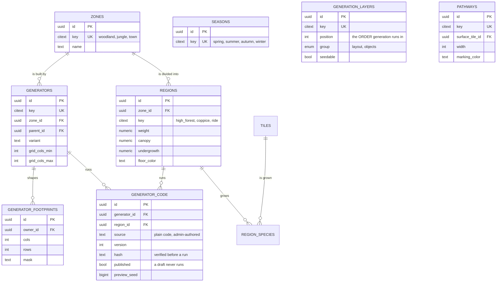

**D8, the three words kept apart:** a ZONE is the kind of place, a REGION is a sub part of a zone, a SEASON
is the time of year. The live `zones` table holds seasons and is renamed.

> *"zone and seasons are vastly different... A season is spring, summer, etc. A zone is woodland, jungle,
> town, etc. A region is a sub part of said zone."*

And a region is a PLACE, never a number: two regions that differ only by a density are one place with two
settings.

**What this kills:** `generators.config` is the live one-fact-two-owners hazard, patched by ~40 of the 102
data migrations in raw SQL. Typed rows end it, and they end the whitelist problem with it. Measured cost of
the current shape: **ten data migrations' worth of region work was erased repeatedly**, because
`GeneratorSource.seed/0` writes the whole `config` column from its own literal every time it runs.

#### The three tables the building generator needs

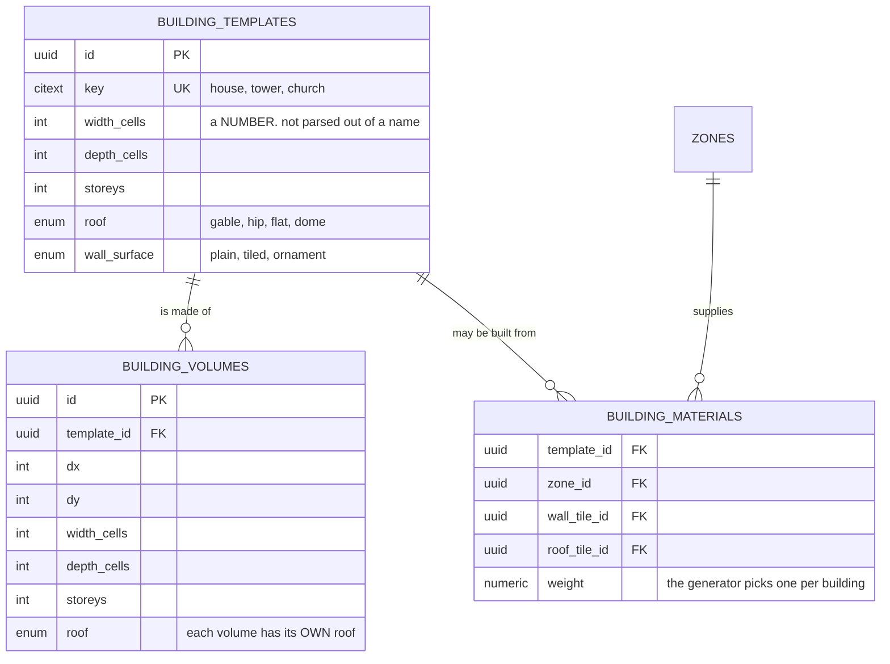

**Why this is three tables and not a parameter.** A building's size lives in a STRING today: widths are
parsed out of composition NAMES (`house_3`, `house_4`, `house_5`), so asking for a six-wide house means
authoring a new composition called `house_6`. A number in a column makes the whole range free.

**`building_volumes` is the multi-volume case**, which has no representation at all today: a church is two
volumes, a nave and a tower, each with its own footprint and its own roof. What exists instead is one box
with a raised column, which is why a church reads as a house with a bump.

**`building_materials` is one wall material per building, chosen by the generator.** Not a fixed
type-to-material mapping, and not a different material per wall. The generator picks one row per building
and the whole building wears it.

### 3.4 Simulation

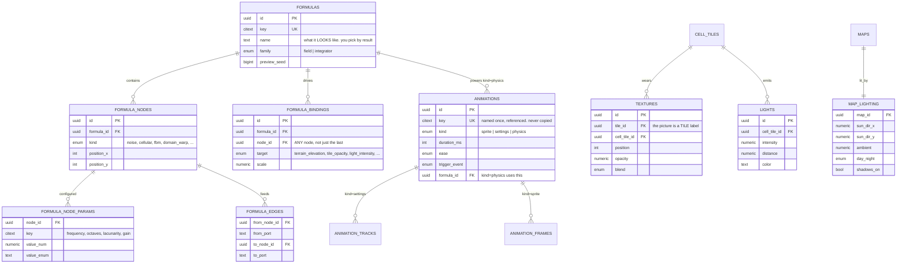

**The finding that shapes this:** a formula over `(x, y)` with time frozen is a **heightfield**; the same
formula over `(x, y, t)` per frame is an **animation**. So the 3D visualizer and the terrain generator are
one evaluator, and `formula_bindings.target` spans systems on purpose.

> *"the system should have a table that allow us to store formulas with a preview of how the formula
> translates to 3d, imagine a 3d visualizer... we want to use physics to handle things like randomizing
> terrain elevation, for example, I can make a formula that randomizes terrain elevation zones."*

#### Why a formula is a GRAPH and not an expression

Researched before designing, per the standing rule. Godot's VisualShader, Unreal's material graph,
Blender's node editor and both World Machine and Gaea converged on the same answer independently: **a
formula is a graph of typed, parameterised primitive nodes.** Not a string to parse, not a fixed pipeline.

The reason is domain warping, which is the technique that makes procedural terrain look like terrain:

```
f(p) = fbm(p + fbm(p + fbm(p)))
```

The intermediate values are useful in themselves. The inner `fbm` that warps the coordinates is also the
thing that should drive the colour, or the moisture, or where the trees go. **That is why
`formula_bindings.node_id` points at ANY node and not at the output**: an expression only has a result, a
graph has a result at every step.

**The node vocabulary**, taken from FastNoiseLite because it is the one the engine will use:

| Axis | Values |
|---|---|
| noise type | OpenSimplex2, OpenSimplex2S, Cellular, Perlin, ValueCubic, Value |
| fractal type | None, FBm, Ridged, PingPong, DomainWarpProgressive, DomainWarpIndependent |
| cellular distance | Euclidean, EuclideanSq, Manhattan, Hybrid |
| cellular return | CellValue, Distance, Distance2, Distance2Add, Distance2Sub, Distance2Mul, Distance2Div |
| domain warp | OpenSimplex2, OpenSimplex2Reduced, BasicGrid |
| numeric params | frequency, octaves, lacunarity, gain, weighted_strength, ping_pong_strength, jitter, warp_amp, seed |

**The one that answers his terrain question directly:** Cellular returning `CellValue` gives **discrete
zones**, each cell of the noise a flat plateau at its own value. Returning `Distance` gives a **gradient**.
So "randomize terrain elevation zones" is one node with one enum set to `CellValue`, and "make it roll" is
the same node set to `Distance`. That is the whole reason the enum is stored rather than the behaviour.

**The second family is integration, not fields.** Rope, cloth and chain need Verlet integration: a list of
points, a list of distance constraints, and a fixed timestep. `formulas.family` separates the two because
a field is evaluated and an integrator is stepped, and nothing useful comes of pretending they are one.

#### Water is seven effects, not one tile

All specified across tickets 1D and 8, none built:

| Layer | What it needs |
|---|---|
| depth tint | `cells.submerge`, which now exists as a number on the cell |
| caustics | an animation bound to the floor tile under the water, not to the water |
| animated surface | four frame sets, one per `water_heading` |
| reflection | the lighting pass, using `map_lighting.sun_dir` |
| foam | an autotile family on the edge where water meets not-water |
| flow | `cell_tiles.water_heading`, so a river reads as moving in a direction |
| falls | a step between two reaches at different elevations gets a fall tile |

**The reason water kept getting redesigned:** its height has had three successive positions across the
tickets (zero everywhere, then a dug negative channel with a sub-1 tile inside it, then a zero-height film
over unchanged terrain). The film supersedes. `cells.submerge` is that film, and it is per cell, so a
channel is deep in the middle and shallow at the banks without a second tile.

### 3.5 Actors

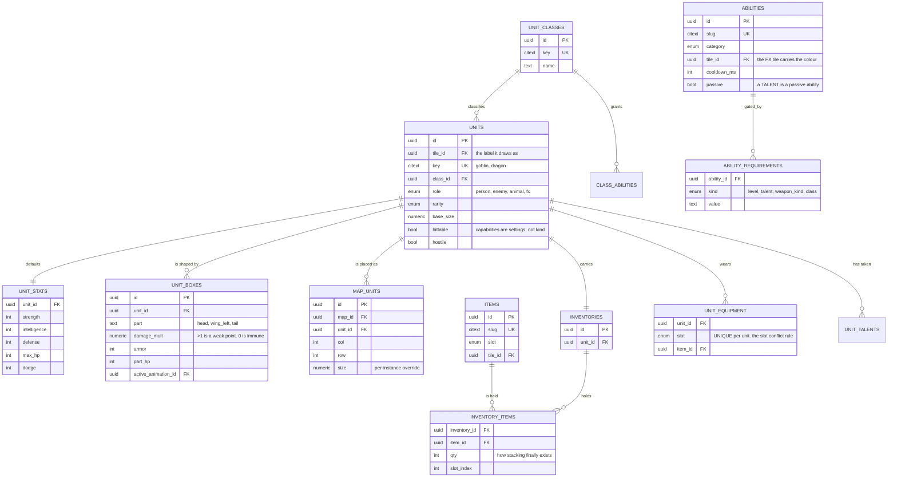

**`unit_stats` are DEFAULTS**, and a placed unit may differ: *"we can randomize X number of units, assign
default stats to each, that we can modify individually later"*. There is no creature-vs-unit split.

**A talent is a passive ability**, not a parallel vocabulary. `ability_requirements` is a table rather than
columns because he named two kinds in one sentence and a column per kind does not survive the third.

### 3.6 Narrative, and the world beyond one map

```mermaid
erDiagram
    QUESTS {
        uuid id PK
        uuid game_id FK "the owner. always set"
        uuid map_id FK "NULL = game wide. set = scoped to that map"
        uuid giver_unit_id FK
        text title
    }
    QUEST_OBJECTIVES {
        uuid id PK
        uuid quest_id FK
        uuid map_id FK "WHERE this step happens. NULL = anywhere"
        enum kind "kill, travel, find, talk"
        text target
        int required
        int position "the order the steps are shown in"
    }
    QUEST_REQUIREMENTS {
        uuid quest_id FK
        uuid requires_quest_id FK "must be done before this one opens"
    }
    QUEST_REWARDS {
        uuid quest_id FK
        enum kind "item, xp, ability, unlock"
        text value
    }
    DIALOGS {
        uuid id PK
        uuid unit_id FK
        enum kind "static, situational, quest"
        int position "specificity: quest, then situational, then static"
        text body
    }
    RULES {
        uuid id PK
        uuid cell_id FK
        uuid map_unit_id FK
        enum event "enter, interact, defeat, status, timer"
        enum action "goto, spawn, give, message, win, lose, unlock"
    }
    RULE_CONDITIONS {
        uuid rule_id FK
        enum kind "has_item, quest_state, level, talent, flag"
        enum operator
        text value
    }
    CONNECTORS {
        uuid id PK
        uuid map_id FK
        uuid target_map_id FK "a real FK. ends dangling exits"
        uuid return_connector_id FK "the door you come back out of"
        enum interaction "walk, interact, trigger"
        enum kind "edge, door, stair, portal"
        bool one_way
    }
    CONNECTOR_CELLS {
        uuid connector_id FK
        int col
        int row
    }
    WORLD_MAP_NODES {
        uuid id PK
        uuid level_id FK
        uuid map_id FK
        int x
        int y
        bool is_start
    }
    WORLD_MAP_EDGES {
        uuid id PK
        uuid from_node_id FK
        uuid to_node_id FK
        uuid connector_id FK "the edge IS a connector, drawn"
    }
    QUESTS ||--o{ QUEST_OBJECTIVES : has
    QUESTS ||--o{ QUEST_REWARDS : pays
    QUESTS ||--o{ QUEST_REQUIREMENTS : "opens after"
    MAPS ||--o{ QUEST_OBJECTIVES : "is where a step happens"
    CELLS ||--o{ RULES : trigger
    MAP_UNITS ||--o{ RULES : trigger
    RULES ||--o{ RULE_CONDITIONS : gated_by
    UNITS ||--o{ DIALOGS : speaks
    MAPS ||--o{ CONNECTORS : "leads out of"
    CONNECTORS ||--o{ CONNECTOR_CELLS : "is ALL the gate's cells"
    CONNECTORS ||--|| CONNECTORS : "returns through"
    LEVELS ||--o{ WORLD_MAP_NODES : "is laid out as"
    WORLD_MAP_NODES ||--o{ WORLD_MAP_EDGES : "is joined by"
```

**A connector is a trigger whose action is goto**, and an exit is ALL of the gate's cells, not one. Today
an exit is a single coordinate, which is why a three-cell doorway only works if you walk through the middle
of it.

**`return_connector_id` is the door you come back out of.** A trigger stair must send you back to the exact
door you took, not to the map's spawn point. There is no return data at all today, so every trip back is a
guess.

**The world map is nodes and edges, and an edge IS a connector.** *"pathways between templates are not
stored"*, so the relationship between two maps exists only while a generator is running and then is gone.
Two tables make the level a shape you can see, and `world_map_edges.connector_id` means the drawn line and
the exit you can actually walk through cannot disagree, because they are the same row.

**A dungeon needs no tables of its own, because a dungeon is a ZONE.** It sits beside woodland, jungle and
town in `zones`, and its parts are its REGIONS, exactly like every other preset. Ticket 51 asks for
*"a way to say, 'this is the entrance, this is part X, this is the final, this is boss room X'"*, and a
region key is that sentence. A level may hold many dungeon maps, which is just many maps generated from
that zone.

The *"one-way portal home"* the same ticket asks for is `connectors.one_way`, a setting on a connector.
A locked gate is a rule on the gate's cell with a `has_item` condition. Both already exist above.

**The line that matters most in this section:** a quest's row is the authored DEFINITION; a player's
progress lives in the save (3.7). Today progress rides the map, so it is shared by every player of that map.

---

### 3.7 Player and platform

The group the product frame promotes from infrastructure to product.

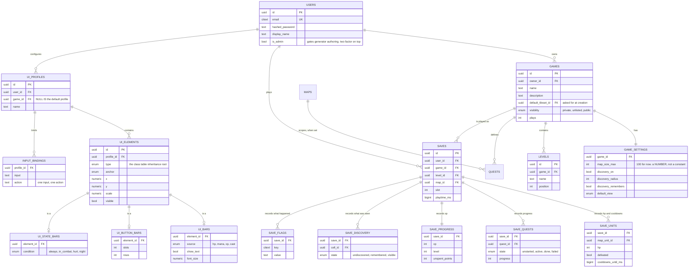

**Author and player are different roles on the same components.** Everything above the line in 3.1 to 3.6
is authored once. Everything in `saves` and its children is written by one player and touches nobody else.
That single split is what makes a public game playable by more than one person, and it is the thing the
product frame requires before anything else.

**`games.visibility` is the whole sharing model**, and it is three values rather than a permissions system,
because the product is *"a platform and a community where people can play with their ideas openly"*. Private
is the default, unlisted is a link, public is listed.

**`game_settings.map_size_max` is a number in a row**, replacing `MAP_SIZE_MAX` as a constant. *"100, for
now"* is exactly the kind of fact that should not need a deploy to change.

**Discovery is three states per cell per SAVE.** Undiscovered is black, remembered is what you saw and left,
visible is what you can see now. It belongs to the save and not the map for the same reason quest progress
does. `discovery_on`, `discovery_radius` and `discovery_remembers` are per game, so a game can turn the
whole system off.

**`save_flags` is the escape hatch, deliberately.** A rule's action can set a flag and a rule's condition
can read one, which is how one-off narrative state exists without a table per story beat. It is key and
value, per save, and nothing else may read it.

#### The HUD, and why it is four tables

Class table inheritance (Fowler), and the pattern is taken from Bartender4, which solved this exact problem
for a game with more HUD surface than this one: a `Bar` root, a `ButtonBar` for anything holding slots, and
a separate `StateBar` for visibility rules.

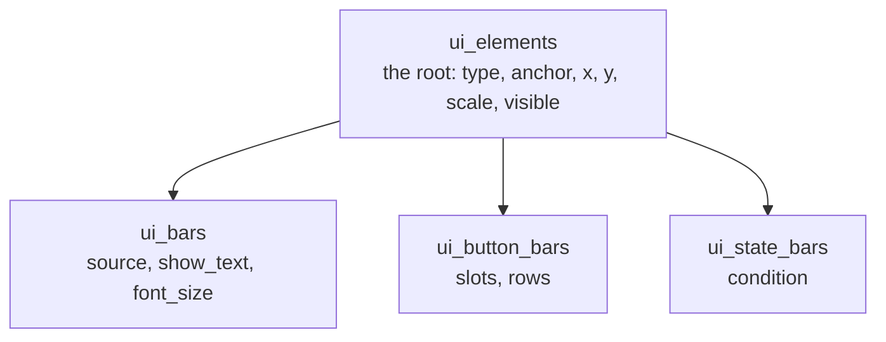

**Why not one wide table.** The HUD layout editor authors **216 values** today (12 elements x 9 fields x 2
forms) into a shape where most fields are meaningless for most elements. And `saveElements` **is called
from nowhere**, while the panel's own text says *"It saves now"*. A typed root plus three typed children is
the smallest shape where a bar cannot have a slot count.

**`ui_profiles.game_id` NULL IS the default profile.** Not a `is_default` boolean beside a nullable FK,
which is two facts that can contradict each other.

**A binding is one input to one action.** `input_bindings` has no jsonb, because a keymap that is a blob is
a keymap you cannot query for conflicts.

---

## 4. The systems

51 subsystems. Each entry: **owns** (its tables), **rules** (the invariants that must hold), **gate** (what
proves it works). A **[NEW]** tag means it does not exist today and was named by a ticket.

A gate is written BEFORE the system is built, and it is the acceptance test for that system.

---

### A · WORLD

#### A1 · Map & grid
**Owns** `maps`, `grids`, `cells`.
**Rules** A grid belongs to a map, only. A cell is addressable by `(grid, col, row)`. CELL is a 2D square,
BLOCK is a 3D unit, TILE is what goes in. Never interchange. Grid dimensions are saved AND restored:
`cell_size`, `iso_scale` and `slab_blocks` are written on every save today and never read back.
**Gate** Every map round-trips: save, reload, and every cell and every setting is identical.

#### A2 · Elevation
**Owns** `cells.ground_height`, `cells.surface`, `cell_tiles.height`.
**Rules** ONE height, in blocks (D6). *"this is not two system, it's just one with two applications,
there's height and height can be achieved by increasing it on a tile or stacking."* Negative is legal and
means dug out. `CHECK (height >= 0)` on the tile's own height.
**Gate** A channel at -1 beside a reach at -2 renders a cascade, and a ramp cell can be entered from both ends.
Today per-cell elevation exists, persists, and is **all zeros on every map**, because the generator zeroes
it. The gate is a non-zero elevation surviving generation.

#### A3 · Terrain
**Owns** `zones`, `regions`, `seasons`, `region_species`, `cells.region_id`, `cells.texture_tile_id`.
**Rules** A region is a PLACE, not a density. Two regions that differ only by a number are one place with
two settings. A zone's regions are its own; the generic set never applies to nine biomes. A zone's palette
has a soil tone, a base tone and a per-season variant.
**Gate** Each zone's regions are distinct, and no region key appears under two zones.

#### A4 · Water
**Owns** `cells.submerge`, water tiles, water textures, water animations.
**Rules** Water is a tile, and the generator sets its settings from context. *"waster is just a tile, the
generator sets it to 0 beacuse it makes sense in the context, and we set it's elevation < floor level for
cases like rivers."* A reach is a run of cells at one elevation; a step between reaches gets a fall tile.
A way never paves over water.
**Gate** A `through` river is crossable in every place the course promises, not one. Measured before: **60
to 79 channel cells paved over per town** at 50x50.

#### A5 · Pathways
**Owns** `pathways`.
**Rules** A pathway is a STRETCH with one or two exits, so six pathways is up to twelve exits. The entrance
is always south. A way is a colour on the ground block, never a tile laid on top.
**Gate** Exits equal what the pathway count promises, on every layout.

#### A6 · Collisions
**Owns** `collision_boxes`.
**Rules** A box is in BLOCKS, relative to the anchor. Array order is the priority stack. Boxes present =
solid; an explicit empty set = explicitly not solid; no row = unstated. Six roles, because one box answers
many questions. Per view is the model; iso and top are authored (D16).
**Gate** An authored blocked cell survives a save and reload. **That is the thing that cannot happen
today:** "Blocks the player" writes `grid.collision[row][col]`, which `serializeGrid` never sends, so
blocking an empty cell or unblocking a solid tile is lost on reload.

#### A7 · World map **[NEW]**
**Owns** `world_map_nodes`, `world_map_edges`.
**Rules** An edge IS a connector, so the drawn line and the exit you can actually walk through are one row and cannot disagree.
Exactly one node per level is `is_start`.
**Gate** Every map in a level is reachable from the start node by walking, and the drawing says the same.

#### A8 · Interiors **[NEW]**
**Owns** nothing of its own. Uses `cell_tiles.transparent` and `cell_tiles.cutaway_near`.
**Rules** A building's inside IS the building. Ticket 54: *"entering a door, opacity, walking out the back,
interior space"*. Walls near the camera drop their opacity so the inside reads; you walk in a door and out
the back. A door may optionally carry a trigger whose action is goto, for a building that should lead
somewhere else, and that is the existing rules system.
**Gate** Walk into a building, see the inside, walk out the other side. No new kind of place was created.

#### A9 · Stairs and floors **[NEW]**
**Owns** `connectors.kind`, `connectors.one_way`, `connectors.return_connector_id`.
**Rules** Ticket 55, in order: *"stairs in multi-floor buildings, then interior generators and dungeon
connections"*. A regular stair you walk up, using the triangle collision box as the ramp. A trigger stair
moves you, and sends you back to the exact door via `return_connector_id`. A one-way portal states it.
**Gate** Up and back down lands you on the cell you left, every time.

---

### B · CONTENT

#### B1 · Art styles · B2 · Tiles
**Owns** `tilesets`, `tiles`, `tile_images`, `tile_categories`.
**Rules** A tile is an image. A label owns every fact. A tileset owns only the picture. No glyph, no emoji,
no char in the database. An art style is *"just a tileset, that's it... a set of png images"*.
**Gate** Parity is a query: no label may have fewer images than there are tilesets.

#### B3 · Compositions
**Owns** `compositions`, `composition_instances`, and cell_tiles hung off a composition.
**Rules** A composition is a preset of tiles plus a footprint. It has no grid. **It does not nest** (D10):
*"to make a church all you have to do is either put a house and a tower in the grid next to each other, or
you can use the house as guide to make the church, then add the extras."* A building uses ONE wall material.
A roof is two tiles, body and ridge cap. **A tile named like a building is removed from the catalog**: a
church is a construction of tiles, not a tile.
**Gate** Stamp a composition, save, reload, and select the whole object as one thing.

#### B4 · Textures **[NEW]**
**Owns** `textures`, `cells.texture_tile_id`.
**Rules** A texture's picture is a tile LABEL, so it comes through the normal bake pipeline. A texture
carries animations and physics but **not another texture** (D11). A cell may carry its own texture,
independent of what is placed in it.
**Gate** "Add texture to this" is an action a person can take. Today it has no home in the data model at
all, so it cannot even be asked for.

#### B5 · Bake · B6 · Import and export **[NEW]**
**Owns** `assets`, `tile_imports`, `import_mappings`.
**Rules** An uploaded tileset is useless until its pictures are mapped onto engine labels, and that mapping
is what a generator needs. Export is the same mapping, read the other way.
**Gate** An imported tileset renders without a single code change, and a generator written for the built-in
style runs on it.

---

### C · SIMULATION

#### C1 · Physics and formulas **[NEW]**
**Owns** `formulas`, `formula_nodes`, `formula_node_params`, `formula_edges`, `formula_bindings`.
**Rules** Deterministic: the same cell at the same time gives the same value at every camera facing and on
every machine. Cheap: it runs per visible cell per frame. **Any node may bind to a property**, not just the
output. Two families: a field is evaluated, an integrator is stepped.
**Gate** The 3D preview and the generated terrain agree, because they are the same evaluator. A Cellular
node set to `CellValue` produces discrete elevation zones on a real map.

#### C2 · Animations
**Owns** `animations`, `animation_tracks`, `animation_frames`, the join tables.
**Rules** An animation is named once and referenced, never copied into a map. Three kinds: sprite, settings,
physics. Per-instance phase offset, or a field of them updates on one frame and reads as lag. **Animations
come first** (D13), because frame-gated hitboxes depend on sprite playback.
**Gate** One animation edited once changes every tile that references it. And the 5 track targets that
currently do nothing either work or are removed.

#### C3 · Lighting · C4 · Shadows **[NEW]**
**Owns** `lights`, `map_lighting`.
**Rules** One sun per map, served. A shadow is cast from the structure and the sun direction. Light is
night-gated; shadow is a day pass. **Whether a tile emits light is a setting**, not a name.
**Gate** All six faces of a block respond to the sun, not two. Today whether a tile glows is **four
hardcoded name strings** in `shared.ts:555` and the whole glow is invented frontend-side.

#### C5 · Weather · C6 · Discovery **[NEW]**
**Owns** `weather`, `map_weather`, `save_discovery`, `game_settings.discovery_*`.
**Rules** Weather and day/night are persisted on the map. Discovery is per SAVE, because it is what a
player has seen. Three states: undiscovered, remembered, visible.
**Gate** Reload a map and the time of day and weather are what you left. Two players of one map have
different discovery.

#### C7 · Water effects **[NEW]**
**Owns** water animations, water textures, `cell_tiles.water_heading`.
**Rules** Seven layers: depth tint, caustics, animated surface, reflection, foam, flow, falls. Caustics
bind to the floor tile under the water, not to the water.
**Gate** A river reads as moving in a direction, and the direction is data.

---

### D · GENERATION

#### D1 · Generators and code
**Owns** `generators`, `generator_code`, `generation_layers`.
**Rules** `position` on a layer is the order generation runs in, and the backend's ordering is honoured
(today `GeneratorDef.position` is parsed and never read). A generator's code is admin-authored,
hash-verified, and `published` gates execution (D15). The script gets a grid API and nothing else: no
ambient globals, no DOM, no network, no storage, no clock. A capability limit, not a language limit.
**Gate** A generator authored entirely in the admin produces a playable map with no code deploy.

#### D2 · Layers · D3 · Zones and regions
**Owns** `zones`, `regions`, `seasons`, `region_species`, `generation_layers`.
**Rules** A rule is not a value: "the border is closed except at its gates" holds on every map, so the seal
cannot be conditional on data; how DEEP the band runs describes one kind of map, so it must be.
**Gate** No region key appears under two zones, and a shared builder's numbers reach only the rows that
declare them.

#### D4 · Footprints **[NEW]**
**Owns** `generator_footprints`.
**Rules** A footprint is a plane that says how a design fits the grid. It is authored in the admin beside
the code and the preview. It is not a grid.
**Gate** The admin shows, for one region: the preview of the result, the code that generates it, and the
footprint design. All three, on one screen.

#### D5 · Buildings **[NEW]**
**Owns** `building_templates`, `building_volumes`, `building_materials`.
**Rules** Size is a NUMBER, not parsed out of a composition name. A building may have several volumes, each
with its own footprint and roof. One wall material per building, picked by the generator.
**Gate** Asking for a six-wide house works without authoring a `house_6`.

---

### E · ACTORS

#### E1 · Units · E2 · Hitboxes **[NEW]**
**Owns** `units`, `unit_stats`, `map_units`, `unit_boxes`.
**Rules** A unit is a tile with extra stuff. Capabilities are settings, not kind. Stats on the unit are
DEFAULTS and a placed unit may differ: *"there's only units and we can randomize X number of units, assign
default stats to each, that we can modify individually later."* There is no creature-versus-unit split.
A box is authored once at 1x and scaled by size. One incoming attack resolves against exactly ONE box.
**Gate** A 3x unit's body, targeting, movement, selection and attack reach all agree with its picture.
**Also owed here:** a game-wide unit list, editable in bulk or individually through the same settings panel
the map uses. And `enemyCombat` resolving stats with `styleTile('ascii', label)` must go: it hardcodes one
tileset, so a unit placed under a different art style reads the wrong numbers. One engine, N art styles.

#### E3 · Classes and talents · E4 · Stats
**Owns** `unit_classes`, `class_abilities`, `unit_talents`, `ability_requirements`.
**Rules** **A talent is a passive ability**, in the same table, not a parallel vocabulary. A requirement is
a row, not a column: *"if an ability might require levels or specific talents, then just add the fucking
field for it."*
**Gate** An ability gated on a talent is unusable until the talent is taken.

#### E5 · Combat · E6 · Abilities · E7 · Items
**Owns** `combat_rules`, `abilities`, `ability_requirements`, `items`, `inventories`, `inventory_items`,
`unit_equipment`.
**Rules** One place reads a stat, in one unit. Dodge, block and crit are **derived from stats**, not stored
per attack. Equipment slots are unique per unit. An item stacks by `qty`. The chain is
`unit -> inventory -> inventory_items`, a join that says which items a unit has access to.
**Gate** Changing a served combat coefficient changes the damage on screen. Today it changes nothing: a
served number that moves nothing means something downstream is dividing up what is left.

#### E8 · AI
**Owns** `unit_ai`, `movement` rows.
**Rules** Behaviour is data on the unit, not a switch on its name.
**Gate** Two units of the same kind with different AI rows behave differently.

---

### F · NARRATIVE

#### F1 · Quests · F2 · Dialogs · F3 · Rules
**Owns** `quests`, `quest_objectives`, `quest_rewards`, `quest_requirements`, `dialogs`, `rules`,
`rule_conditions`, `save_flags`.
**Rules** A quest row is the authored definition; progress belongs to the save. Dialog specificity: quest,
then situational, then static.
**Gate** Two people play the same map and their quest states do not touch. A quest given on one map is
completed by steps on another, and a chained quest stays closed until the one it waits on is done.

#### F4 · Connectors
**Owns** `connectors`, `connector_cells`.
**Rules** A connector is a trigger whose action is goto. An exit is ALL of the gate's cells, not one. A
connector's target is a real FK.
**Gate** Deleting a map leaves no dangling connector, because the FK says so.

#### F5 · Lock and key **[NEW]**
**Owns** nothing of its own. A rule on the gate's cell with a `has_item` condition.
**Rules** A locked gate is a rule, not a new concept. What the GENERATOR must guarantee is that the key is
reachable without passing through the gate it opens.
**Gate** That reachability is a query the generator checks on every layout it produces, not something
hoped for.

---

### G · PLAYER

#### G1 · Games and levels · G2 · Saves · G3 · Progression
**Owns** `games`, `game_settings`, `levels`, `saves` and its children.
**Rules** A LEVEL is a container of maps, not a map. Author and player are different roles on the same
components. A game has an owner and a visibility.
**Gate** Two people play the same map and their progress does not touch.

#### G4 · HUD · G5 · Input
**Owns** `ui_profiles`, `ui_elements`, `ui_bars`, `ui_button_bars`, `ui_state_bars`, `input_bindings`.
**Rules** Class table inheritance: a typed root plus typed children, so a bar cannot have a slot count.
`ui_profiles.game_id` NULL IS the default profile. A binding is one input to one action, queryable for
conflicts.
**Gate** The layout editor's Save writes a row. Today `saveElements` is called from nowhere while the panel
says *"It saves now"*.

#### G6 · Minimap **[NEW]**
**Owns** nothing of its own. Reads cells, discovery and the top view.
**Rules** One pure function serves both the in-game minimap and the world map view.
**Gate** The minimap and the map agree, because they are one function.

#### G7 · Character panel **[NEW]**
**Owns** nothing of its own. Reads units, stats, inventory, abilities, talents.
**Rules** Tabs: inventory, map, stats, status, class, abilities.
**Gate** Every tab reads a real row. No tab shows a number the backend does not serve.

---

### H · PLATFORM

#### H1 · Users
**Owns** `users`.
**Rules** `is_admin` gates generator authoring, with two factor on top. *"Since it's admin only
functionality, it should be fine on security side, we'll have two factor or something to ensure it's hard
to reach."*
**Gate** A non-admin cannot write `generator_code`, proved by a test that tries.

#### H2 · Visibility and sharing **[NEW]**
**Owns** `games.visibility`, `games.plays`.
**Rules** Private by default, unlisted is a link, public is listed. This is the product, not a feature.
**Gate** A public game is playable by a signed-in stranger, and they cannot edit it.

#### H3 · Admin and authoring **[NEW]**
**Owns** the admin surface over generators, tiles, compositions, zones and regions.
**Rules** For one region the admin shows the preview, the code and the footprint. A code editor with syntax
highlighting, nothing more elaborate: *"we just need markdown with synthax highlight... and have the ability
to code a new generator end to end, that's it."*
**Gate** A whole generator is authored, previewed, published and run without touching a repository.

---

## 5. The flows

### 5.1 Generate a map

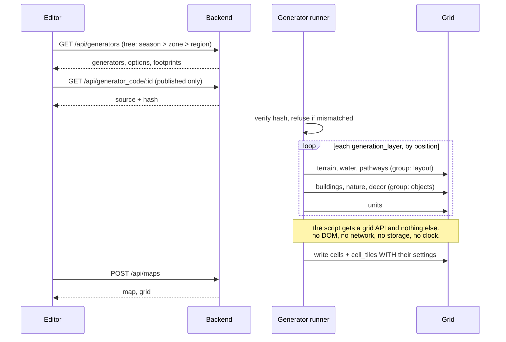

**The rule the loop enforces:** a layer is a step at a place in a sequence, and `position` is that place.

### 5.2 Load a map

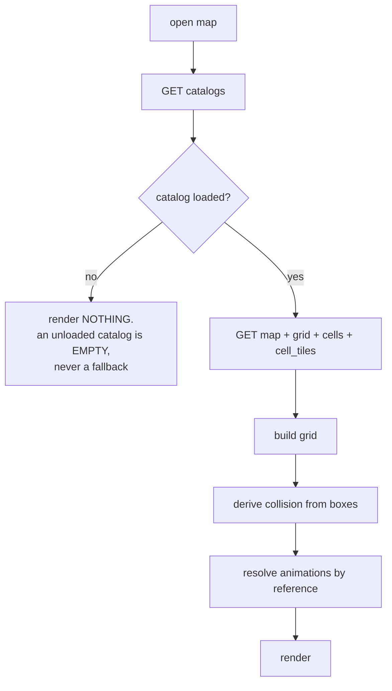

**Why the gate at C matters:** every hardcoded fallback in the current renderer exists because something
drew before its data arrived.

### 5.3 Place a tile, and resolve what it looks like

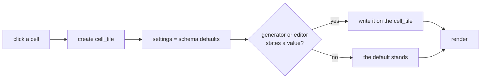

**This is D7 as a picture.** There is no catalog lookup in that path, so there is nothing for a re-seed to
erase and nothing to drift per art style.

### 5.4 Stamp a composition, and save one

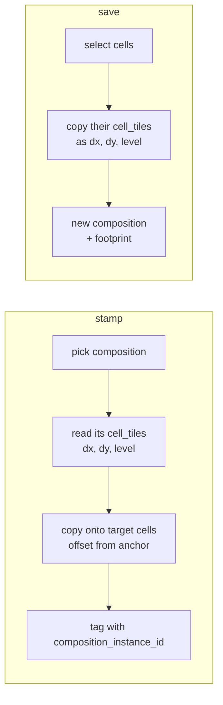

**Same rows, same settings, both directions.** That symmetry is what makes composition authoring the same
code path as map authoring.

### 5.5 A combat swing

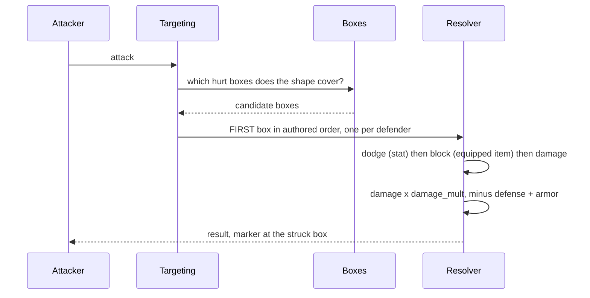

**Two rules made explicit here.** One attack resolves against exactly one box per defender, or a unit with
five overlapping part boxes takes five times the damage. And dodge and block are read once, in one unit,
from the stat and the equipped item.

### 5.6 Publish a generator

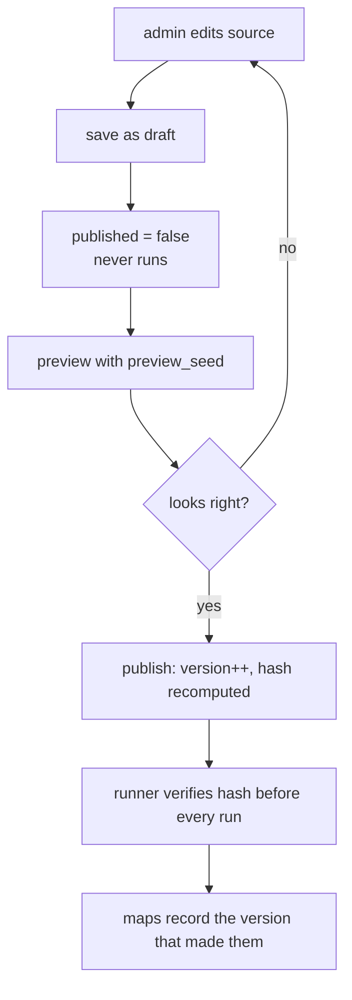

**`version` plus `hash` buy the rollback:** a generator can be edited without orphaning the maps it already
made.

### 5.7 Play and save

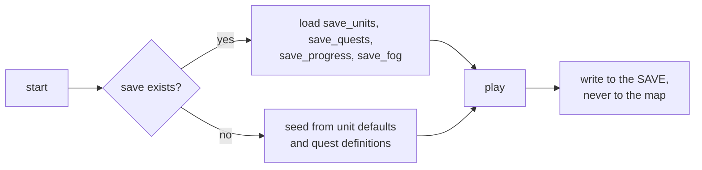

**The line that fixes the biggest hole:** play writes to the save. Today quest progress is written onto the
map, so it is shared by everyone who opens it. `save_fog` is `save_discovery` here.

### 5.8 Walk into a building, and back out

The ordinary case, which is most buildings. Nothing loads, nothing changes place.

```mermaid
flowchart LR
    A["step through the doorway"] --> B["walls between you and the camera<br/>drop their opacity"]
    B --> C["the inside reads. it is the same cells<br/>it always was"]
    C --> D["walk out the back"]
```

**Ticket 54 is four words and they are all rendering:** *"entering a door, opacity, walking out the back,
interior space"*. The inside of a building is the building. There is no interior map, no load, no second
kind of place.

**The optional case:** a door carries a trigger whose action is goto, because THAT building should lead
somewhere else. Then `return_connector_id` brings you back out of the door you used rather than the map's
spawn point, which is the only piece of data this needs that does not exist today.

### 5.9 A locked gate, and the key that opens it

```mermaid
flowchart TD
    G["generator runs the DUNGEON zone"] --> R["its regions lay out the map:<br/>entrance, part X, final, boss room"]
    R --> K["pick a gate: a connector between<br/>two regions"]
    K --> I["pick a key item"]
    I --> Q{"is the key reachable<br/>WITHOUT passing the gate?"}
    Q -->|no| K
    Q -->|yes| W["write a RULE on the gate cell:<br/>condition has_item = key"]
    W --> P["play: the rule opens it"]
```

**No new tables in that flow.** A dungeon is a zone, its parts are its regions, the gate is a connector and
the lock is a rule with a condition. The only thing that is genuinely hard is the property in the diamond:
**the key must be reachable without the gate it opens.** That is a check the generator runs, and a test
asserts, on every layout it produces.

### 5.10 Publish a game, and someone else plays it

```mermaid
sequenceDiagram
    participant A as author
    participant API as backend
    participant V as a stranger
    A->>API: PATCH /games/:id visibility = public
    API->>API: authorise: owner_id = current user
    API-->>A: listed
    V->>API: GET /games (public)
    V->>API: POST /saves game_id, slot
    API->>API: seed save_units from unit defaults,<br/>save_quests from quest definitions
    V->>API: play, write to the SAVE
    Note over API: the author's rows are never touched.<br/>a second player gets a second save.
    V->>API: PATCH /maps/:id
    API-->>V: 403. reading a public game is not editing it
```

**Why this flow is in the spec at all.** *"we're looking to provide a platform and a community where people
can play with their ideas openly."* If two people cannot play one game without colliding, there is no
platform, and today they collide on the first quest.

---

## 6. Testing

### 6.1 The two layers, and both are required

His rule, and it does not bend:

> *"JEST IS ONLY USEFUL WHEN WE WANNA TEST NODEJS BACKENDS, IS NOT GOOD FOR FRONTEND WHATSOEVER IN MY
> OPINION."*

```mermaid
flowchart TB
    subgraph L1["LAYER 1 · Backend units · mix test"]
        A[every context module]
        B[every changeset, positive and negative]
        C[every seeder: counts and vocabulary]
        D[schema invariants]
    end
    subgraph L2["LAYER 2 · End to end · Playwright on the real page"]
        E[click through the feature as a person does]
        F[then read the row the UI wrote]
    end
    L1 --> G[green]
    L2 --> G
    G --> H["his verdict at :3000<br/>the only 'done' for anything visual"]
```

**Why both, measured:** a 4,877-test node suite sat green while the reported defect was live on screen,
because the tests built their stages without the options the real UI sends, so every assertion silently
skipped.

**When the view is a canvas there is no DOM to assert on**, and that decides WHAT you assert, not whether
you test: drive the UI, then read the saved row.

### 6.2 What a gate looks like

**A new test must be run against the code BEFORE the fix, and must fail there.** A gate that cannot fail is
decoration.

Three traps this codebase has already fallen into, each of which becomes a rule:

| Trap | Measured | Rule |
|---|---|---|
| **The degenerate oracle** | a "floor-safe" test stayed green while the code deleted the floor, because the fallback manufactured the same value the test painted | Assert the thing EXISTS, never a derived string a fallback can produce |
| **The fixture trap** | a captured API payload drifted from live, so an assertion passed against a shape the server no longer sends | Top a fixture up field by field from live; never re-capture wholesale |
| **The self-supplied input** | a test rendered a model the real page no longer produces, so a deleted property went unnoticed | Feed the test the row the editor feeds the engine |

### 6.3 Invariants as tests, not as discipline

*"An invariant that depends on being remembered is not an invariant."*

Eight that must exist from day one. Two already caught real bugs, and three exist because the 184-property
pass found a defect that only a test can keep out.

| # | Invariant | The defect it keeps out |
|---|---|---|
| 1 | **Seed coverage** | `seed/0` omits 8 seeders (108 water rows, 48 path pieces, 20 canopy, 8 stat blocks). Two are called by nothing at all |
| 2 | **Label parity** | every label has an image in every tileset. Now a query, not a sweep |
| 3 | **No new jsonb** | the 19 jsonb columns today are how the schema became invisible. Adding one needs a written reason |
| 4 | **No hardcoded served values** | 116 `?? <literal>` reads in the engine. This is law 7 with teeth |
| 5 | **No hand-written field list** | `placeAsset` drops 21 of `GridAsset`'s 41 columns. A copy must be generated from the schema |
| 6 | **Every served enum reaches its picker** | `ease: "flicker"` and `trigger.on: "night"` are seeded and unreachable |
| 7 | **Every column is read by something** | `brightness` is written and read by nothing. `cellAnim` is fully dead. `tilesets.data` is written and never loaded |
| 8 | **Every migration runs on the current schema** | `water_bend_tile.ex:23,33` references `t.occupies`, **a column that never existed**. It raises today |

**Invariant 7 is the one that is easy to argue against and should not be.** A column with no reader is not
harmless: it is a knob a person turns that does nothing, and it is indistinguishable from a broken feature.
The editor has several. The Class switch, the ability slots and the whole pose editor all write somewhere
nothing reads.

### 6.4 The traps that are specific to this codebase

Four mechanical hazards, each of which produced a **silent no-op** and each recorded more than once:

| Hazard | What happens | The rule |
|---|---|---|
| `$2::jsonb` | a bare jsonb parameter is encoded as a JSON **string scalar**, so a has-key test answers false for a key that is plainly there, and **the UPDATE reports rows while changing nothing** | always `$2::text::jsonb`. Recorded independently in four migrations |
| `?` in raw SQL | collides with Postgrex's parameter placeholder | use `jsonb_exists` |
| `key` vs `name` | *"A migration written against `name` matches nothing and still reports success."* Twice | match on `key` |
| `jsonb_set` on a whole key | deletes its siblings | patch the leaf, or read-modify-write |

**And one that is not about SQL:** *"Ecto's sandbox does not isolate a test from rows committed outside
it."* A `mix run` plus a seeder COMMITS, and from then on every sandboxed transaction starts on top of those
rows, so inserting a natural key hits a unique index and returns a changeset error that looks exactly like
a broken changeset. **Never seed outside the sandbox.** Verify with `mix test` or a read-only SELECT.

**The measurement trap, which is the subtlest one here.** *"A paver that covers the evidence cannot be
measured by the evidence."* Asking "is any water cell paved" answers zero on the broken map for the same
reason it answers zero on the fixed one, because a paved water cell stops being a water cell. **Ask the
pass what it claimed, not the picture what it shows.**

### 6.5 Per-system gates

Every system in section 4 carries a **Gate** line. That line is the acceptance test for that system, and it
is written before the system is built.

**And his verdict at :3000 is the only "done" for anything visual.** A green suite and a commit are not a
report: *"we should have a design, then model over said design, then compare the end rsult visually with
the originald esign, and report when it has been validated they're the same or close."*
---

## 7. Documentation

All 41 previous documents were deleted on his instruction: *"remove all docs, they all suck, we need to redo
them, even the framworks. they all are based on a shitty architecture."*

### 7.0 What the deletion broke, measured

The deletion is correct and it is not free. Measured in `nebulith` after the `git rm`:

| | |
|---|---|
| documents deleted | **41** |
| code lines citing a document by name | **119** |
| distinct documents cited from code | **26** |
| of those, still present | **1** (`SOURCES.md`, in `docs/references/`) |
| **code lines now pointing at nothing** | **113** |

The heaviest are `WATER.md` (19 lines), `PATHWAYS.md` (18), `REGIONS.md` (17) and `TILE-DESIGN.md` (10),
and `TILE-DESIGN.md` was **already missing before the deletion**, so ten citations have been dangling for
a while and nothing noticed.

**What survives and must not be deleted:** `docs/renders/` (16 approved object PNGs, which are his visual
verdicts made durable) and `docs/references/SOURCES.md` (the provenance ledger for licensed material).

**The rule that comes out of this:** a `§` citation is a link, and a link to a document that does not exist
is a lie in a comment. Invariant: **no citation without the document.** That is checkable, and it is how
113 dangling references never happen again.

### 7.1 What replaces them

```mermaid
flowchart TB
    SPEC["SPEC.md<br/>THIS. the target architecture"]
    SPEC --> F1["one framework per GROUP<br/>8 documents, not 41"]
    SPEC --> API2["API.md<br/>generated from the router, not written"]
    SPEC --> DEC["DECISIONS.md<br/>append-only, his words, dated"]
    SPEC --> VOC["VOCABULARY.md<br/>the settled terms. one page"]
    F1 --> CL["each has a CHECKLIST<br/>that is a gate, not a summary"]
```

**The eight frameworks, matching section 4's groups:**

| Document | Covers | Replaces |
|---|---|---|
| `WORLD.md` | A1-A10 | `MAP-MODEL.md`, `TERRAIN.md`, `WATER.md`, `PATHWAYS.md`, `REGIONS.md`, `HITBOXES-AND-ELEVATION.md` |
| `CONTENT.md` | B1-B6 | `TILE-DESIGN.md` (never written), `TILESET-AUTHORING.md`, `OBJECT-CONSTRUCTION.md`, `TREES.md` |
| `SIMULATION.md` | C1-C7 | `ANIMATION-SYSTEM.md`, `LIGHTING.md`, `MATH-FOUNDATIONS.md` |
| `GENERATION.md` | D1-D5 | `GENERATION-SPEC.md`, `ALGORITHMS.md`, `DESIGN-ENTRANCES.md` |
| `ACTORS.md` | E1-E8 | `COMBAT-AND-SYSTEMS-SPEC.md` |
| `NARRATIVE.md` | F1-F5 | `TRIGGERS-SPEC.md` |
| `PLAYER.md` | G1-G7 | `EDITOR-UX.md` |
| `PLATFORM.md` | H1-H3 | `VISION.md`, `DEPLOYMENT-AND-BOUNDARIES.md` |

Plus three that are not frameworks: `API.md` (generated), `DECISIONS.md` (append-only), `VOCABULARY.md`
(one page of settled terms). `CODING-STANDARDS.md` and `PERFORMANCE.md` stay as they are, since neither is
about the architecture being replaced.

**Four rules, each from a measured failure:**

1. **One framework per GROUP**, matching section 4. Not 41 overlapping documents, three of which were
   substantially stale and contradicted each other.
2. **A framework carries a CHECKLIST, and the checklist is the gate.** Walk it item by item before saying
   done, and state the evidence for each item. *"'I followed the framework' without the per-item evidence is
   the failure this rule exists to stop."*
3. **A shared reference goes INTO the doc in the same turn it arrives**, with its source. A video becomes a
   timestamped transcript. Knowledge applied once and never written down is knowledge lost.
4. **The API document is generated from the router**, never written. The previous one drifted on three
   separate points within eight days.

### 7.2 What keeps it true

| Mechanism | Stops |
|---|---|
| Docs live next to the code and are reviewed in the same change | a doc describing a Next.js/Prisma tree that no longer exists |
| A group's framework is updated in the SAME commit as an architecture change | stale docs causing repeated wrong work |
| Code comments explain the WHY, never quote prompts or name people | the 666-line cleanup, and the 110 comments now ending mid-sentence |
| **No citation without the document** | the 113 dangling references measured above |

### 7.3 The documentation debt worth paying first

Four commits removed roughly **1,050 net lines of his own quoted words** from code comments, leaving **110
comments in `lib/` ending mid-sentence**. Those quotes are recoverable from the parents of those commits and
are the richest single source of requirements in the project. **Mine them before the rewrite, not after.**

**This is not sentiment, it is measurement.** The settled vocabulary in `VOCABULARY.md` was recovered
entirely from code comments: what a pathway is, what `stackAt` means, why thickness is not width, why a
region is a place. None of it was in the 41 documents. The comments were more accurate than the docs, which
is itself the argument for rewriting the docs.
---

## 8. The implementation plan

### 8.0 What this plan is for

Stated at the start of the thread that produced this document, and it has not changed:

> *"yes, all that is a shitty architecture, no wonder is failing, you didn't follow my instructions when we
> first built it. give me a list of existing tables and relationships, **we'll fix and standardize the
> architecture first, else we'll always have bugs**."*

And the job itself, stated plainly later in the same thread:

> *"that's the whole point of the audit we're doing... **to determine what needs to be on the db and to
> update the system to correctly handle what is frontend only**."*

**So every phase below has two halves, and a phase with only the first half is not done.**

| Half | What it means |
|---|---|
| **TABLES** | the rows that should exist, created and seeded |
| **REWIRE** | the frontend that holds that fact today stops holding it and reads the rows instead |

A table nobody reads changes nothing. The bugs come from the frontend owning facts, so moving the fact
without moving the reader leaves the bug exactly where it was.

### 8.1 The order comes from the schema you wrote

The phases follow the shape written at 2026-09-20 19:31, top down, because a thing is built after the thing
it belongs to:

```mermaid
flowchart TD
    U["users"] --> G["games"]
    G --> GS["game_settings"]
    G --> UI["player UI"]
    G --> L["levels"]
    G --> TS["art style default"]
    L --> M["maps"]
    M --> GR["grid"]
    GR --> C["cells"]
    GR --> COL["collisions"]
    C --> CT["tiles in cells"]
    C --> R["rules"]
    CT --> A["animations"]
    CT --> SET["tile settings"]
    TSET["tilesets"] --> TL["tiles"]
    TL --> CT
    GC["zones"] --> GEN["generators"]
    GEN --> REG["regions"]
    UN["units"] --> UST["unit settings"]
    UN --> INV["inventory"]
    UN --> AB["abilities"]
    UN --> UC["unit class"]
    G --> SF["savefiles"]
    L --> SF
    M --> SF
```

---

### Phase 0 · Unblock a fresh database

No new tables. Three things that are broken right now.

**TABLES** none.
**REWIRE** the editor stops inventing slider minimums and maximums (D18). The engine's own enum lists are
served so a picker cannot be missing a value the engine accepts (D17).
**FIX** the data migration that names a column which no longer exists. It raises, so a database cannot be
built from empty today.
**GATE** a fresh database builds from nothing, and every value the engine accepts appears in its picker.

### Phase 1 · users, games, game_settings, levels

The spine. Everything below belongs to a game.

**TABLES** `users`, `games`, `game_settings`, `levels`.
**REWIRE** the art style stops being a marker asset hidden at cell (-1, -1) and becomes `games.default_tileset_id`
with a per-map override, which is what you asked for: *"I like the versatility of having one art style per
map, but I do want to be able to set the default at the game table level instead of hardcoding ascii."*
Creating a game asks for its name and its art style.
**DELETE** the hardcoded `ascii` default, and `MAP_SIZE_MAX` as a constant.
**GATE** two accounts exist, one owns a game, the other can open it and cannot edit it.

### Phase 2 · tilesets and tiles

**TABLES** `tilesets`, `tiles`, `tile_images`, `tile_categories`, `enum_sets`, `enum_values`.
**REWIRE** the catalog is read by a FUNCTION at render time, never frozen into a module constant. The three
frontend constants whose own comments admit they mirror a backend fact come out.
**DELETE** every glyph, emoji and character column. Every tile whose name is a building, because a building
is a construction of tiles.
**GATE** label parity is a query: no label may have fewer images than there are tilesets. Swapping art style
changes pictures and nothing else.

### Phase 3 · maps, grids, cells, and the tiles in them

**The big one, and the one that ends most of the bugs.** Everything a person authors on a tile stops being
an untyped blob and becomes a column with a default.

**TABLES** `maps`, `grids`, `cells`, `cell_tiles` with its 53 columns, `cell_tile_views`.
**REWIRE** this is where "frontend only" is worst, and all of it moves:

| Held in the frontend today | Moves to |
|---|---|
| 116 places where a renderer invents a value the backend should have served | the column's default |
| the hand-written field list that silently drops 21 of a placement's 41 fields | a copy generated from the schema |
| the map's own cell size, iso scale and body thickness, written on every save and never read back | `grids` |
| the Zoom control, which multiplies the three size axes rather than replacing them | deleted (D20) |

**DELETE** `walkable`, `blocking`, `blocked`, `blocks_movement`, `is_solid`, `occupies`.
**GATE** three, and all three fail today:

1. A map round-trips: save, reload, every cell and every setting identical.
2. No renderer reads a served value through a fallback.
3. The Depth control does the same thing in every view. Today it is a size from above and a thickness from
   the side.

### Phase 4 · collisions

**TABLES** `collision_boxes`, with a role, a shape and an optional animation frame.
**REWIRE** the one loader line that is currently the whole frontend's idea of walkability is deleted. The
"Blocks the player" control stops writing to a grid the save never sends.
**GATE** an authored blocked cell survives a reload. It cannot today.

### Phase 5 · rules, on cells and on tiles

Your schema puts rules in two places and they are different questions: *"cells have many rules"* and
*"tile has many rules"*.

**TABLES** `rules`, `rule_conditions`, `save_flags`.
**REWIRE** triggers stop riding inside a serialized blob.
**GATE** a rule on a cell and a rule on a tile both fire, and a condition can read a flag another rule set.

### Phase 6 · animations

**Animations before hitbox frames (D13)**, because a box gated to a frame needs frame playback to exist.

**TABLES** `animations`, `animation_tracks`, `animation_frames`, and the joins to tiles and units.
**REWIRE** an animation is referenced, never copied into a map. The five animation targets that are parsed
and do nothing either work or are removed.
**GATE** one animation edited once changes every tile that references it.

### Phase 7 · compositions

**TABLES** `compositions`, `composition_instances`. Its tiles are `cell_tiles` with an offset, because
*"a composition is JUST A PRESET OF TILES THAT ARE POSITIONED IN THE MAP... a composition DOESN'T HAVE ANY
GRID"*.
**REWIRE** stamping a preset and saving a selection as one become the same code path in two directions.
**DELETE** the separate composition cells table, and the parsing of a building's size out of its name.
**GATE** stamp a preset, save, reload, select the whole object as one thing.

### Phase 8 · zones, generators, regions

A ZONE is the kind of place, a REGION is a sub part of it, a SEASON is the time of year (D8).

**TABLES** `zones`, `generators`, `regions`, `seasons`, `generator_code`, `generator_footprints`,
`generation_layers`, and the building tables.
**REWIRE** the generator's source code moves to the backend and is authored in the admin: its preview, its
code and its footprint on one screen. The layer order the backend serves is actually honoured, which it is
not today.
**DELETE** the generator config blob, and with it the reason forty migrations had to patch raw SQL.
**GATE** a whole generator is authored, previewed, published and run without touching a repository.

### Phase 9 · The world, regenerated

**TABLES** none. Every map is regenerated from phase 8.
**GATE** a generated map has real elevation, water that reads as flowing, and ways that never pave over a
channel. Per-cell elevation persists today and is all zeros on every map, because the generator zeroes it.

### Phase 10 · units

One path to its items, agreed: *"we can have a database of items, and then have unit -> inventory >
inventory_items where the later is just a join table that helps us say 'this unit has access to these
items'"*.

**TABLES** `units`, `unit_stats`, `unit_classes`, `unit_talents`, `abilities`, `ability_requirements`,
`items`, `inventories`, `inventory_items`, `unit_equipment`, `unit_ai`, `map_units`, `unit_boxes`.
**REWIRE** 43 properties that ride on a placed unit today move to the unit and its settings. The resolver
that reads one hardcoded tileset for a unit's numbers is deleted. A game-wide unit list appears, editable in
bulk or one at a time, through the same settings panel the map uses.
**GATE** changing a served combat number changes the damage on screen. It changes nothing today.

### Phase 11 · quests and dialogs

Your schema: *"map has many quests"* and *"unit has many quests"*.

**TABLES** `quests`, `quest_objectives`, `quest_rewards`, `quest_requirements`, `dialogs`, `connectors`,
`connector_cells`, `world_map_nodes`, `world_map_edges`.
**RULES** a quest is owned by a game and may be scoped to a map. Each OBJECTIVE carries its own map, so one
quest walks you across several. `quest_requirements` makes a chain, and it is a graph so a quest can wait
on more than one.

**Three separate questions, three separate places to answer them.** Conflating them is what made the
earlier draft wrong.

| Question | Answered by |
|---|---|
| who OWNS this quest | `quests.game_id`, always set |
| where does this quest LIVE | `quests.map_id`. NULL is game wide, set scopes it to that map |
| where does this STEP happen | `quest_objectives.map_id`. NULL is anywhere |
| what must be done FIRST | `quest_requirements` rows |

> *"A unit might be present in many maps, have many different quests that are map specific related, I still
> think we need to scope to have the ability to scope to maps, just as I think its ok to have game wide
> quests."*

So one unit can stand on three maps and give a different quest on each, because a quest names both its
giver and its map.

**A quest scoped to one map still reaches other maps**, because the step carries the map, not the quest:

> *"I can definitely just put a text indicating to go to X map, go to X map, kill the things i want, and go
> back to the original map and complete it... the objectives of the quests can be linked to many maps."*

Given to you in the village, step one is on the village map, step two is in the forest, step three is back
in the village. One quest, three objectives, three different maps.

**Chains are a graph, not a number.** `quest_requirements` says which quests must be finished before this
one opens. A table rather than a `previous_quest_id` column for the same reason ability requirements are a
table: a quest can wait on more than one, and a column cannot express the second.
**REWIRE** an exit is every cell of its gate, not one coordinate. A connector's target is a real foreign key.
**GATE** deleting a map leaves no dangling exit.

### Phase 12 · savefiles

One save is one playthrough, and the three levels of progress are its children rather than three separate
save tables:

| Child | Records |
|---|---|
| `save_progress` | *"how many levels were completed, achievements, etc"* |
| `save_quests` | *"how many maps were completed"*, and quest state |
| `save_units`, `save_discovery`, `save_flags` | *"which objects were taken"*, and what was seen |

**TABLES** `saves` and its children.
**REWIRE** every place progress is written onto a map stops. Today quest state rides the map, so everyone
who opens it shares one.
**GATE** two people play one game and neither sees the other's progress. **This is the phase that makes the
product possible.**

### Phase 13 · the player UI

Your schema: *"game has one player UI"*.

**TABLES** `ui_profiles`, `ui_elements` and its three typed children, `input_bindings`.
**REWIRE** the layout editor's Save writes a row. It is called from nowhere today while the panel says it
saves.
**GATE** lay out a HUD, reload, and it is still there.

### Phase 14 · physics, lighting, textures, weather

Last, because everything above is what it binds to.

**TABLES** `formulas` and its node tables, `formula_bindings`, `textures`, `lights`, `map_lighting`,
`weather`, `map_weather`.
**REWIRE** whether a tile glows stops being four hardcoded name strings and a glow the frontend invents.
**GATE** the 3D formula preview and the generated terrain agree, because they are one evaluator.

---

### 8.2 What ships after each phase

A phase is only worth doing if something is better when it lands.

| After | You can |
|---|---|
| 0 | build a database from empty |
| 1 | have more than one person, and a game that is yours, in the art style you chose |
| 2 | add an art style without touching code |
| 3 | author a tile and get back exactly what you set |
| 4 | block a cell and have it still be blocked tomorrow |
| 5 | put a trigger on a cell or a tile and have it fire |
| 6 | animate one thing once and have every copy follow |
| 7 | build an object once and stamp it anywhere |
| 8 | write a generator in the admin and run it |
| 9 | play a map with real elevation and real water |
| 10 | change a combat number and see the damage change |
| 11 | walk between maps without a dangling exit |
| 12 | **publish a game and let a stranger play it** |
| 13 | lay out a HUD that survives a reload |
| 14 | drive terrain from a formula, and light it |

### 8.3 Two migrations to deal with before phase 1

1. **A data migration names a column that no longer exists.** It raises on the current schema, so a
   database cannot be built from empty. That is why phase 0 exists.
2. **One migration writes a whole settings blob rather than merging**, erasing four keys on the row it
   touches. Every other write merges. The class of bug disappears when settings are columns, but the
   damaged row needs fixing on the way out.
---

## 9. The setting ledger

All 184 authorable properties from `SETTINGS.md`, and where each one lands. Nothing is dropped silently.

**How to read this:** the left column is the setting as the PANEL names it, which is the only name that
matters. A table name on the right means it becomes a column there. **DELETED** means it does not survive,
and the reason is given. The spellings these travel under on the wire today are not listed, because a
spelling is not a setting and all of them disappear when these become columns.

### 9.1 Size and position (32)

| Property | Lands in |
|---|---|
| Width | `cell_tiles.width` |
| Height | `cell_tiles.height`. **ONE height** (D6), in blocks. The two numbers that both mean "taller" collapse to this |
| Depth | `cell_tiles.depth`. A SIZE, in every view. It stops doubling as thickness in iso |
| Zoom | **DELETED (D20).** It is Width, Height and Depth set to the same number, and it multiplies them rather than replacing them |
| Thickness, four reaches | `cell_tiles.thickness_lu/ru/ld/rd`. How much of its own cell it fills. **Not width** |
| Thickness axis | `cell_tiles.thickness_axis` |
| Footprint, four counts | `cell_tiles.span_forward/back/perp/perp_back`. How many WHOLE cells it covers |
| Footprint axis | `cell_tiles.span_axis` |
| Left to Right | `cell_tiles.nudge_x` |
| Up to Down | `cell_tiles.nudge_y` |
| Rotate | `cell_tiles.rotation`, **stored in degrees**, which is what the control shows |
| Face the other way | `cell_tiles.mirror` |
| Art scale | `cell_tiles.art_scale` |
| Where the shot comes out | `cell_tiles.muzzle`, weapons only |
| Toward and away | `cell_tiles.slide_amount` and `slide_direction` |
| Draw order | `cell_tiles.draw_order` |
| Stack level | `cell_tiles.stack_level` |
| Stack at | `cell_tiles.stack_at`, **default 1**, and a generator sets it per context |
| Per-view size, pose, lift | `cell_tile_views`, iso and top only (D16) |
| Per-view atlas rect | `tile_images`. The rect describes the PICTURE |
| Map body thickness | `grids.slab_blocks` |

**24 to `cell_tiles`, 3 to `cell_tile_views`, 1 to `tile_images`, 1 to `grids`, 1 deleted.**

### 9.2 Appearance (32)

| Property | Lands in |
|---|---|
| Colour | `cell_tiles.color` |
| Clear colour | **NOT STORED.** It is a button, not a value |
| Colour by zone | **DELETED as a stored map.** The generator writes `color` onto the placement |
| Colour role | `cell_tiles.color_role` |
| How it draws, one face or all | `cell_tiles.display` |
| Transparent | `cell_tiles.transparent` |
| Shape | `cell_tiles.shape`, **plus `cone`** |
| Glow on | a `lights` row exists, or does not |
| Glow intensity | `lights.intensity` |
| Glow distance | `lights.distance` |
| Glow colour | `lights.color` |
| Opacity | `cell_tiles.opacity` |
| Brightness | `cell_tiles.brightness`, **and wired to a reader.** Nothing reads it today |
| Background colour | `cell_tiles.bg_color` |
| Side colour | `cell_tiles.side_color`, **written from the material**, not derived by darkening the top |
| Fade near the hero | `cell_tiles.fade_near` |
| Open up near the hero | `cell_tiles.cutaway_near`. This is what lets you see inside a building |
| Minimum alpha | `cell_tiles.min_alpha` |
| Sign text | `cell_tiles.sign_text` |
| Sign colour | `cell_tiles.sign_color` |
| The baked picture | `tile_images.image_path` |
| Pinned | `cell_tiles.pinned` |
| Glyph | **DELETED.** A tile is an image |
| Emoji | **DELETED.** A tile is an image |
| ASCII art rows | `animation_frames`. The grid bakes to a PNG like everything else |
| Autotile slot | `tiles.autotile_slot`. It describes the PICTURE, not a placement |
| Terrain characters | **DELETED.** Characters are not content |
| Foliage | `cell_tiles.foliage` |
| Frame pictures | `animation_frames.image_path` |
| Frame duration | `animation_frames.ms` |
| ASCII frames | `animation_frames` |
| Water heading | `cell_tiles.water_heading` |

**17 to `cell_tiles`, 4 to `lights`, 4 to the animation tables, 1 to `tiles`, 1 to `tile_images`,
4 deleted, 1 not stored.**

**Two columns on `cell_tiles` are NEW and not in the 184**, because the tickets asked for them and no
property exists to carry them: `leaf_color` (beside roof and wall on the colour chain) and `surface`
(`plain` / `tiled` / `ornament`, a building wall's finish). That makes 19 appearance columns.

### 9.3 Behaviour (26)

| Property | Lands in |
|---|---|
| `collision_box_x/y/w/h` | `collision_boxes.col_offset/row_offset/width/depth` |
| `is_solid` | **DELETED.** A box says so |
| `things_stack_on_top` (`actAsTile`) | `cell_tiles.act_as_tile` |
| `cell_blocked` | **DELETED.** And it was never serialized anyway, which is the live data-loss bug |
| `cell_walkable` | **DELETED.** A box says so |
| `unit_blocks_movement` | **DELETED.** A box says so |
| `unit_hittable` | `units.hittable` |
| `unit_hostile` | `units.hostile`. Nothing writes it today |
| `unit_role` | `units.role` |
| five `combat_*` stats | `unit_stats` |
| `combat_move_delay_ms` | `unit_stats.move_delay_ms` |
| `combat_reach_cells` | `collision_boxes` with `role = reach` |
| seven `combat_attack_*` | `abilities` |

**1 to `cell_tiles`, 5 to `collision_boxes`, 3 to `units`, 6 to `unit_stats`, 7 to `abilities`,
4 deleted.**

### 9.4 Character (43), all of it to the actors group

| Property | Lands in |
|---|---|
| `unit_name` | `units.name` |
| `unit_size` | `units.base_size`, overridable by `map_units.size` |
| `unit_kind` | `units.role` |
| `unit_col`, `unit_row` | `map_units.col`, `map_units.row` |
| `enemy_type_tag` | `enum_values`, in the `enemy_type` set (D17) |
| five `stat_*` | `unit_stats` |
| `respawn_ms` | `units.respawn_ms` |
| `rarity` | `units.rarity` |
| `figure_variant` | `units.variant` |
| `quest_given` | `quests.giver_unit_id`. The quest owns the link, not the unit |
| six `dialog_*` | `dialogs` |
| four `loadout_*` | `unit_equipment` |
| three `inventory_*` | `inventories` and `inventory_items` |
| `ability_bindings` | `class_abilities` and `input_bindings`. **Goes nowhere today** |
| `talent_path` | `unit_talents`. **Goes nowhere today** |
| six `movement_*` | `unit_ai` |
| `attack_pattern_mode` | `unit_ai` |
| seven `enemy_attack_*` | `abilities` |

**Zero to `cell_tiles`.** This is the group whose misplacement causes the most damage: every one of these
describes a UNIT, and units are owned by the units and combat systems, together with items. They sit on
tile placements today only because there was nowhere else to put them.

### 9.5 Animation (30), all of it to the simulation group

| Property | Lands in |
|---|---|
| `animations` | `cell_tile_animations`, a join. An animation is referenced, never copied |
| `placed_at` | `cell_tile_animations.phase_offset_ms`. Without it, a field of tiles updates on one frame and reads as lag |
| ten envelope fields | `animation_tracks` |
| `anim_trigger_on` | `animations.trigger_event` |
| `anim_trigger_radius` | `animations.trigger_radius` |
| two `anim_scope_*` | `animations.scope` |
| three `track_*` | `animation_tracks` |
| the 13 track targets | `animation_tracks.target`. **5 of the 13 currently do nothing** and must work or go |
| three `sprite_frames_*` | `animation_frames` |
| four `sprite_trigger_*` | `animations` |
| `sprite_direction` | `animation_frames.direction` |
| `glyph_cycles` | `animations.cycles`. The legacy name is a leftover, the count is real |
| `cell_anim` | **DELETED.** No writer, no reader. Fully dead |

**The one trap to carry forward:** `settings.frames` holds PNG **paths** and `animations[].frames` holds
`{tileId}` **maps**. They are different things with one name, and confusing them **silently plays the base
picture forever**. In the new schema they are `animation_frames.image_path` and
`animation_frames.tile_id`, which cannot be mistaken for each other.

### 9.6 Rules (10) and identity (13)

| Property | Lands in |
|---|---|
| `rule_event` | `rules.event` |
| `rule_action` | `rules.action` |
| seven `rule_*` params | `rule_conditions`, plus the action's own payload |
| `rule_id` | `rules.id` |
| `label` | `tiles.label` |
| `title` | `tiles.title` |
| `category` | `tiles.category_id` |
| `floor_slug` | **DELETED.** A floor is a regular tile |
| `asset_type` | **DELETED.** Capabilities are settings, not a kind |
| `building_type` | `building_templates.key` |
| `edge_class` | `tiles.autotile_slot` |
| `cell_part` | `tiles.autotile_slot`. Same idea, second spelling |
| `base_shadow` | **DELETED.** Shadows come from the sun (C4), not from a flag |
| `footprint_w`, `footprint_h` | `compositions` |
| `cell_dx`, `cell_dy` | `cell_tiles.dx`, `cell_tiles.dy` |

### 9.7 The totals

| Destination | Properties from the 184 |
|---|---|
| `cell_tiles` | **44** |
| `units`, `unit_stats`, `map_units`, `unit_ai`, `abilities`, inventory and equipment | **57** |
| the animation tables | **29** |
| `rules` and `rule_conditions` | **10** |
| `tiles` | **6** |
| `compositions`, `grids`, `tile_images`, `building_templates`, `enum_values` | **7** |
| `collision_boxes` | **5** |
| `lights` | **4** |
| `cell_tile_views` | **3** |
| **DELETED, with a reason each** | **14** |
| not stored, or merged into another column | **2** |

**That accounts for 181.** The remaining three are grouping imprecision in `SETTINGS.md` itself, which
labels a 32-item appearance list as 31 and a 26-item behaviour list as 25. The imprecision is in the source
count, not in the destinations: every property named in that document appears in a row above.

**`cell_tiles` ends up with 53 columns**, which is 44 from the 184, 2 that are new (`leaf_color` and
`surface`, asked for by tickets with no property to carry them), and 7 structural columns that are not
settings at all: `id`, `cell_id`, `composition_id`, `tile_id`, `level`, `stack_index` and
`composition_instance_id`.

**What the totals say.** Only **a quarter** of what the editor can author is a property of a placed tile.
The other three quarters belong to units, animations, rules and collision, and are stored today on the
placement because there was nowhere else to put them. That is the whole reason a tile's in-memory record
has 41 fields, and why a copy function that forgets 21 of them is an easy mistake to make rather than a
careless one.

**The number to remember from this whole document:** 184 properties, 5 physical homes, and **not one of
those homes is validated on write**, because `Nebulith.EctoJSON` is an identity function. `cast`, `load`
and `dump` all return the value unchanged, so every jsonb column in the app accepts anything. Turning 45 of
these into typed columns with defaults is what makes the schema able to say no.
